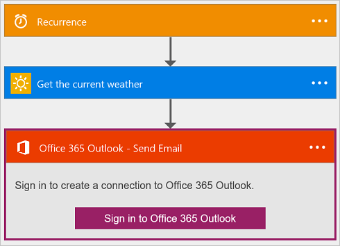
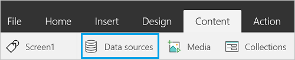
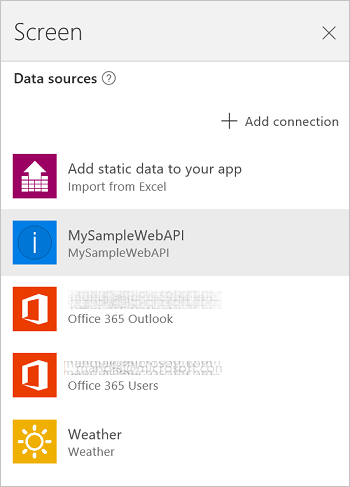

<properties
	pageTitle="How to use custom APIs | Microsoft PowerApps"
	description="What are custom APIs, using OAuth providers, and using Swagger to add custom APIs in flows and apps"
	services=""
    suite="powerapps"
	documentationCenter=""
	authors="sunaysv"
	manager="erikre"
	editor=""/>

<tags
   ms.service="powerapps"
   ms.devlang="na"
   ms.topic="article"
   ms.tgt_pltfrm="na"
   ms.workload="na"
   ms.date="05/23/2016"
   ms.author="mandia"/>

# What are custom APIs

[AZURE.VIDEO nb:cid:UUID:a971d001-3731-42d3-8abe-d82d44869343]

Custom APIs are any RESTful APIs that you can bring in and use with PowerApps and Microsoft Flow. These APIs can be hosted anywhere, as long as a well-documented specification that conforms to the [OpenAPI][1] standard is available.

## What you need to get started

- Custom APIs can be used by anyone using PowerApps. PowerApps Enterprise is not required.
- A Swagger file (.json) and an icon for your custom API are needed. This topic gives you several options to create the Swagger file. For an icon, you can use any image you want.


## Authentication

You can use one of the following authentication mechanisms:

- Basic Authentication
- OAuth 2.0: The following lists all the supported OAuth 2.0 providers you can use with your custom API (support for more coming soon):

	- Azure Active Directory
	- Box
	- Dropbox
	- Facebook
	- Google
	- Instagram
	- OneDrive
	- SalesForce
	- Slack
	- Yammer

> [AZURE.NOTE] Support for API key authentication is coming soon.


You can learn more about specifying the authentication type in your OpenAPI (Swagger) document at [OpenAPI Specification][1].

If your API endpoint allows unauthenticated access, you should remove the ```securityDefintions``` object from the OpenAPI (Swagger) file. In the following example, remove all of the following ```securityDefintions``` object:

```
  "securityDefinitions": {
    "AAD": {
      "type": "oauth2",
      "flow": "implicit",
      "authorizationUrl": "https://login.windows.net/common/oauth2/authorize",
      "scopes": {}
    }
  },
```

> [AZURE.TIP] In .json files, you can not add comments; All text is considered part of the data.

### Authentication examples
* [Azure Resource Manager](customapi-azure-resource-manager-tutorial.md) with AAD authentication
* [Azure WebApp](customapi-web-api-tutorial.md) with AAD authentication

## Register a custom API

### Step 1: Create a Swagger file

You can create a Swagger file from **any** API endpoint, including:

- Any API that is published and publicly available. Some examples include [Spotify][2], [Uber][3], [Slack][4], [Rackspace][5], and more.
- An API that you create and deploy to any cloud service where you can deploy web apps, including Amazon Web Services (AWS), Heroku, Azure web apps, Google Cloud, and more.  
- An API deployed in your network, or on your computer; as long as the API is available publicly on the internet.

When you create the Swagger file, a .json file is created. Keep this .json file handy.

#### Get help creating Swagger files

- If you're brand new to creating a Swagger file or have never created a Swagger file before, [Get started with Swagger][6] is a good resource.

- To create your own API, deploy it to Azure, create a Swagger file based off this new API, and then consider using [Web API tutorial](customapi-web-api-tutorial.md). This tutorial gives you a working Swagger file. There's also a [Hello World example][7] on GitHub.

- To validate your Swagger files, use the [Swagger editor][8]. You can paste your .json data, and validation automatically occurs.

- To customize your Swagger document to work with PowerApps and Logic Flows, see [Customize your Swagger definition](customapi-how-to-swagger.md).

### Step 2: Add a connection to the custom API
Now that the Swagger file (.json file) is generated for the custom API, add the connection to PowerApps. You'll also need the icon for your custom API.

1. Go to [powerapps.com][9], and sign in with your work account.  

	> [AZURE.NOTE] Currently, custom APIs can only be used at powerapps.com. They cannot be used in PowerApps.  

2. Under **Manage**, select **Connections**, and then select **New connection**:  
	  

3. Select **Custom**, and select **New custom API**:  
	  
	Add the properties of your API, including the .json and icon files. Then, select **Next**:  

	|Property|Description|
|---|---|
|Name|Enter the name of your custom API. If this is the sample web API, you can name it **MySampleWebAPI**.|
|Swagger API definition|Browse to the .json file created from Swagger.|
|Upload API icon|Browse to the icon file.|
|Description|Enter a description of your custom API. If this is the sample web API, you can enter **Sample Web API Tutorial**.|

	Select **Next**.  
4. Enter any authentication properties. If the .json file uses OAuth2 authentication in the ```securityDefintions``` object, you are prompted for the following values:  

	|Property|Description|
|---|---|
|Client id|Using one of the supported OAuth identity providers (listed in this topic), a client ID is provided. Enter this client ID.
|Client secret|Enter the client secret from the identity provider you chose.|  

	The **Authentication examples** in this topic provide examples of these OAuth properties.  

	If the .json file does not use the ```securityDefintions``` object, then no additional values may be needed.

5. Select **Create**. Your custom API is now displayed in **Custom**:  

	  


> [AZURE.TIP] If the Swagger files fails to validate, there may be extra characters. For example, mostly all data should be in quotes, including websites. So if you have `https://mywebapi.mywebsite.com` outside of quotes, the file fails to validate.


### Step 3: Add the custom API to a flow and an app
Now, you're ready to use the custom API with your app or flow. In this section, we use a custom Weather API.

#### Add the custom API to your flow
In this step, we create a very simple flow that shows you how to add your custom API. For a more in-depth experience, see [Get started with  flows](https://flow.microsoft.com/en-us/documentation/get-started-logic-flow/) at flow.microsoft.com.

1. At [powerapps.com][9], select the **Flows** tab, and select **Create a flow**.
2. In this window, there are several templates already created that use some common scenarios. You can use any of these, and add your custom API to it. Or, you can choose **Create from blank** to create a flow from scratch.  

	The quickest way to add your custom API is to select **Create from blank**, which opens the following flow:  
	   

4. Select **Recurrence**, and set the frequency to 1 minute:    
	  	

5. Select the plus sign ( ), and select **Add an action**. In the list, your custom API is listed:  


6. The next steps are determined by what your API can do. In a weather example, maybe your API gets the current temperature, and then sends an email using Office 365:  


7. Name your flow, and then select **Done**.


#### Add the custom API to your PowerApp
In this step, we create a very simple app that shows you how to add your custom API. For a more in-depth experience, see [Create an app from data](get-started-create-from-data.md).

1. At [powerapps.com][9], select **New App**:  
	  
2. A new tab opens in your browser. In this new tab, a blank app is created automatically. Select **connect to data**:  
  
3. In the **Content** tab, select **Data sources**:  
  
4. In the new screen, your existing connections are listed, including the custom API you added. Select your custom API:  
  
5. Select **Add data source**.

Once added, you can use your custom API within the function bar, a text box, and more. For example, in the function bar, you can start typing **MySampleWebAPI** to see the available functions. [Show data from Office 365](show-office-data.md) is an example of using the Office 365 API.


## Sharing a Custom API
Users can also share custom APIs with each other. Once you've added a custom API, then:

1. Under **Manage**, select **Connections**, and then select **New connection**:  
	
2. Select **Custom**, and then select your API.
3. Select **Share**, and then enter the users or groups you want to share with:  

4. **Save** your changes.


> [AZURE.NOTE] You can share custom APIs with other users in only your organization.


## Quota and throttling

- You can create up to five custom APIs in a PowerApps account. Custom APIs that are shared with you don't count against this quota.
- For each connection created on a custom API, users can make up to 500 requests per minute.
- Keep in mind that deleting a custom API deletes all the connections created to the API.

To ask questions or make comments about custom APIs, [join our community](https://aka.ms/powerapps-community).

<!--Reference links in article-->
[1]: https://github.com/OAI/OpenAPI-Specification/blob/master/versions/2.0.md#securityDefinitionsObject
[2]: https://developer.spotify.com/
[3]: https://developer.uber.com/
[4]: https://api.slack.com/
[5]: http://docs.rackspace.com/
[6]: http://swagger.io/getting-started/
[7]: https://github.com/OAI/OpenAPI-Specification/wiki/Hello-World-Sample
[8]: http://editor.swagger.io/#/
[9]: https://web.powerapps.com
