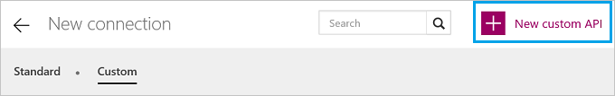
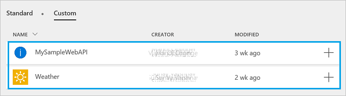

<properties
	pageTitle="Register custom APIs in PowerApps | Microsoft PowerApps"
	description="Register custom APIs in PowerApps using Swagger and OAuth."
	services=""
    suite="powerapps"
	documentationCenter=""
	authors="RickSaling"
	manager="anneta"
	editor=""/>

<tags
   ms.service="powerapps"
   ms.devlang="na"
   ms.topic="article"
   ms.tgt_pltfrm="na"
   ms.workload="na"
   ms.date="10/26/2016"
   ms.author="ricksal"/>

# Register custom APIs in PowerApps

PowerApps can leverage any RESTful APIs hosted anywhere.  This tutorial demonstrates registering and using a custom API.

## Prerequisites

- A [PowerApps account](https://powerapps.microsoft.com).
- A Swagger file (JSON) OR a URL to Swagger definition for your custom API. If you don't have one, we'll show you several options to create the Swagger file.
- An image to use as an icon for your custom API (optional).


## Authentication

Custom APIs in PowerApps can use any of several authentication mechanisms

- API Key
- Basic Authentication
- Generic OAuth 2.0
- OAuth 2.0. The specific implementations below are currently supported, with more coming soon.

	- Azure Active Directory
	- Box
	- Dropbox
	- Facebook
	- Google
	- Instagram
	- OneDrive
	- SalesForce
	- Slack
	- Yammer


The [OpenAPI Specification](https://github.com/OAI/OpenAPI-Specification/blob/master/versions/2.0.md#securityDefinitionsObject) describes how to specify authentication within a Swagger.

If your API endpoint allows unauthenticated access, you should remove the ```securityDefintions``` object from the OpenAPI (Swagger) file. In the following example, remove all of the following ```securityDefintions``` object:

```
  "securityDefinitions": {
    "AAD": {
      "type": "oauth2",
      "flow": "implicit",
      "authorizationUrl": "https://login.windows.net/common/oauth2/authorize",
      "scopes": {}
    }
  },
```

### Examples
* [Azure Resource Manager](customapi-azure-resource-manager-tutorial.md) with AAD authentication.
* [Azure WebApp](customapi-web-api-tutorial.md) with AAD authentication.

## Register a custom API

### Step 1: Create a Swagger file

You can create a Swagger file from *any* API endpoint, including:

- Publicly available APIs. Some examples include [Spotify](https://developer.spotify.com/), [Uber](https://developer.uber.com/), [Slack](https://api.slack.com/), [Rackspace](http://docs.rackspace.com/), and more.
- An API that you create and deploy to any cloud hosting provider, including Amazon Web Services (AWS), Heroku, Azure Web Apps, Google Cloud, and more.  
- A custom line-of-business API deployed on your network as long as the API is exposed on the public internet.

When you create the Swagger file, a JSON file is created.  You'll need this is Step 2.

#### Getting help with Swagger files

- If you're new to Swagger, you should visit the [Getting Started pages on Swagger.io](http://swagger.io/getting-started/).

-  There's a Swagger [Hello World example](https://github.com/OAI/OpenAPI-Specification/wiki/Hello-World-Sample) on GitHub.

- To create your own API, deploy it to Azure, create a Swagger file based off this new API, and then register it in PowerApps, see the [Web API tutorial](customapi-web-api-tutorial.md).

- To validate your Swagger files, use the [Swagger editor](http://editor.swagger.io/#/). You can paste your JSON data, and validation automatically occurs.

- To customize your Swagger document to work with PowerApps, see [Customize your Swagger definition](customapi-how-to-swagger.md).

### Step 2: Add a connection to the custom API

Now that the Swagger file (JSON file) is generated for the custom API, register the custom API in PowerApps

1. In [powerapps.com](https://web.powerapps.com), in the menu on the left, click **Connections**. Then click on **...** and select **Manage custom APIs** in the upper-right corner.

	 >[AZURE.TIP] If you can't find the menu, it may be under a hamburger button in the upper-left corner in mobile browsers.

	  

2. Select **New custom API**:  

	  

	You will be prompted for the properties of your API.  

	| Property | Description |
	|----------|-------------|
	| Swagger URL OR Swagger API definition  | Paste a URL to Swagger definition OR Browse to the JSON file created from Swagger. |
	| Name | Type the name of your custom API. |
	| Upload API icon | Browse an image file for the icon (optional). |
	| Description | Type a description of your custom API (optional). |

	Select **Next**.

3. Enter any authentication properties. If the JSON file uses OAuth2 authentication in the ```securityDefintions``` object, you are prompted for the following values:  

	| Property | Description |
	|----------|-------------|
	| Client id | Using one of the supported OAuth identity providers, a client ID is provided. Type this client ID. |
	| Client secret | Type the client secret from the identity provider you chose. |  

	If the JSON file does not use the ```securityDefintions``` object, then no additional values may be needed.

4. Select **Create**.

	Your custom API is now displayed under **Custom**.

	  

	> [AZURE.TIP] If the Swagger file fails to validate, there may be extra characters. For example, most data should be in quotes, including website URLs.

5. Now that the custom API is registered, you must create a connection to the custom API so it can be used in your apps.  Click the **+** to the right of the **Modified** date of your custom API and then complete any necessary steps to sign in to your API's data source. If you're using **OAuth** authentication with your API, you might be presented a sign-in screen. For API Key authentication, you might be prompted for a key value.

### Step 3: Add the custom API to an app
[Add the custom API to an app](add-data-connection.md) as you would any other data source, and then use the API within the function bar, a text box, and more. For example, in the function bar, you can start typing **MySampleWebAPI** to see the available functions. [Office 365 Outlook](connection-office365-outlook.md) is an example of using the Office 365 API.

## Share a custom API
Users can also share custom APIs with each other.

1. In [powerapps.com](https://web.powerapps.com), in the menu on the left, click **Connections**. Then click on **...** and select **Manage custom APIs** in the upper-right corner.

	

2. Select your API and select **Share**, and then enter the users or groups to whom you want to grant access to your API.  

	

3. Select **Save**.

> [AZURE.NOTE] You may only share custom APIs with other users in your organization.

## Quota and throttling

- You can create up to five custom APIs in a PowerApps account. Custom APIs that are shared with you don't count against this quota.
- For each connection created on a custom API, users can make up to 500 requests per minute.
- Keep in mind that deleting a custom API deletes all the connections created to the API.

## Next steps

[Learn about custom Swagger extensions](customapi-how-to-swagger.md).

[Use an ASP.NET Web API](customapi-web-api-tutorial.md).

[Register an Azure Resource Manager API](customapi-azure-resource-manager-tutorial.md).
