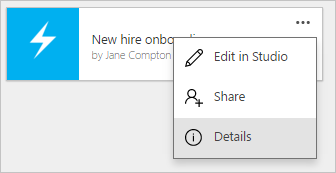
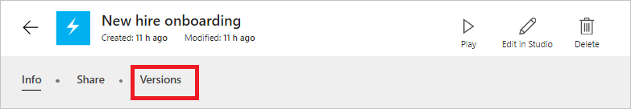
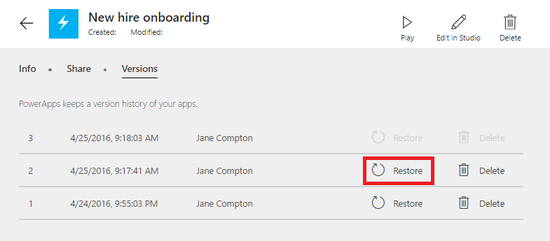
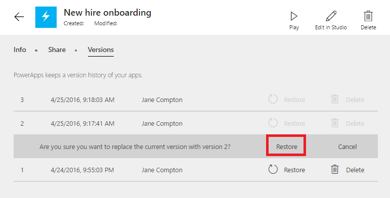
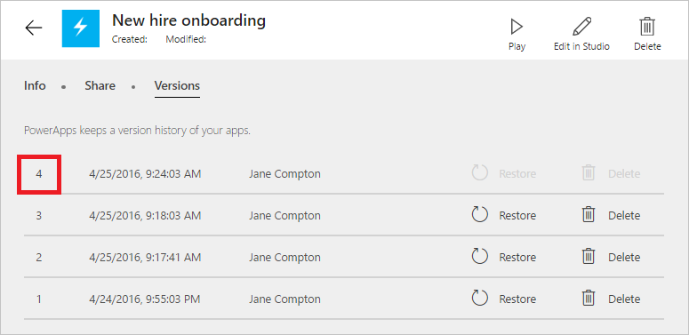

<properties
    pageTitle="Restore your app to a previous version | Microsoft PowerApps"
    description="Restore an app"
    services=""
    suite="powerapps"
    documentationCenter="na"
    authors="jamesol-msft"
    manager="darshand"
    editor=""
    tags=""
/>
<tags
    ms.service="powerapps"
    ms.devlang="na"
    ms.topic="article"
    ms.tgt_pltfrm="na"
    ms.workload="na"
    ms.date="04/24/2016"
    ms.author="jamesol"/>

# Restore an app to a previous version #

This article introduces you on how to restore an app to a previous version that was saved to the cloud from your PowerApps account.

## Restore an app from your account ##

1. On [powerapps.com](1), select **My Apps** in the left navigation bar.  

1. Select the ellipsis on tile of the app that you want to restore, and click **Details**.  

1. Select the **Versions** tab.  

1. Find the previous version that you want to restore and select **Restore**.  

1. Confirm that you want to restore to this version and select **Restore**.  

1. If successful, you will see a new version added to your version list.  

## Resources

Here are some other good resources for managing your apps:

[Share an app](./share-app.md)

[Change app name and tile](./set-name-tile.md)

[Delete an app](./delete-app.md)
