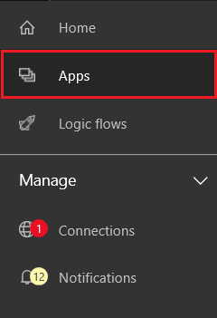
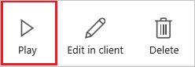
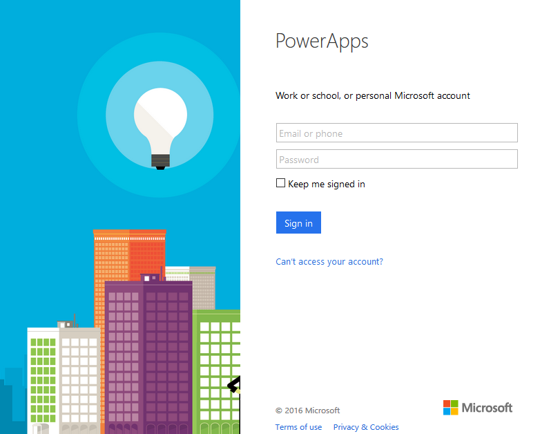
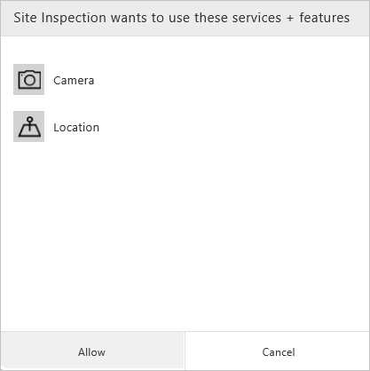

<properties
    pageTitle="Run apps in browser | Microsoft PowerApps"
    description="Walkthrough - run apps in the browser"
    services=""
    suite="powerapps"
    documentationCenter="na"
    authors="KarthikB"
    manager=""
    editor="AFTOwen"
    tags=""
 />
<tags
    ms.service="powerapps"
    ms.devlang="na"
    ms.topic="article"
    ms.tgt_pltfrm="na"
    ms.workload="na"
    ms.date="04/13/2016"
    ms.author="karthikb"/>

# Using apps in browser #
PowerApps can run on Windows, iOS, Android and the browser. Apps running in a browser match the experience as apps running in the client. Running apps in a browser may be the only option when the store app is not available on a platform or cannot be accessed due to organization policies. 

## Prerequisites ##
- Either of the following:
	- An app that you built (from a [template](get-started-test-drive.md), from [data](get-started-create-from-data.md), or from [scratch](get-started-create-from-blank.md)).
	- An app that someone else built and shared with view permissions.
- Supported browsers: Internet Explorer 11 and above, Chrome v47 and above, Safari on iOS 9 and above

## Launching an app ##
To run PowerApps inside a browser do either of the following:

1. Launch apps from the web portal
	- Login to the powerapps.com [web.powerapps.com](http://web.powerapps.com), select **Apps** from the left navigation of the screen. 

	

	- Click on the app to open the app details page
	- In the right top view click the Play icon to run the app in the browser
	
	

1. Launch apps directly from web URLs shared in email

	- For Apps shared with you, you will get an email with the link to the app
	- Click on the link to launch the app in the browser.
	 
## Login ##
If the app is launched from the web portal, chances are you already logged-in to PowerApps. On the other hand, if you are launching the app from the web link, you will be prompted to sign-in using your Azure Active Directory credentials.

## Connection ##
For the first time, if the app requires connections to data sources or consent to use device capabilities, you will be prompted for configuration before running the app.

## Exiting App ##
You can exit the app in one of the several ways:

1. By closing the browser tab or navigating to a different website URL
1. By clicking on the Home icon from the navigation bar
2. By clicking on Sign out from the navigation bar

	

Save or submit any data that was loaded in the app before exiting the app.

## Error and Warnings ##
If the app contains controls that cannot be supported in the browser, then you will see a warning header on the top of the app window with a link to download the client app from the store.

If the app cannot be launched due to invalid links or permission issues, you would see land into the error. 