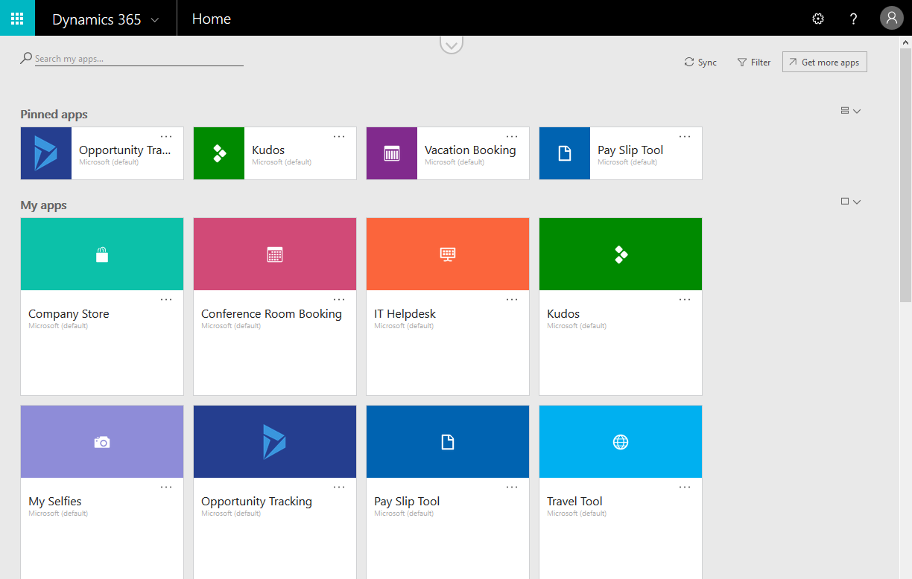
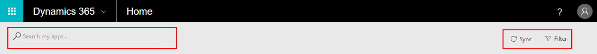
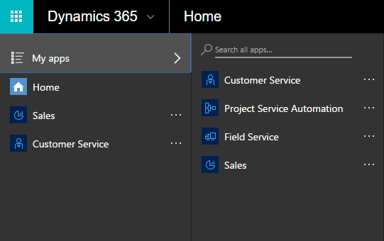
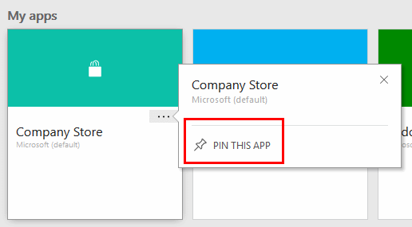

<properties
    pageTitle="Use apps in a web browser | Microsoft PowerApps"
    description="Walkthrough of how to use apps in the web browser"
    services=""
    suite="powerapps"
    documentationCenter="na"
    authors="fikaradz"
    manager="anneta"
    editor=""
    tags=""
 />
<tags
    ms.service="powerapps"
    ms.devlang="na"
    ms.topic="article"
    ms.tgt_pltfrm="na"
    ms.workload="na"
    ms.date="10/12/2016"
    ms.author="fikaradz"/>

# Using PowerApps in a web browser #
After you create an app in PowerApps, you can run that app if you open a browser window and then click or tap the app’s tile on the Dynamics 365 home page. This page may show several types of business apps, but you can find a specific app by typing at least part of its name in the search box. You can also filter the list to show only those apps that were created in PowerApps. If someone else creates an app and shares it with you, you can open it directly by clicking or tapping the link in the mail that you receive. This way, you can bypass the Dynamics 365 home page and explore the app sooner.

Note: You can find general information about [Microsoft Dynamics 365](https://docs.microsoft.com/en-us/dynamics365/) or [contact support](https://www.microsoft.com/en-us/dynamics365/contact-us) if you have a question about a Dynamics 365 app, such as Sales.

## Searching ##

If you are having trouble finding an app, filter the list of apps by typing at least part of the app name in the **search box**. You can also filter by app environment in the **Filter** pane.

If you have recently installed an app, it may not appear in your app list immediately. Click or tap **Sync** to show all your apps, but this process may take up to a minute.

## Task pane ##
The task pane gives you quick access to all your apps. You access it by clicking or tapping the Dynamics 365 toggle-button on the header, which appears on top of your apps.

You can quickly open a pinned app from the task pane or find any of your apps through the "My apps" sub-menu.

## Pin an app ##
Pin an app to quickly access it from either the homepage or the task pane. To pin an app, open the ellipsis (...) menu on the app tile either in the task pane or the homepage, and then select **Pin this app**.

## Open an app ##
To open an app, click or tap its tile in either the Dynamics 365 homepage or the task pane.

You can also access an app directly using its URL. You can also share the link over email or bookmark it in your browser.

If your browser does not support all the controls used in the app, you can download and use PowerApps Mobile, which is available on iOS, Android or Windows.  

## Sign in to PowerApps ##
If you open an app from dynamics.com, you're probably already signed in to Dynamics 365. If you open the app from a web link, you will be prompted to sign in using your Azure Active Directory credentials.

## Give consent ##
If the app requires a connection to a data source or requires consent to use device capabilities, you will be prompted for configuration before you use the app:  

Typically, you are prompted only the first time.

## Exit PowerApps ##
Exit or close the app using either of these ways:

- Click or tap **Sign out** in the Dynamics 365 portal.
- Navigate to the Dynamics 365 home page or launch another app from the task pane.
