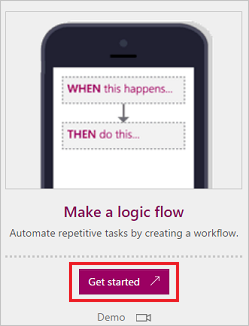
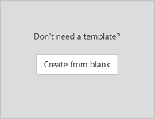
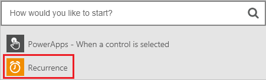
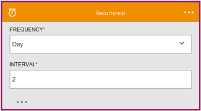
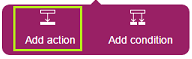
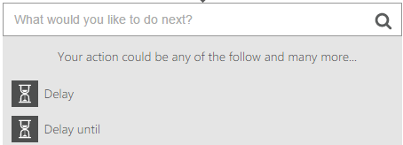

<properties
    pageTitle="Run flows on a schedule | Microsoft Flow"
    description="Automate recurring tasks by running flows on a schedule, such as every day or every hour."
    services=""
    suite="flow"
    documentationCenter="na"
    authors="stepsic-microsoft-com"
    manager="dwrede"
    editor=""
    tags=""/>

<tags
   ms.service="flow"
   ms.devlang="na"
   ms.topic="article"
   ms.tgt_pltfrm="na"
   ms.workload="na"
   ms.date="04/08/2016"
   ms.author="stepsic"/>

# Run flows on a schedule #
Create a flow that performs the same task or tasks, such as sending reports in email, every day, hour, or minute. As an alternative, create a flow that waits a certain number of minutes or until a certain date before performing a task or tasks.

## Prerequisites ##
- An account on [flow.microsoft.com](https://flow.microsoft.com)

## Create a recurring flow

1. In [flow.microsoft.com](https://flow.microsoft.com), select **My flows** in the top navigation bar.

	

1. Select **Create a flow**.

	

1. Select **Recurrence** in the box that says **How would you like to start?**

	

1. In the **Recurrence** dialog box, specify how often you want the flow to run.

	For example, specify **Day** under **Frequency** and **2** under **Interval** if you want the flow to run every two days.

	

1. Add the action or actions that you want the flow to take, as [Create a flow from scratch](get-started-logic-flow.md) describes.

## Schedule a flow ##

1. In [flow.microsoft.com](https://flow.microsoft.com), select **My flows** in the top navigation bar.

	

1. Select **Create a flow**.

	

1. Specify an event as [Create a flow from scratch](get-started-logic-flow.md) describes.

1. Select the plus icon, and then select **Add action**.

	

1. In the list of actions, do either of the following:
	- Select **Delay**, and then specify a number of minutes,
	- Select **Delay until**, and then specify a date.

	
