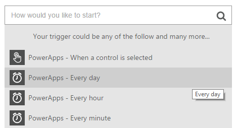

<properties
    pageTitle="Scheduling in a Logic Flow"
    description="Run a logic flow on a schedule for recurring tasks, such as every day, or every hour."
    services=""
    suite="powerapps"
    documentationCenter="na"
    authors="stepsic-microsoft-com"
    manager="dwrede"
    editor=""
    tags=""/>

<tags
   ms.service="powerapps"
   ms.devlang="na"
   ms.topic="article"
   ms.tgt_pltfrm="na"
   ms.workload="na"
   ms.date="11/14/2015"
   ms.author="stepsic"/>

# Scheduling in a Logic Flow #
Sometimes you will want to run a process that should run on a fixed period of time and do some task. For example, sending out an email reminder every day.

In addition, you can schedule a task in the middle of a Logic flow, by having it wait a fixed period of time.

**Prerequisites**
- An account on [powerapps.com](http://go.microsoft.com/fwlink/?LinkId=708209)
- An account on Office 365 (from which you can send email)

## Add a recurrence trigger

1. In your web browser, open [powerapps.com](http://go.microsoft.com/fwlink/?LinkId=708209), and then select **Create a flow**.

    

2. Select **Create from blank**.

    

3. In the box that says **How would you like to start?** select **Every day**.

    

4. You can now add the action that you want to run, for example **Send email**.

## Waiting as an action ##

In this procedure, you'll add an action that waits for a fixed period of time. One example of this is if you want to send out a reminder after a certain amount of time, or, on a certain day.

1. In Chrome, open [powerapps.com](http://go.microsoft.com/fwlink/?LinkId=708209), and then click **Flows** in the left navigation bar.

2. In the list of Logic Flows, click the edit icon, which looks like a pencil, next to the Logic Flow that you want to edit.

3. Now, click the add button at the bottom of the logic flow.

4. Search for **Wait** and click it in the list.

5. Choose exactly how long you want to wait.

6. Click **Done**.
