<properties
    pageTitle="Conference Attendee Sample App | Microsoft PowerApps"
    description="Sample app with SQL Server as a data source"
    services=""
    suite="powerapps"
    documentationCenter="na"
    authors="merwanhade"
    manager="dwrede"
    editor=""
    tags=""/>

<tags
   ms.service="powerapps"
   ms.devlang="na"
   ms.topic="article"
   ms.tgt_pltfrm="na"
   ms.workload="na"
   ms.date="12/22/2015"
   ms.author="mhade"/>

# Sample app: conference attendee #

This sample app demonstrates key concepts such as:

- Binding galleries to data in a master-details pattern
- Navigational patterns such as tabs and back buttons
- Viewing and categorizing information in different ways
- Storing personalized data per user 

The app enables conference attendees to view a list of sessions, details about a particular session, and information about the session's speaker. In addition, attendees can also add sessions to a list of favorites.  
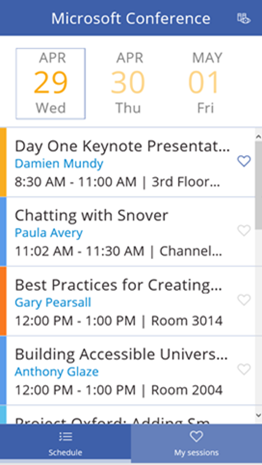
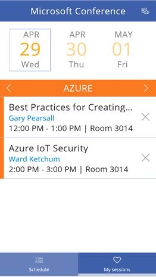
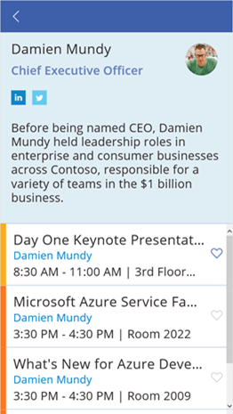

**Prerequisites**

- [Install PowerApps](http://aka.ms/powerappsinstall)
- A Dropbox, OneDrive, or Google Drive account. (In this tutorial, you'll use Dropbox.)

## Get the sample data ##
1. Download [this sample](http://aka.ms/conferenceattendeesample), and decompress it on your computer.

	The sample data includes:

	- a PowerApps file, named **conference-attendee-excel.msapp**
	- an Excel file, named **data.xlsx**
	- a folder, named **data_images** 

1. Create a folder named **ConferenceAttendee** in your cloud-storage account (for example, Dropbox).

	

1. In the **ConferenceAttendee** folder, upload **data.xlsx**, and create a folder called **data_images**.

	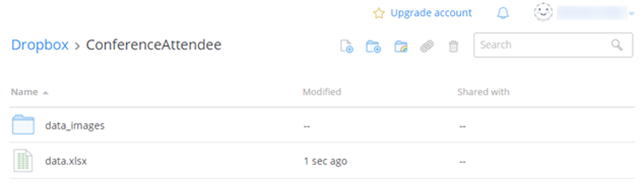

1. Upload all the files from the **data_images** folder on your computer to the corresponding folder in your cloud-storage account.

	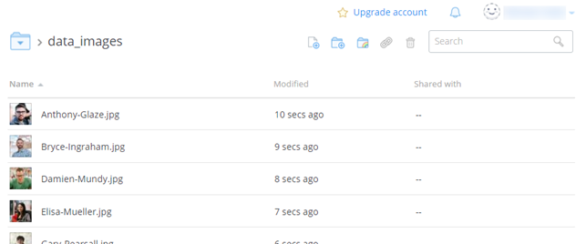

## Connect from PowerApps to cloud storage ##
Skip this procedure if you've already created a connection from PowerApps to your cloud-storage account.

1. Open PowerApps, and then select **Connections** on the **File** menu (near the left edge of the screen).

	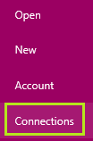

1.  Select **Available Connections**, select your cloud-storage provider, and then select **Connect**.

	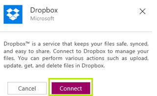

1. When prompted, provide your credentials.

	

## Open the app ##

1. On the **File** menu, select **Open**.

	

1. Near the upper-right corner, select **Browse**.

	

1. Navigate to the **conference-attendee-excel.msapp** file, and then select **Open**.

## Configure the app ##

1. When the app opens, select **Options** near the lower-right corner, and then select **Insert your data**.

	

1. Under **My connections**, select the connection to your cloud-storage provider.

	

1. Open the **ConferenceAttendee** folder, and then select the **data.xlsx** file.

	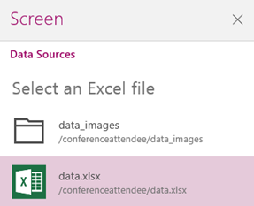

1. Select the check box for each table, and then select **Insert**.

	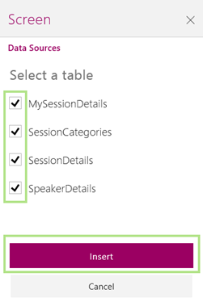

## Run the app ##

1. Change views by selecting the view toggle button. You can either view sessions by time or by track. 
 **Note** - The first time you run this app, you may have to click the toggle button to fetch data.  
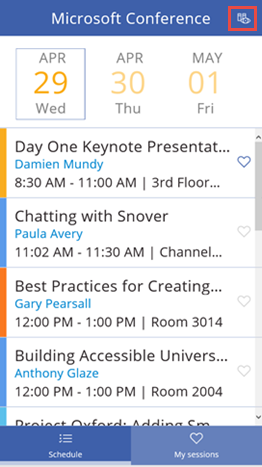
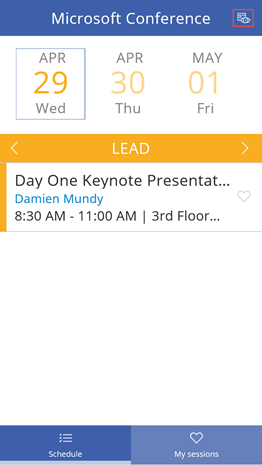

2. Select a particular session from the list to view session details such as location and speaker information. 
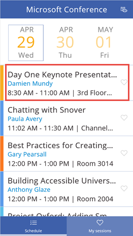

3. Select the speaker to view more information about the speaker.  
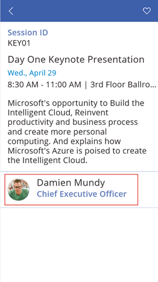
4. In the speaker details screen, you can click on the LinkedIn and Twitter buttons to launch the respective websites or add other sessions by the speaker to your favorites.  
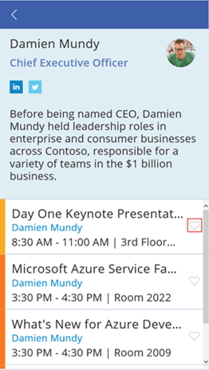

5. You can view your favorite sessions by navigating to the **My sessions** tab on the home screen.  
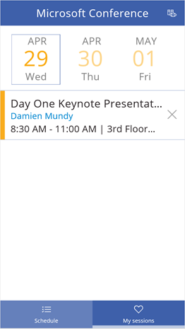
 
