<properties
    pageTitle="Sample app: estimate generator | Microsoft PowerApps"
    description="Sample app with Excel as a data source"
    services=""
    suite="powerapps"
    documentationCenter="na"
    authors="merwanhade"
    manager="dwrede"
    editor=""
    tags=""/>

<tags
   ms.service="powerapps"
   ms.devlang="na"
   ms.topic="article"
   ms.tgt_pltfrm="na"
   ms.workload="na"
   ms.date="12/23/2015"
   ms.author="mhade"/>

# Sample app: estimate generator #

This sample app demonstrates key concepts such as:

- Showing and categorizing information in different ways
- Using a gallery of images as a single-select listbox
- Using a card gallery to create a grid of images
- Binding galleries to data in a master-details pattern
- Creating navigational patterns such as tabs and forward/back buttons

By using this app, a flooring estimator can capture estimate details such as square footage, flooring type, images, markups, and discounts. Users can create jobs, close them, and view jobs that are open or closed.  

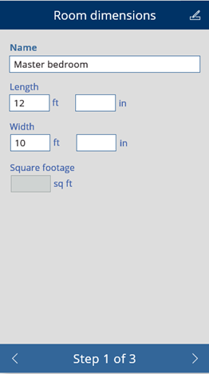
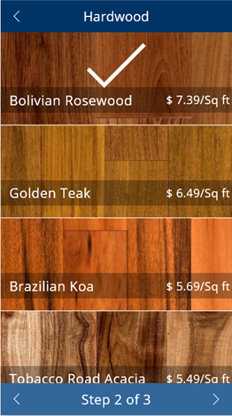
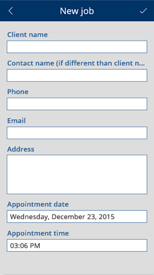

**Prerequisites**

- [Sign up](signup-for-powerapps.md) for PowerApps, [install](http://aka.ms/powerappsinstall) it, open it, and then sign in by providing the same credentials that you used to sign up.
- A Dropbox, OneDrive, or Google Drive account. (In this tutorial, you'll use Dropbox.)

## Get the sample data ##
1. Download [this sample](http://aka.ms/estimategeneratorsample), and decompress it on your computer.

	The sample data includes:

	- a PowerApps file, named **estimate-generator.msapp**
	- an Excel file, named **data.xlsx**
	- a folder, named **data_images**

1. Create a folder named **EstimateGenerator** in your cloud-storage account (for example, Dropbox).

	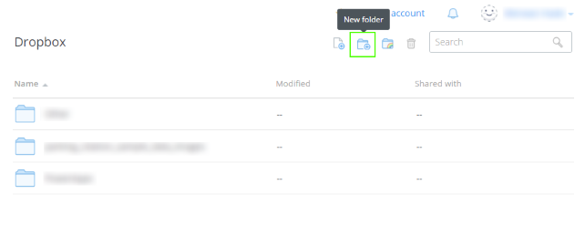

1. In the **EstimateGenerator** folder, upload **data.xlsx**, and create a folder called **data_images**.

	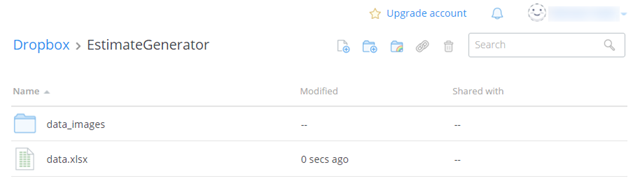

1. Upload all the files from the **data_images** folder on your computer to the corresponding folder in your cloud-storage account.

	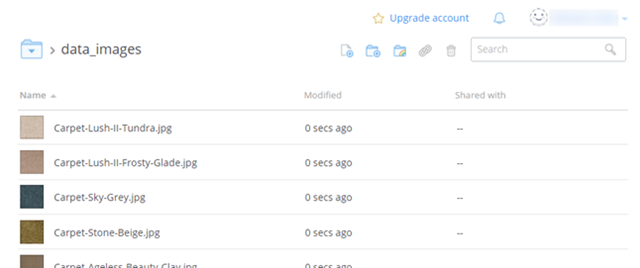

## Connect from PowerApps to cloud storage ##
Skip this procedure if you've already created a connection from PowerApps to your cloud-storage account.

1. Open PowerApps, and then select **Connections** on the **File** menu (near the left edge of the screen).

	

1.  Select **Available Connections**, select your cloud-storage provider, and then select **Connect**.

	

1. When prompted, provide your credentials.

	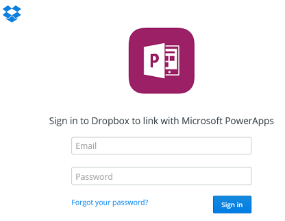

## Open the app ##

1. On the **File** menu, select **Open**.

	

1. Near the upper-right corner, select **Browse**.

	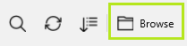

1. Navigate to the **estimate-generator.msapp** file, and then select **Open**.

## Configure the app ##

1. When the app opens, select **Options** near the lower-right corner, and then select **Insert your data**.

	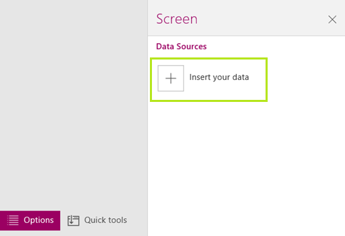

1. Under **My connections**, select the connection to your cloud-storage provider.

	

1. Open the **EstimateGenerator** folder, and then select the **data.xlsx** file.

	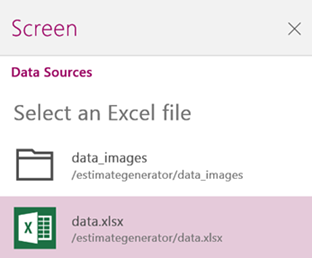

1. Select the check box for each table, and then select **Insert**.

	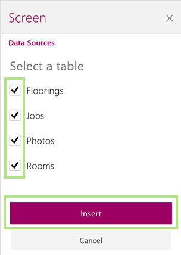

## Run the app ##
1. Press F5, and then select the + button to create an appointment.

	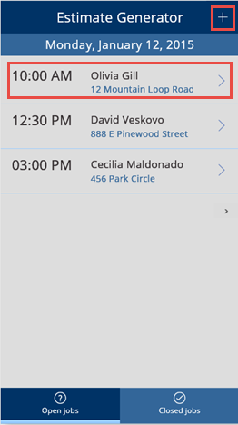

1. In the **New Job** screen, enter appointment details, and then select the checkmark (near the upper-right corner) to save your changes.

	**Note:** Remember what date you specify.

1. In the **Estimate Generator** screen, find the appointment you just created, select it, and then select **Begin estimate**.

	Navigate between dates by selecting the left and right arrows near the middle of the left and right edges of the screen.

1. Add room dimensions, a flooring type, and one or more photos. Navigate to each screen by using the navigational buttons at the bottom of the screen.

	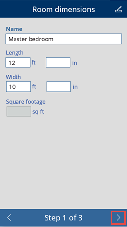
	

1. Add a markup, discount, or both before selecting the **Finish and send estimate** button.

	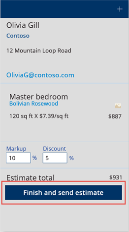

1. Submit the estimate by entering your signature and then selecting the **Done** button.

	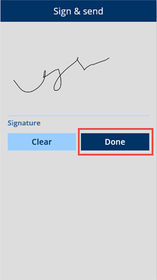

1. Select **OK**, select **Closed jobs** at the bottom of the **Estimate Generator** screen.

1. Display the job you just completed by navigating to the date of the appointment.
