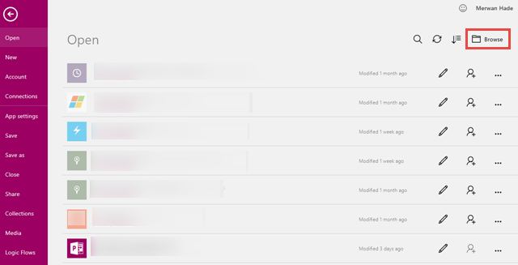

<properties
    pageTitle="Parking Citation Sample App | Microsoft PowerApps"
    description="Sample app with SharePoint Online as a data source"
    services=""
    suite="powerapps"
    documentationCenter="na"
    authors="merwanhade"
    manager="dwrede"
    editor=""
    tags=""/>

<tags
   ms.service="powerapps"
   ms.devlang="na"
   ms.topic="article"
   ms.tgt_pltfrm="na"
   ms.workload="na"
   ms.date="12/18/2015"
   ms.author="mhade"/>

# Parking Citation Sample App#

This PowerApps sample demonstrates key concepts such as:

- Using the pen control for annotations
- Using card galleries to create a grid of images
- Using checkboxes and galleries to create a multi-select listbox
- Using the image control to show latitude and longitude coordinates on a map

The app enables parking enforcement officers to capture infraction details such as vehicle make, vehicle color, and a series of images. Each image can include both notes and annotations. 

## How to run this sample ##
To run this sample, you will need:

- [Install PowerApps](http://aka.ms/powerappsinstall)
- A Dropbox, OneDrive, or Google Drive account (In this tutorial, we will use Dropbox.)

### 1. [Download the sample as .zip](http://aka.ms/parkingcitationsample)
To get started, download this sample and unzip it your computer. In the zip, you'll find:

- parking-citation.msapp
- data.xlsx
- data_images folder

### 2. Upload the sample data to your personal storage account on Dropbox, OneDrive, or Google Drive
- In Dropbox, create a folder called **ParkingCitation**.

- Open the **ParkingCitation** folder and upload the **data.xlsx** spreadsheet to this folder.
- In the **ParkingCitation** folder, create a new folder called **data_images**.

- Upload all the images from the **data_images** folder on your computer to this folder in Dropbox. 

### 3. Run the sample in PowerApps on Windows
1. To run the app, open PowerApps on Windows.
- Navigate to the **File**->**Open** menu and **Browse** to the parking-citation.msapp file.

- Once the app is open, go to the **File**->**Connections** menu and open the **Available Connections** tab.

- Select Dropbox and click **Connect**.  

- Login with your Dropbox credentials
- Select the first screen of the app and click **Options** followed by **Insert your data**.

- From a list of **My connections**, select the Dropbox connection you just created. 

- Navigate to the ParkingCitation folder and select the data.xlsx file.  

- Select all the tables and choose **Insert**.  

And that's it! 