<properties
    pageTitle="Sample app: parking citation | Microsoft PowerApps"
    description="Sample app with Excel in Dropbox as a data source"
    services=""
    suite="powerapps"
    documentationCenter="na"
    authors="merwanhade"
    manager="dwrede"
    editor=""
    tags=""/>

<tags
   ms.service="powerapps"
   ms.devlang="na"
   ms.topic="article"
   ms.tgt_pltfrm="na"
   ms.workload="na"
   ms.date="12/21/2015"
   ms.author="mhade"/>

# Sample app: parking citation #

This sample app demonstrates key concepts such as:

- Using the pen control for annotations
- Using a card gallery to create a grid of images
- Using checkboxes and galleries to create a multi-select listbox
- Using the image control to show latitude and longitude coordinates on a map

The app enables parking-enforcement officers to capture infraction details such as vehicle make, vehicle color, and a series of images. Each image can include both notes and annotations.

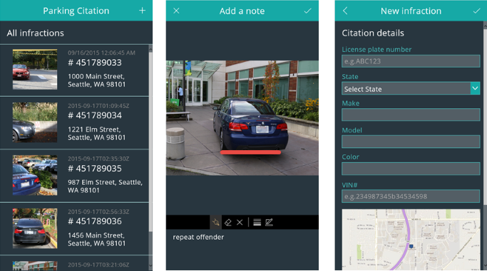

**Prerequisites**
- [Install PowerApps](http://aka.ms/powerappsinstall)
- A Dropbox, OneDrive, or Google Drive account. (In this tutorial, you'll use Dropbox.)

## Get the sample data ##
1. Download [this sample](http://aka.ms/parkingcitationsample), and decompress it on your computer.

	The sample data includes:

	- a PowerApps file, named **parking-citation.msapp**
	- an Excel file, named **data.xlsx**
	- a folder, named **data_images**

1. Create a folder named **ParkingCitation** in your cloud-storage account (for example, Dropbox).

	

1. In the **ParkingCitation** folder, upload **data.xlsx**, and create a folder called **data_images**.

	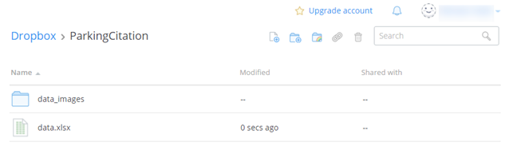

1. Upload all the files from the **data_images** folder on your computer to the corresponding folder in your cloud-storage account.

	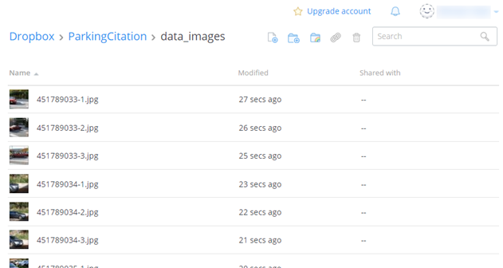

## Connect from PowerApps to cloud storage ##
Skip this procedure if you've already created a connection from PowerApps to your cloud-storage account.

1. Open PowerApps, and then select **Connections** on the **File** menu (near the left edge of the screen).

	

1.  Select **Available Connections**, select your cloud-storage provider, and then select **Connect**.

	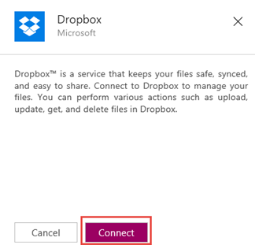

1. When prompted, provide your credentials.

	

## Open the app ##

1. On the **File** menu, select **Open**.

	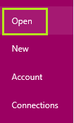

1. Near the upper-right corner, select **Browse**.

	

1. Navigate to the **parking-citation.msapp** file, and then select **Open**.

## Configure the app ##

1. When the app opens, select **Options** near the lower-right corner, and then select **Insert your data**.

	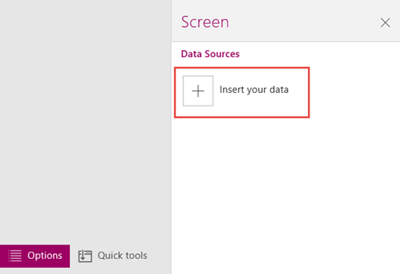

1. Under **My connections**, select the connection to your cloud-storage provider.

	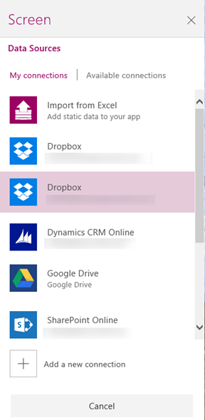

1. Open the **ParkingCitation** folder, and then select the **data.xlsx** file.

	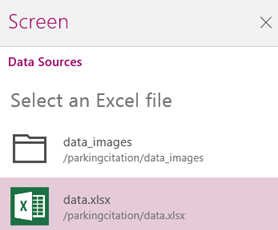

1. Select the check box for each table, and then select **Insert**.

	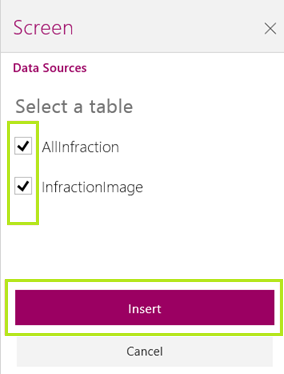

##Run the app

1. Review existing citations by selecting one of the sample citations in the list or create a new citation by selecting the + button. 
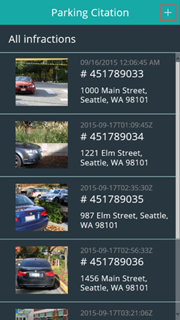

2. Step through each screen of the app and enter violation codes, add photos, and provide infractions details. Navigate to the next step in the app by selecting the Next button in each screen. 
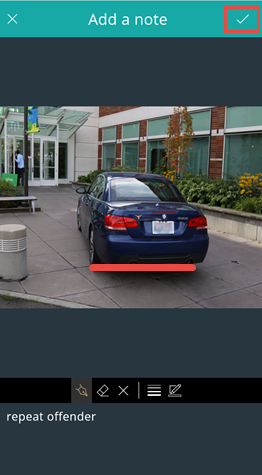
3. Submit the new citation by entering your signature at the bottom of the summary screen and select the **Submit** button.  
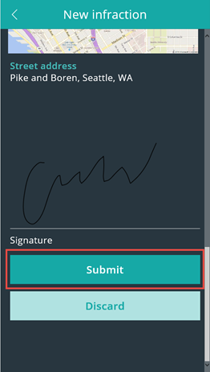