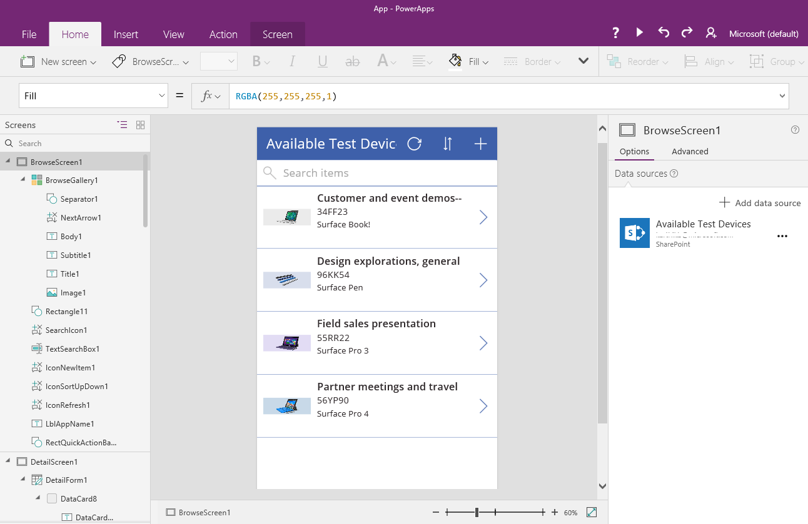
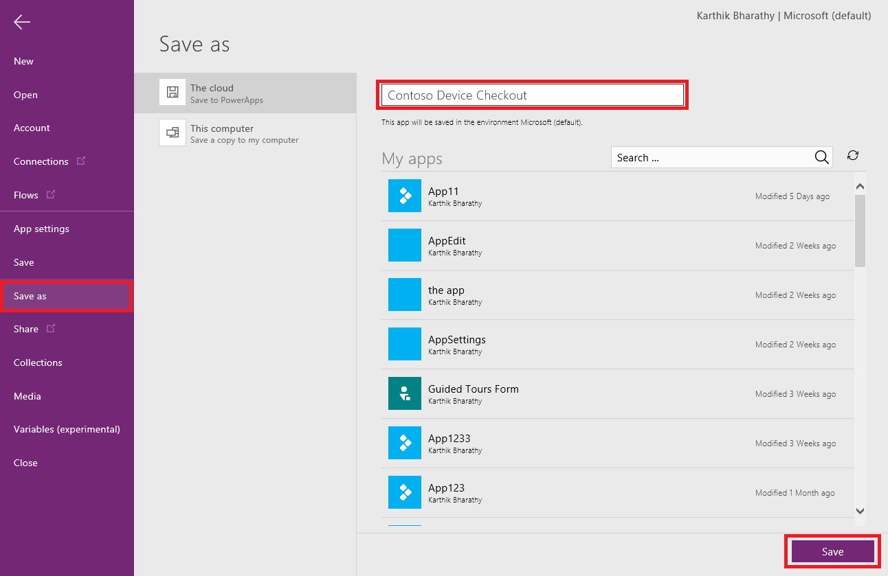
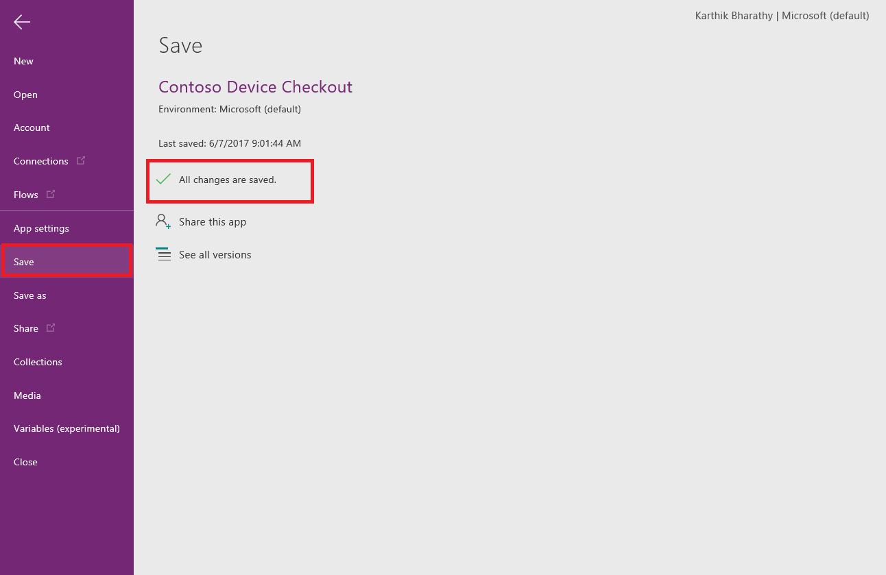
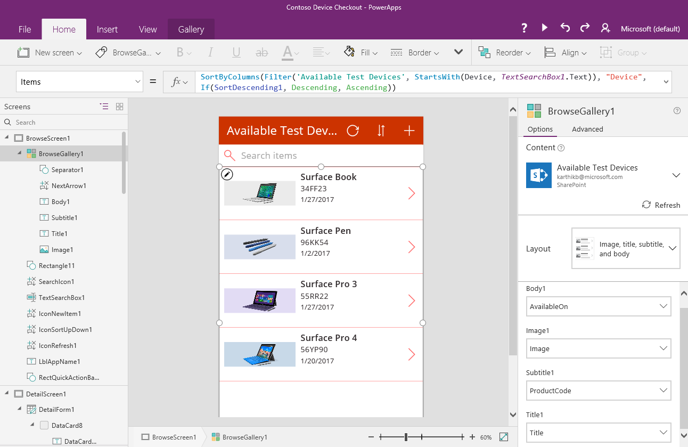
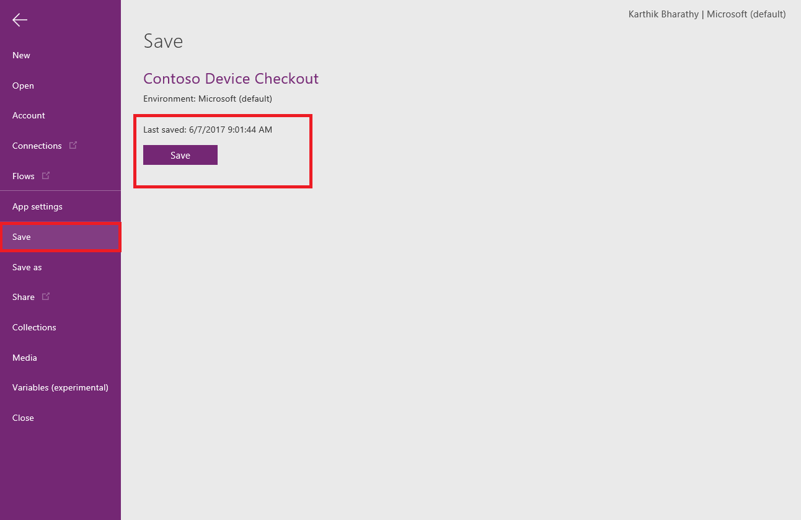
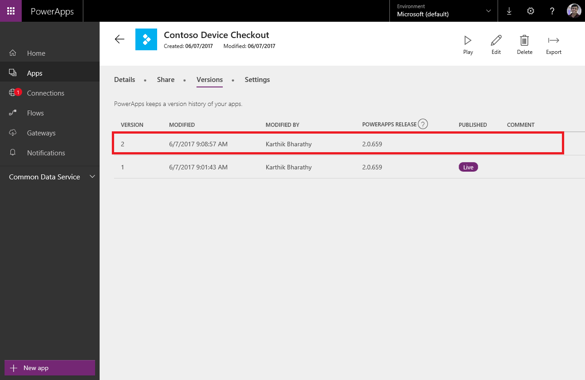
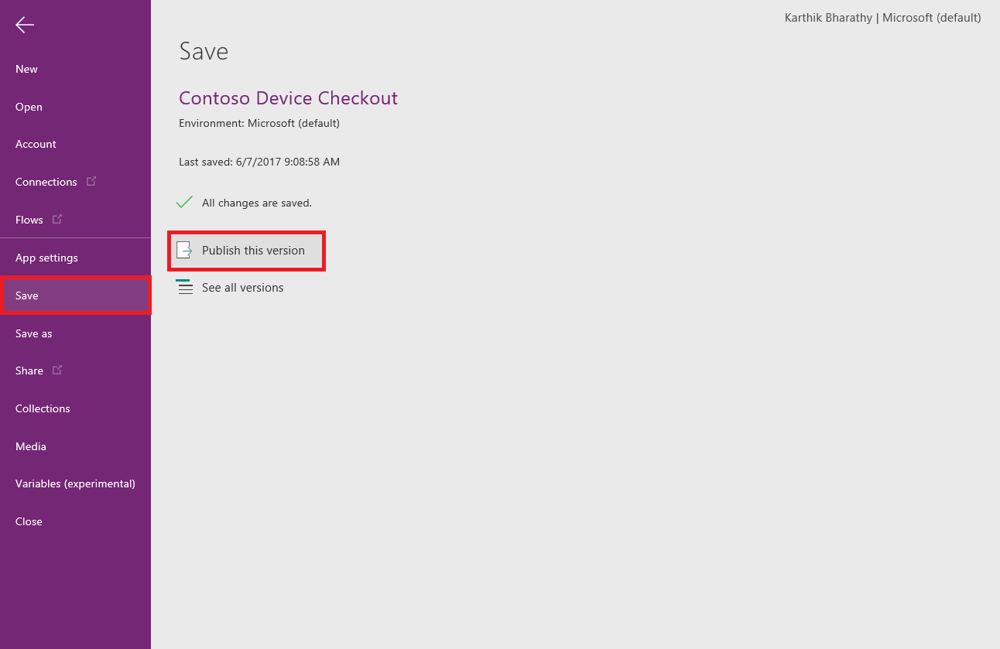
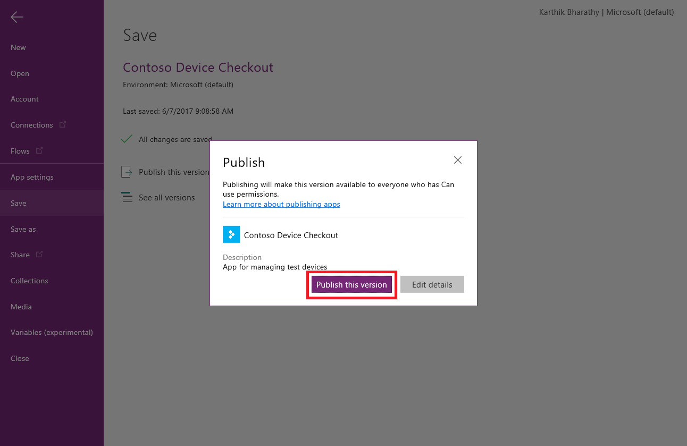
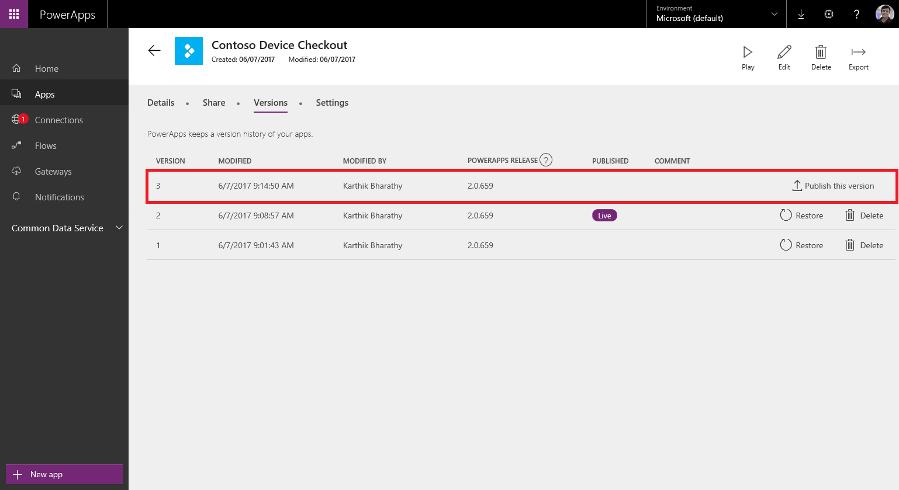

<properties
	pageTitle="Save and Publish app | Microsoft PowerApps"
	description="Step-by-step instructions to Save and Publish app for app authors"
	services=""
	suite="powerapps"
	documentationCenter="na"
	authors="karthik-1"
	manager="anneta"
	editor=""
	tags=""/>

<tags
   ms.service="powerapps"
   ms.devlang="na"
   ms.topic="article"
   ms.tgt_pltfrm="na"
   ms.workload="na"
   ms.date="06/07/2017"
   ms.author="karthikb"/>

# Save and Publish apps in PowerApps #
This article will show you how app authors can use Save and Publish features to control how apps are made visible to users. Authors wish to incrementally update their app, save the changes and test the app without publishing any intermediate versions to users. Authors can then publish their changes to all users.

## Prerequisites ##
1. Create an app, or open one for editing. Here is an app we will use in this walkthrough.

1. [Share the app](share-app.md) with one or more app authors and users

## First time Save ##
1. Navigate to the backstage **File** menu, click or tap on **Save** to save the app

1. First time **Save** on the app will redirect the user to the **Save As** page. Enter an app name and click or tap the **Save** button.

	

1. Once the app is saved you can share the app with other users or authors.

	

	*Note: Saving the app for the first time also publishes the app and is available only to the app author.*

## Save draft app ##
App Authors can update the app without rolling out the intermediate versions of the app to users.

1. From PowerApps Studio [edit the app](edit-app.md) if it is not already open. Update the app by say rearranging the fields, increasing the size of images and changing the theme of the app.

	

1. Navigate to the backstage **File** menu, click or tap **Save** and then select the **Save** button to save all the changes of the app.

	

1. From the PowerApps portal, navigate to the app's **Versions** page. There will be one **Live** version and one or more draft versions of the app. The draft versions are only available to app authors.

	

## Publish app ##
After apps have been saved and tested, they are ready to be published. Apps in draft state can be published from PowerApps Studio or PowerApps portal.

 - **Publish in Studio**:
 Navigate to the **File** menu and click or tap on **Save** menu. If the app was previously saved and ready to publish you will see the **Publish this version** option.

 

 Choosing this option will bring up a summary to review. Tap or click **Publish this version** to publish the app to all users.

 

 - **Publish in Portal**:
From the PowerApps portal choose **Apps** from the navigation menu. Select the details option for the app being published. Click the **Versions** tab and you will see the latest draft of the app with the option to publish the app. Choose **Publish this version** and you will be presented a modal summary view before publishing the app.

 

## Next steps #

- [Change app name](set=name=tile.md) from the PowerApps portal
- [Restore an app](restore-an-app.md) if you have multiple versions of draft and published apps
