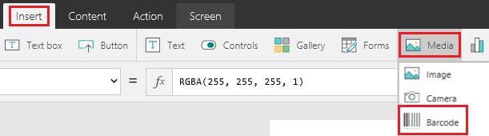
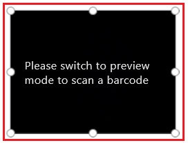
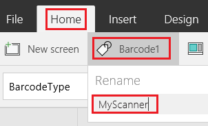
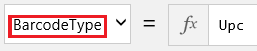
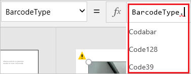
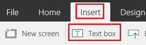
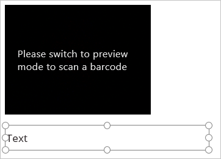
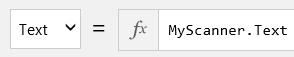
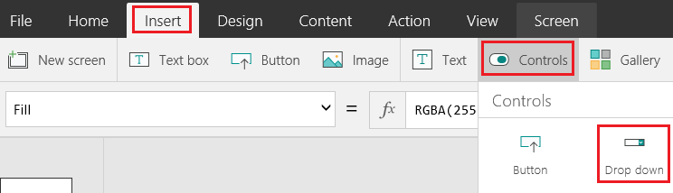
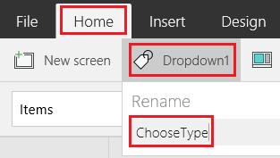

<properties
    pageTitle="Scan a barcode | Microsoft PowerApps"
    description="Scan a variety of barcode types, such as Codabar and UPC"
    services=""
    suite="powerapps"
    documentationCenter="na"
    authors="aftowen"
    manager="erikre"
    editor=""
    tags=""/>

<tags
   ms.service="powerapps"
   ms.devlang="na"
   ms.topic="article"
   ms.tgt_pltfrm="na"
   ms.workload="na"
   ms.date="08/26/2016"
   ms.author="anneta"/>

# Scan a barcode in Microsoft PowerApps #
Scan several types of barcodes by creating an app and running it on a device with a camera. The numerical equivalent of the barcode appears in a **Text box** control, and you can upload it to a variety of data sources.

## Create a blank app ##
1. [Sign up for PowerApps](signup-for-powerapps.md), and then do *either* of the following:

	- [Open PowerApps](https://create.powerapps.com/api/start) in a browser on a device that has a camera.
	- [Install PowerApps](http://aka.ms/powerappsinstall) from the Windows Store on a device that has a camera. Open PowerApps, sign in, and then click or tap **New** on the **File** menu (along the left edge).

1. Under **Create an app**, click or tap **Phone layout** in the **Blank app** tile.

	

1. If you haven't used PowerApps before, get familiar with key areas of the app by taking the intro tour (or click or tap **Skip**).

	

	**Note**: You can always take the tour later by clicking or tapping the question-mark icon near the upper-right corner and then clicking or tapping **Take the intro tour**.

## Add a Barcode control ##
1. On the **Insert** tab, click or tap **Media**, and then click or tap **Barcode**.

	

1. Ensure that the **Barcode** control is selected by confirming that a selection box (with handles to resize the control) surrounds it.

	

1. On the **Home** tab, click or tap **Barcode1**, and then type or paste **MyScanner** under **Rename**.

	**Tip**: The first **Barcode** control that you add is named **Barcode1** by default. If you delete that control and add another **Barcode** control, it will be named **Barcode2** by default. By manually renaming a control, you ensure that formulas will refer to the control by its correct name.

	

1. (optional) If you don't expect to scan a UPC barcode, change the type of barcode that you expect to scan.

	1. With **MyScanner** selected, ensure that the properties list shows **BarcodeType**.

		

	1. Click or tap in the formula bar, and then press Backspace three times to remove **UPC** but not the period.

		

	1. In the list of barcode types, click or tap the type of barcode that you expect to scan.

## Add a Text box ##
1. On the **Insert** tab, click or tap **Text box**.

	If the **Insert** tab doesn't appear, maximize your PowerApps window.

	

1. Drag the selection box (not the resize handles) around the **Text box** control down until it appears below **MyScanner**.

	

1. With the **Text box** control still selected, ensure that **Text** appears in the properties list, and then type or paste **MyScanner.Text** in the formula bar.

	

## Test the app ##
1. Open Preview mode by pressing F5 (or by clicking or tapping the play button near the upper-right corner).

	

1. Hold a barcode in front of the camera on the device until the numerical equivalent of the barcode appears in the **Text box** control.

## Change the barcode type ##
1. On the **Insert** tab, click or tap **Controls**, and then click or tap **Drop down**.

	

1. Move the **Drop down** control so that it appears below the other controls on the screen.

	

1. With the **Drop down** control still selected, ensure that the properties list shows **Items**, and then type or paste this string of text in the formula bar: 
	**[Codabar, Code128, Code39, Ean, I2of5, Upc]**

	

1. On the **Home** tab, rename the **Drop down** control to **ChooseType**.

	

1. Click or tap the **Barcode** control to select it, ensure that the properties list shows **BarcodeType**, and then type or paste this string of text in the formula bar: 
	**ChooseType.Selected.Value**
