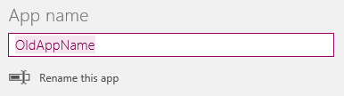
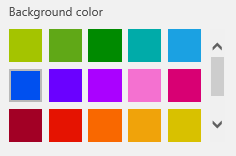
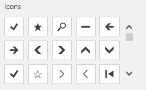

<properties
	pageTitle="Change app name and tile | Microsoft PowerApps"
	description="Step-by-step instructions for changing settings such the app name and icon"
	services=""
	suite="powerapps"
	documentationCenter="na"
	authors="AFTOwen"
	manager="erikre"
	editor=""
	tags=""/>

<tags
   ms.service="powerapps"
   ms.devlang="na"
   ms.topic="article"
   ms.tgt_pltfrm="na"
   ms.workload="na"
   ms.date="01/21/2015"
   ms.author="anneta"/>

# Change app name and icon in PowerApps #

Customize an app by changing its name and tile.

**Prerequisites**

1. [Create an app](quick-tour-other.md) in PowerApps, and then open it for editing.
1. On the **File** menu, select **App settings**.

## Rename an app ##

- Under **App name**, select **Rename this app**, and then type a different name.

	

## Change an app tile ##

Follow one or more of these steps:

- Select a different background color from the list of options.

	

- Select an icon from the list of default icons.

	

- Select **Browse file**, select the image that you want to use, and then select **Open**.

## Next step ##

On the **File** menu, select **Save** to republish your app with the new settings.
