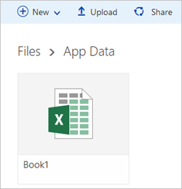
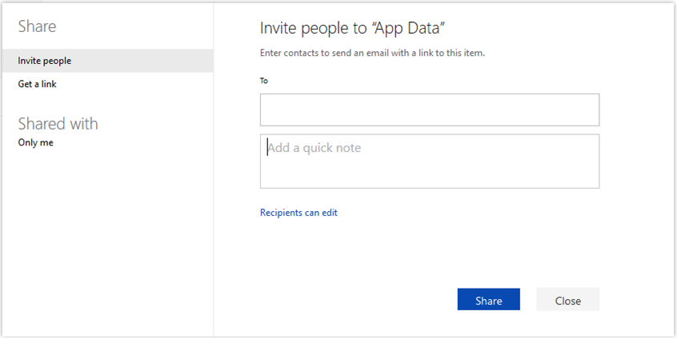
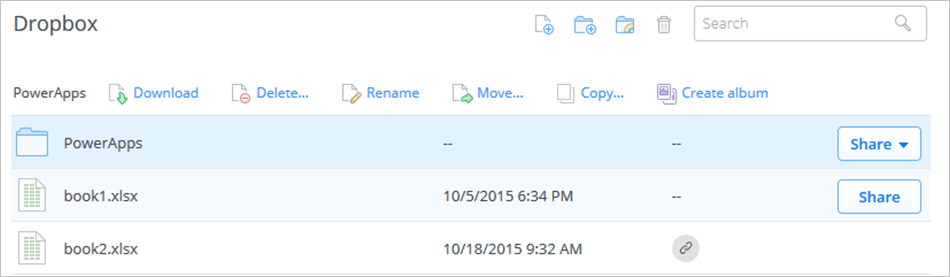
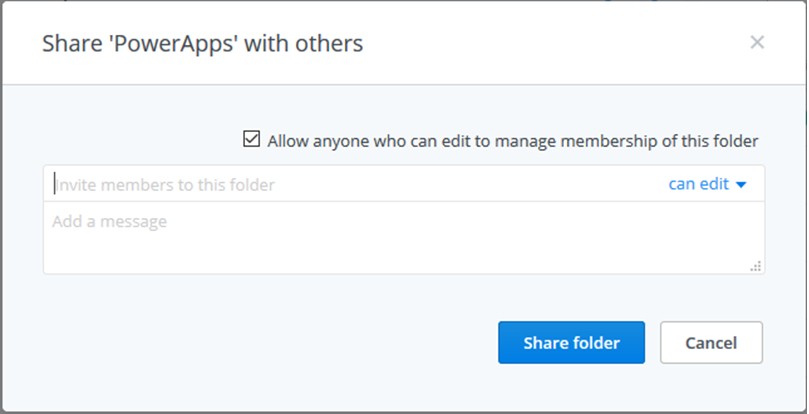
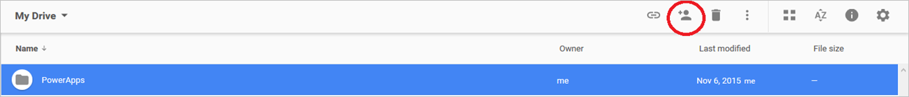
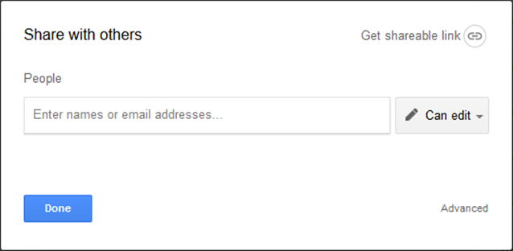

<properties
    pageTitle="Share files used by an app | Microsoft PowerApps"
    description="Before you share an app that relies on data in the cloud, share that data with the people you expect to run or even modify your app."
    services=""
    suite="powerapps"
    documentationCenter="na"
    authors="karthik-1"
    manager="dwrede"
    editor=""
    tags=""
 />
<tags
    ms.service="powerapps"
    ms.devlang="na"
    ms.topic="article"
    ms.tgt_pltfrm="na"
    ms.workload="na"
    ms.date="11/25/2015"
    ms.author="karthikb"/>

# Share data associated with an app #
Before you share an app that relies on data in the cloud, share that data with the people you expect to run or even modify your app. For example, you can share an app that's based on an Excel file in Dropbox, but the app won't run properly for anyone who doesn't have access to that file. Share data in Dropbox, OneDrive or Google Drive by following the steps in the appropriate section of this topic.

## Share data in OneDrive ##

1. Sign in to OneDrive by using the same credentials that you used to create the OneDrive connection in PowerApps.

1. Navigate to the folder that contains the Excel file that you used in your app.

	**Note**: If you want to share an app that you created by using a template, the "PowerApps" folder will be in your OneDrive account.

1. Select the folder that contains the file, and then select **Share**.

	

1. In the dialog box that appears, type the email address that your co-worker uses to sign in to OneDrive.

	

1. If your co-worker will add, modify, or delete data in your app, select **Can edit** in the list of permissions. Otherwise, select **Can view**.

1. Select **Share**.

[More info](https://support.office.com/en-us/article/Share-files-and-folders-and-change-permissions-9fcc2f7d-de0c-4cec-93b0-a82024800c07)

## Share data in Dropbox ##

1. Sign in to Dropbox by using the same credentials that you used to create the Dropbox connection in PowerApps.

1. Navigate to the folder that contains the Excel file that you used in your app.

	**Note**: If you want to share an app that you created by using a template, the "PowerApps" folder will be in your Dropbox account.

1. Select the folder that contains the file, and then select **Share**.

	

1. Select **Invite people to collaborate**.

1. In the dialog box that appears, type the email address that your co-worker uses to sign in to OneDrive.

	

1. If your co-worker will add, modify, or delete data in your app, select **can edit** in the list of permissions. Otherwise, select **can view**.

1. Select **Share folder**.

[More info](https://www.dropbox.com/en/help/19)

## Share data in Google Drive ##

1. Sign in to Google Drive by using the same credentials that you used to create the Google Drive connection in PowerApps.

1. Navigate to the folder that contains the Excel file that you used in your app.

	**Note**: If you want to share an app that you created by using a template, the "PowerApps" folder will be in your Google Drive account.

1. Select the folder, and then select the icon to share it.

	

1. In the dialog box that appears, type the email address that your co-worker uses to sign in to Google Drive.

	

1. If your co-worker will add, modify, or delete data in your app, select **Can edit** in the list of permissions. Otherwise, select **Can view**.

1. Select **Done**.

[More info](https://support.google.com/drive/answer/2494822?hl=en)
