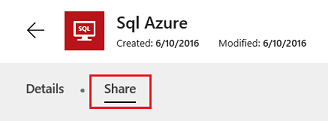

<properties
    pageTitle="Share resources used in your app | Microsoft PowerApps"
    description="Understand how resources used in your app are shared, when an app is shared"
    services=""
    suite="powerapps"
    documentationCenter="na"
    authors="archnair"
    manager="erikre"
    editor=""
    tags=""/>
<tags
    ms.service="powerapps"
    ms.devlang="na"
    ms.topic="article"
    ms.tgt_pltfrm="na"
    ms.workload="na"
    ms.date="06/28/2016"
    ms.author="archanan"/>

# Share app resources #
Before you [share an app](./share-app.md), consider the types of resources on which it relies, such as one or more of the following:

- a connection to a data source
- an on-premises data gateway
- a custom API
- an Excel workbook or other service
- a flow

Some of these resources are shared automatically when you share the app. Other resources require you or the people with whom you share the app to take extra steps so that the app works as you expect.

## Connections ##
Some types of connections, such as SQL Server, are shared automatically, but others require users to create their own connections to the data source or sources in the app.

On [powerapps.com](https://web.powerapps.com), you can determine whether a connection will be shared automatically, and you can update sharing permissions. In the left navigation bar, click or tap **Manage**, click or tap **Connections**, and then click or tap a connection. If the **Share** tab appears, the connection will be shared automatically.

  

## On-premises data gateways ##
Some on-premise connections aren't automatically shared, but the [on-premise data gateway](gateway-management.md) through which you made the connection is. Users of the app can then create their own connections through that gateway.

On [powerapps.com](https://web.powerapps.com), you can view connections created on any gateway that you created or for which you were given administrative permissions. In the left navigation bar, click or tap **Manage**, click or tap **Gateways**, and then click or tap a gateway.

## Custom APIs ##
When you share an app that uses a custom API, it is automatically shared, but users must create their own connections to it.

On [powerapps.com](https://web.powerapps.com), you can view or update permissions for a custom API. In the left navigation bar, click or tap **Manage**, click or tap **Connections**, and then click or tap **New connection** (in the upper-right corner). Click or tap **Custom**, and then click or tap a custom API to display details about it.

## Excel workbooks ##
If a shared app uses data to which not all users have access (such as an Excel workbook in a cloud-storage account), [share the data](share-app-data.md).

## Flows ##
If you share an app that includes a flow, users who run the app will be prompted to confirm or update any connections on which the flow relies. In addition, only the person who created the flow can customize its parameters. For example, you can create a flow that sends mail to an address that you specify, but other users can’t change that address.
