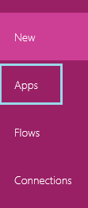
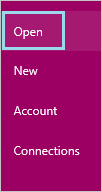
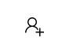
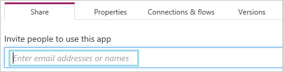
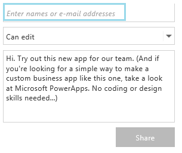

<properties
    pageTitle="PowerApps: Share an app"
    description=""
    services=""
    suite="powerapps"
    documentationCenter="na"
    authors="AFTOwen"
    manager="dwrede"
    editor=""
    tags=""
 />
<tags
    ms.service="powerapps"
    ms.devlang="na"
    ms.topic="article"
    ms.tgt_pltfrm="na"
    ms.workload="na"
    ms.date="11/11/2015"
    ms.author="anneta"/>

# Share an app #
Share your app with co-workers or other users by giving them permission either to just run the app or to not only run it but also to customize it and then share their own versions.

Share an app with multiple co-workers at the same time or with a group in Active Directory. If you share an app with a group, everyone in that group will have the permissions that you assign to it. If users are added to or deleted from the group, they will gain and lose permissions accordingly.

You can also watch a [video](http://pwrappssamples.blob.core.windows.net/samples/SharingAnApp.mp4) that shows how to share a PowerApp.

## Prerequisites ##
- An account with which you've signed in to [powerapps.com]() or PowerApps.
- Either of the following:
	- An app that you built (from a [template](get-started-test-drive.md), from [data](get-started-create-from-data.md), or from [scratch](get-started-create-from-blank.md)).
	- An app that someone else built and given you permission to run, customize, and share.

## Share an app ##
1. Do either of the following:
	- In [powerapps.com](), select **Apps** near the left edge of the screen.

	

	- In PowerApps, select **Open** near the left edge of the screen.

	

1. Select the share icon for the app that you want to share.

	

1. In the dialog box that appears, type the first few letters of your co-worker’s name or email address, and then select the person you want in the list that appears.

	On **powerapps.com**

	

	In **PowerApps**

	

1. In the list of permission types, select **Can view** to allow the user to just run the app, or select **Can edit** to allow the user to run your app, customize it, and share a new version of your app.

	On **powerapps.com**

	

	In **PowerApps**

	

1. Select **Save** on powerapps.com or **Share** in PowerApps to send a message that notifies the user or users you've specified of your shared app.

	The message contains a link that a user can select to access the app. Any users who don't have PowerApps (or aren’t signed up to use it) are prompted to install it and sign up for it.

## Change or remove permission ##
- Change a user's or a group’s permission for a shared app by selecting the other option in the list of permissions next to the appropriate name.
- Remove a user's or a group's permission for a shared app by selecting the **X** next to the appropriate name.
