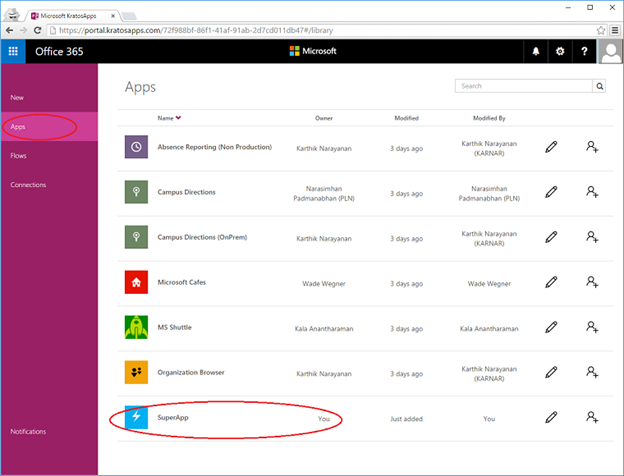
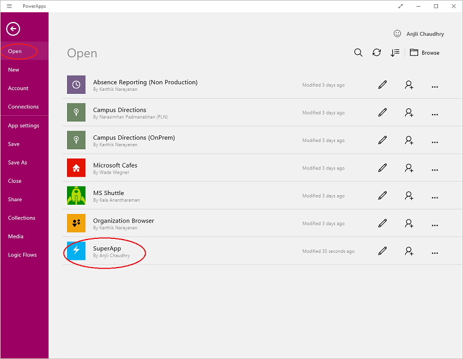
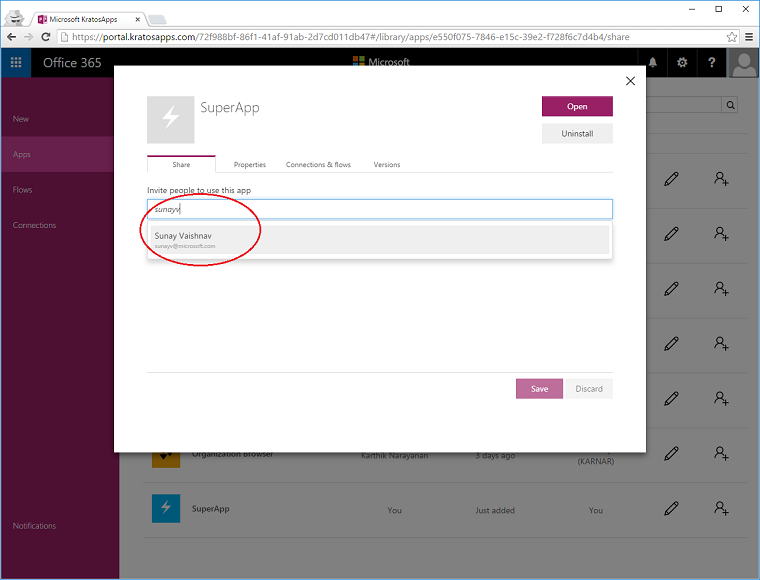
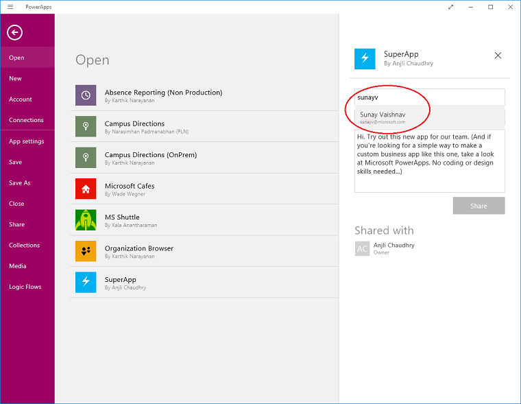
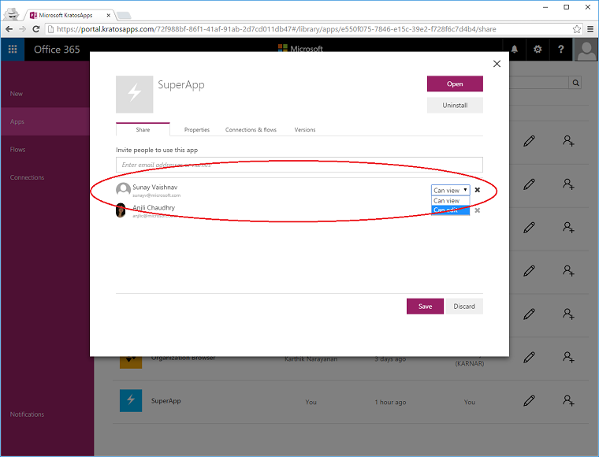
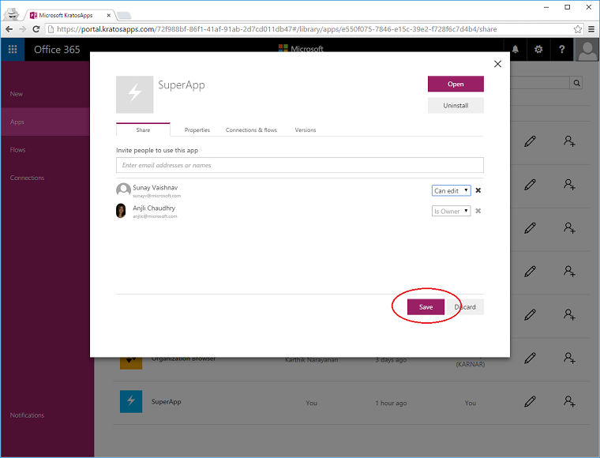
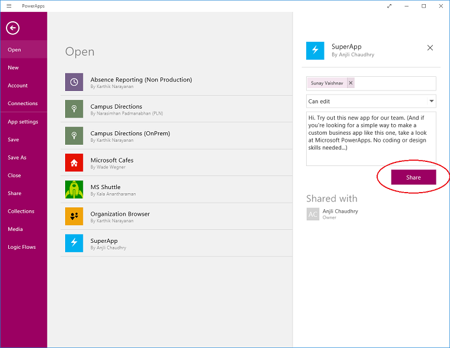
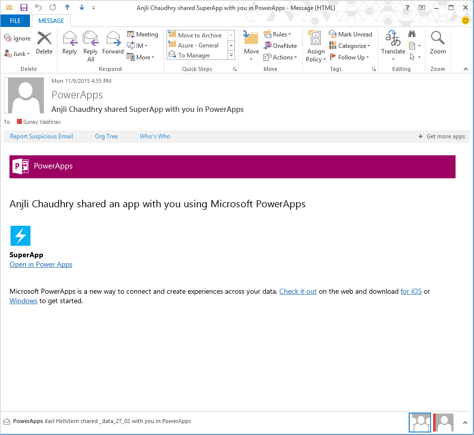
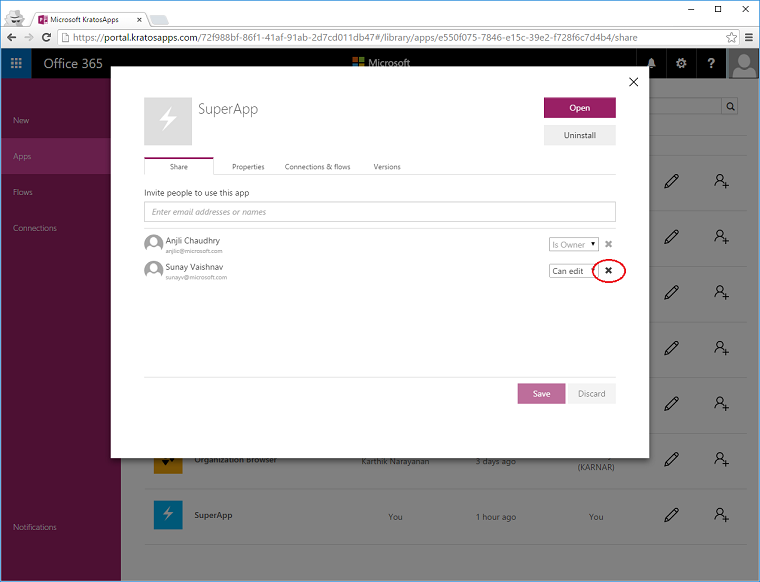

<properties
    pageTitle="PowerApps: Share an app"
    description=""
    services="powerapps"
    documentationCenter="na"
    authors="AFTOwen"
    manager="dwrede"
    editor=""
    tags=""
 />
<tags
    ms.service="powerapps"
    ms.devlang="na"
    ms.topic="article"
    ms.tgt_pltfrm="na"
    ms.workload="na"
    ms.date="11/02/2015"
    ms.author="anneta"/>

# Share an app#
You can share your app with co-workers so that they can use your app too! If you share an app with ‘view’ permissions, your co-worker may use the app; and if you share an app with ‘edit’ permissions, your co-worker may edit the app to make improvements to it and share the app with others.

**Prerequisites**
- PowerApps on iOS or Windows device
- An app that you have built from data or a template. For more information on how to build an app, look [here]().

You may share an app from

## Share an app from the web and from PowerApps ##
1. Sign into your account on [powerapps.com]() or on PowerApps.

1. Navigate to an app that you’ve built.

	On the **web**:

	Click on the Apps tab in the navigation menu and select an app that you have built.

	

	In **PowerApps**:

	Click on the Open tab in the navigation menu and select an app that you have built.

	

1. Click on the share icon of the app that you want to share with your co-worker.

	

1. In the Share dialog, start to type your co-worker’s name or email, and select the appropriate person from the list.

	On the **web**, a pop-up will appear:

	

	In **PowerApps**:

	

1. If you’d like your co-worker to use the app but not edit it, share the app with ‘Can View’ permissions.

	If you’d like your co-worker to help make changes to the app, share the app with ‘Can Edit’ permissions. Co-workers who have ‘Can Edit’ permissions on your app will be able to share it on further with other co-workers.

	On the **web**, permissions can be selected next to your co-worker’s name:

	

	Make sure to click on ‘Save’ to share the app with your co-worker.

	

	In PowerApps, permissions can be selected right below your co-worker’s name:

	

	Make sure to click on Share to share the app with your co-worker.

	

1.	Your co-worker will now get an email indicating that an app was shared by you. All your co-worker has to do is to click the link in the email to access the app. If your co-worker doesn’t have PowerApps or isn’t signed up to use it, he/she will be taken through the process to download PowerApps and sign up for it.

	

1.	You may share an app with multiple co-workers at the same time, or with an AD group. When you share an app with an AD group, the permissions that you assign to the group will apply to all the users in the AD group. If a user is added to the AD group, he/she will be able to access the app with the assigned permissions. If a user is deleted from the AD group, he/she will no longer have access to the app.

1. You may revoke a user’s access to the app by clicking on the ‘X’ next to his/her name in the Share dialog on the web.

	
