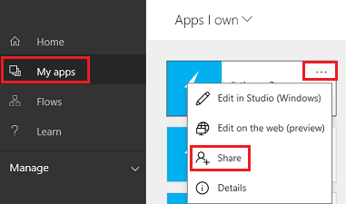
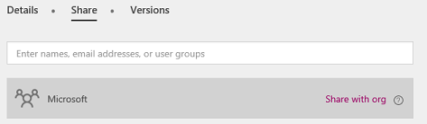
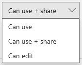
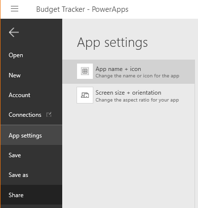
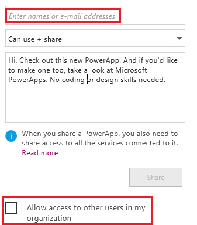
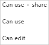

<properties
    pageTitle="Share an app in PowerApps | Microsoft PowerApps"
    description="Share your app by giving other users permission to run or modify it"
    services=""
    suite="powerapps"
    documentationCenter="na"
    authors="AFTOwen"
    manager="anneta"
    editor=""
    tags=""/>
<tags
    ms.service="powerapps"
    ms.devlang="na"
    ms.topic="article"
    ms.tgt_pltfrm="na"
    ms.workload="na"
    ms.date="10/07/2016"
    ms.author="ricksal;anneta"/>

# Share an app #

[AZURE.VIDEO nb:cid:UUID:7c4368ab-58a7-4930-9df3-6ba255e2b593]

Share an app that you created (or that someone shared with you) from PowerApps or [powerapps.com](https://web.powerapps.com). Specify who can run the app, edit it, share it again, or all three.

When you share an app, specify the names of one or more users or groups in Azure Active Directory, or specify that you want to share the app with your entire organization. Then specify one of these permission levels:

- **Can use**: Users or groups can run the app but not share it.
- **Can use and share**: Users or groups can run and share the app.
- **Can edit**: Users or groups can run the app, customize it, and share the customized version.

When you share an app, a message notifies the user or users that you specified and contains a link with which they can access the app. If appropriate, users are prompted to sign up for and install PowerApps.

## TBD UPDATE this topic

## Before you share an app ##
Consider these points:

- If you share an app with your entire organization, all users can run the app. Users can share and edit the app only if they're members of a group that has those permissions or you've explicitly granted those users more permissions.
- If you share an app with a group, existing members of that group and anyone who joins it have the permissions that you specify. Anyone who leaves the group loses those permissions unless they're members of a different group that has access or you specify permissions for them explicitly.
- Every member of a group has at least as many permissions for an app as the overall group. However, you can specify greater permissions for one or more members of that group to allow them greater access. If you specify fewer permissions to one or more members of a group, they'll still have all the permissions that you've granted to the overall group.
- Most apps rely on at least one of these types of resources:

	- a connection to a data source
	- an on-premises data gateway
	- a custom API
	- an Excel workbook or other service
	- a flow

For more information, see [Share app resources](share-app-resources.md).

**Prerequisites**

[Sign up](signup-for-powerapps.md) for PowerApps, and then do either of the following:

- [Sign in to powerapps.com](https://web.powerapps.com).
- [Install PowerApps](http://aka.ms/powerappsinstall), open it, and then sign in by providing the same credentials that you used to sign up.

## Share an app from powerapps.com
1.  In the left navigation bar, click or tap **My apps**, click or tap the ellipsis for the app that you want to share, and then click or tap **Share**.

	

1. Specify the users, groups, or both with whom you want to share the app, or click or tap the link to share the app with your organization.

	

1. Specify the level of permissions, and then click or tap **Save**.

	

To change permissions for a user or a group, repeat step 1 of this procedure, and then specify a different option in the list of permissions for that user or group. To remove all permissions for a user or group, click or tap the **x** icon for that user or group.

## Share an app in PowerApps ##
1. In the **File** menu (near the left edge of the screen), click or tap **Open**, and then click or tap the share icon for the app that you want to share.

	

1. Specify the users, groups, or both with whom you want to share the app, or select the check box to share the app with your organization.

	

1. Specify the level of permissions, and then click or tap **Share**.

	

**Note**: To change or remove permissions for a user or a group, repeat step 1 of this procedure, click or tap the user or group, and then specify a different option in the list of permissions.
