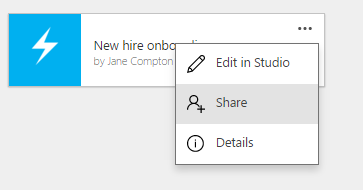

<properties
    pageTitle="Share an app in PowerApps | Microsoft PowerApps"
    description="Share your app by giving other users permission to run or modify it"
    services=""
    suite="powerapps"
    documentationCenter="na"
    authors="jamesol-msft"
    manager="erikre"
    editor=""
    tags=""/>
<tags
    ms.service="powerapps"
    ms.devlang="na"
    ms.topic="article"
    ms.tgt_pltfrm="na"
    ms.workload="na"
    ms.date="05/18/2016"
    ms.author="jamesol"/>

# Share an app #

[AZURE.VIDEO nb:cid:UUID:7c4368ab-58a7-4930-9df3-6ba255e2b593]

You created an app, and now you're ready to share it with your coworkers. You can give other users permission to run the app, customize the app, and then they can share their own version of the app. You can share an app with:

- Multiple co-workers at the same time
- A group in Azure Active Directory (AAD)
- All users within your organization

If you share an app with a group, *everyone* in that group has the permissions that you assign to the group. If users are added or deleted from the group, they gain and lose permissions accordingly.

If you share an app with your organization, *everyone* in your organization has the permission to run the app (default behavior). They can't change or update the app.

**Note**: Before you share an app, make sure that the people with whom you're sharing it have access to the data. For example, if your app uses an Excel file, you must also [share the Excel or other file](share-app-data.md) in a cloud-storage account.

If you embed a flow within an app and then share the app with others, they’ll need to confirm or update any connections on which the flow relies. In addition, other users can’t customize the flow’s parameters. For example, a flow can send email to your address when an action occurs, but other users can’t change that address to their own.

## What you need to get started

- An account that you've signed in to [powerapps.com][2] or PowerApps.
- Either of the following:
	- An app that you built from a [template](get-started-test-drive.md), from [data](get-started-create-from-data.md), or from [scratch](get-started-create-from-blank.md).
	- An app that someone else built and has given you permission to run, customize, and share.

## Share an app

#### powerapps.com

1. On [powerapps.com][1], select **My apps** in the left navigation bar:  

1. Select the ellipsis on tile of the app that you want to share, and click **Share**  

1. Type in your co-worker or group's work name or email address, and then select the person you want from the list. Remember, you can share this app with a co-worker or work group.

	In the list of permission types, choose from the following:  

	- **Can use**: Allow the user or group members to run the app. User are not able to share your app with other users or groups.  
	- **Can use and share**: Allow the user or group members to run your app and share your app.  
	- **Can edit**: Allow the user or group members to run your app, customize it, and share a new version of your app.  

	

1. To share this app with all users within your organization, select **Allow access to others users in my organization**.

1. Select **Save**. A message is sent that notifies the user or users you entered of your shared app.

	The message contains a link for the user to access the app. Any users who don't have PowerApps (or aren’t signed up to use it) are prompted to install it, and then sign up for it.

#### PowerApps
1. In PowerApps, go to the **File** menu (near the left edge of the screen), then select **Open**:  

	

2. Select the share icon for the app that you want to share:  

3. Type in your co-worker or groups work name or email address, and then select the person you want from the list. Remember, you can share this app with a co-worker or work group.

	In the list of permission types:

	- **Can use**: Allow the user or group members to run the app. User are not able to share your app with other users or groups.  
	- **Can use and share**: Allow the user or group members to run your app and share your app.  
	- **Can edit**: Allow the user or group members to run your app, customize it, and share a new version of your app.  

    

4. Select **Share**. A message is sent that notifies the user or users you entered of your shared app.

	The message contains a link for the user to access the app. Any users who don't have PowerApps (or aren’t signed up to use it) are prompted to install it, and then sign up for it.

5. To share this app with all users within your organization, select **Allow access to others users in my organization**.

	

[AZURE.NOTE] If a user is given multiple permission types, the permission with the highest access is used. For example, Nancy is a member of GroupA and GroupB. GroupA is given *Can use* permissions, and GroupB is given *Can edit* permissions. In this scenario, Nancy has *Can edit* permission because it has the highest access.

## Change or remove permission

#### powerapps.com

1. On [powerapps.com][1], select **My apps** in the left navigation bar.  

2. Select the ellipsis on tile of the app that you want to modify, and click **Share**.  

3. Select a different permission from the drop-down list. Or select the **x** icon to delete a user, group, or your organization's permission.  

4. Select **Save**.

#### PowerApps

1. In PowerApps, go to the **File** menu (near the left edge of the screen), then select **Open**.
2. Select the share icon for the app.
3. Under **Shared with**, select a user's name to see the options for changing or removing permissions. You can also select **My org** under **Shared with**, and then select **Delete** to stop sharing this app with all users in your organization.

## Resources

Here are some other good resources for managing your apps:

[Change app name and tile](set-name-tile.md)  
[Delete an app](delete-app.md)  
[Restore an app to a previous version](restore-an-app.md)

<!--Reference links in article-->
[1]: http://go.microsoft.com/fwlink/p/?LinkId=715583
[2]: http://go.microsoft.com/fwlink/p/?LinkId=708209
