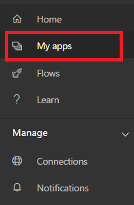
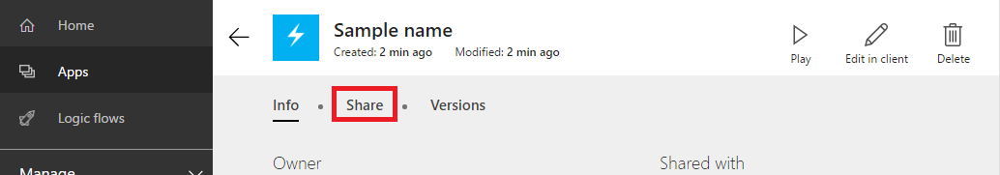
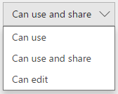
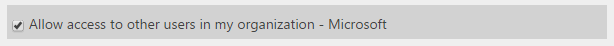
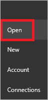
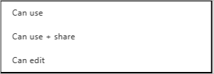
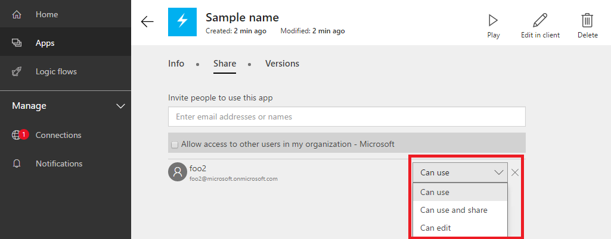

<properties
    pageTitle="Share an app in PowerApps | Microsoft PowerApps"
    description="Share your app by giving other users permission to run or modify it"
    services=""
    suite="powerapps"
    documentationCenter="na"
    authors="jamesol-msft"
    manager="erikre"
    editor=""
    tags=""/>
<tags
    ms.service="powerapps"
    ms.devlang="na"
    ms.topic="article"
    ms.tgt_pltfrm="na"
    ms.workload="na"
    ms.date="04/20/2016"
    ms.author="jamesol"/>

# Share an app #
[AZURE.VIDEO nb:cid:UUID:4a51313a-0d00-80c4-1ead-f1e5920c334e]

[[[Replace with Linh's video when ready]]]

You created an app, and now you're ready to share it with your coworkers. You can give other users permission to run the app, customize the app, and then they can share their own version of the app. You can share an app with:

- Individual co-workers or multiple co-workers within your organization
- A group or multiple groups within your organization
- All users within your organization

If you share an app with a group, *everyone* in that group has the permissions that you assign to the group. If users are added or deleted from the group, then these users gain and lose permissions accordingly.

If you share an app with your organization, *everyone* in your organization has the permission to run the app (default behavior). They cannot change or update the app.

> [AZURE.NOTE] Before you share an app, make sure that the users with whom you're sharing it have access to the data. For example, if your app shows data from an Excel file, you must [share the Excel file](share-app-data.md) in a cloud-storage account.

## What you need to get started

- The account you used to sign-in to the [PowerApps portal][1] or PowerApps.
- An app, either of the following:
	- An app that you built from a [template](get-started-test-drive.md), from [data](get-started-create-from-data.md), or from [scratch](get-started-create-from-blank.md).
	- An app that someone else create and gave you permission to run, customize, and share.

## Share an app##

#### PowerApps portal

1. In the [PowerApps portal][1], select **Apps** in the left navigation bar:  

	

1. Select the tile of the app that you want to share.

1. Select the **Share** tab:  

	

1. Type in your co-worker or group's work name or email address, and then select the person you want from the list. Remember, you can share this app with a co-worker or a work group.

  In the list of permission types, choose from the following:  

    
  - **Can use**: Allow the user or group members to run the app. User are not able to share your app with other users or groups.
  - **Can use and share**: Allow the user or group members to run your app and share your app.
  - **Can edit**: Allow the user or group members to run your app, customize it, and share a new version of your app.  

1. To share this app with all users within your organization, select **Allow access to others users in my organization**:  

1. Select **Save**. A message is sent that notifies the user or users you entered of your shared app.

	The message contains a link for the user to access the app. Any users who don't have PowerApps (or aren’t signed up to use it) are prompted to install it, and then sign up for it.

#### PowerApps
1. In PowerApps, go to the **File** menu (near the left edge of the screen), then select **Open**:  

 

1. Select the share icon for the app that you want to share:  
	

1. Type in your co-worker or groups work name or email address, and then select the person you want from the list. Remember, you can share this app with a co-worker or work group.

  In the list of permission types:
  - **Can use**: Allow the user or group members to run the app. User are not able to share your app with other users or groups.
  - **Can use and share**: Allow the user or group members to run your app and share your app.
  - **Can edit**: Allow the user or group members to run your app, customize it, and share a new version of your app.

	 

1. Select **Share**. A message is sent that notifies the user or users you entered of your shared app.

	The message contains a link for the user to access the app. Any users who don't have PowerApps (or aren’t signed up to use it) are prompted to install it, and then sign up for it.

1. To share this app with all users within your organization, select **Allow access to others users in my organization**:  

    

## Change or remove permission ##

#### PowerApps portal

1. On the [PowreApps portal][1], select **Apps** in the left navigation bar:  

  

1. Select the tile of the app that you want to modify.
1. Select the **Share** tab:  

  

1. Select a different permission from the drop-down list. Or select the **x** icon to delete a user, group, or your organization's permission:  

  

1. Select **Save**.

#### PowerApps

1. In PowerApps, go to the **File** menu (near the left edge of the screen), then select **Open**.
1. Select the share icon for the app.
2. Under **Shared with**, select a user's name to see the options for changing or removing permissions. You can also select **My org** under **Shared with**, and then select **Delete** to stop sharing this app with all users in your organization.

<!--Reference links in article-->
[1]: http://go.microsoft.com/fwlink/p/?LinkId=715583
