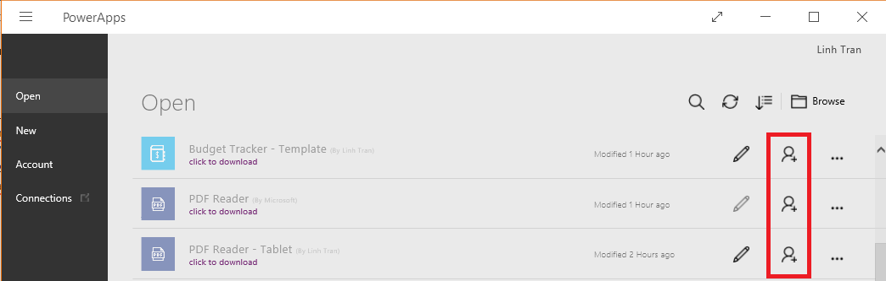

<properties
    pageTitle="Share an app in PowerApps | Microsoft PowerApps"
    description="Share your app by giving other users permission to run or modify it"
    services=""
    suite="powerapps"
    documentationCenter="na"
    authors="linhtranms"
    manager="anneta"
    editor=""
    tags=""/>
<tags
    ms.service="powerapps"
    ms.devlang="na"
    ms.topic="article"
    ms.tgt_pltfrm="na"
    ms.workload="na"
    ms.date="10/28/2016"
    ms.author="litran;ricksal;anneta"/>

# Share an app #

It’s great to build apps that address your own business needs, but the real magic of PowerApps comes from sharing those apps with others. In this topic you will learn how to share an apps with specific users or security groups, or you can share it with your entire organization.

### How to get to share app screen ###
You can get to the sharing screen from powerapps.com or PowerApps Studio. We no longer support sharing app from PowerApps mobile.

**From PowerApps Studio** once you click share, it will link to [powerapps.com] sharing page. We no longer support an in-place sharing experience in PowerApps Studio.
  - Option 1 - Click or tap **File** > **Share**

      
  - Option 2 - Click on **Open** > the ellipsis (...) on each app in the list of apps

      

**From [powerapps.com](http://web.powerapps.com)**
  - Click or tap **Apps** on the left navigation, then the ellipsis (...), then **Share**

      

### Share app ###
From here, you can share an app by following these steps.

1. Specify the names of one or more users or security groups in Azure Active Directory, or specify that you want to share the app with your entire organization. Note you can only share with **User** permission when sharing to your entire organization.

	

2. Specify the level of permissions
  - **User**: Users or groups can run the app but not share it.
  - **Contributor**: Users or groups can run the app, customize it, and share the customized version further to other users.

    

3. Click or tap **Save**.

To change permissions for a user or a group, repeat step 1 of this procedure, and then specify a different option in the list of permissions for that user or group. To remove all permissions for a user or group, click or tap the **x** icon for that user or group.

#### Sending email notification when sharing app ####

When you share an app, you can select whether or not to notify users or security group via email. If you choose this option, an email will be sent to notify the user or users or security groups. The email contains a link with which they can access the app. If appropriate, users are prompted to sign up for and install PowerApps.

Please note that different email templates are sent depending on the permission you decide to share the app with. When sharing the app with **User** permission, the email contains the link to run the app. When sharing the app with **Contributor** permission, the email contains the link to edit the app in PowerApps Studio or to run the app.

### How do my users see the app I shared? ###
After you share an app with one or more users or security groups, how they can see the app depends on the permission you shared the app with.

##### If you shared app with *User* permission #####
The people you shared the app with will receive an email notification if you selected that checkbox in the app sharing screen. In the email, there is a link they can click to run the app on [Dynamics 365](http://home.dynamics.com). Soon we will support universal link, which means if you have PowerApps Studio or PowerApps mobile installed, the app will be opened in PowerApps Studio or PowerApps mobile.

Another way can they discover the app, for example if you didn't choose to send an email, is via AppSource on [Dynamics 365](http://home.dynamics.com). [Read more](app-source.md) on how to users can get app via AppSource.

##### If you shared app with *Contributor* permission #####
The people you shared the app with will receive an email notification if you selected that checkbox in the app sharing screen. In the email, there is a link they can open the app directly for editing using PowerApps Studio for the web. There is also a link to click to run the app on [Dynamics 365](http://home.dynamics.com). Soon we will support universal link, which means if you have PowerApps Studio or PowerApps mobile installed, the app will be opened in PowerApps Studio or PowerApps mobile.

Another way can they discover the app, for example if you didn't choose to send an email, is via [powerapps.com](http://web.powerapps.com). This is the home for all the creators to browse through all the apps they created or have been shared with them with **Contributor** permission while [Dynamics 365](http://home.dynamics.com) the home for consumers to run their PowerApps or other business apps quickly.

### Other things to know when sharing an app ###
  - To share an app, the app must be saved to the cloud (as we did earlier), not locally.
  - Before you share an app, consider which users and security groups you’re going to share it with and what role you want each to have—user or contributor. If you share an app with a group, existing members of that group and anyone who joins it have the permissions that you specify. Anyone who leaves the group loses those permissions unless they're members of a different group that has access or you specify permissions for them explicitly.
  - Every member of a group has the permissions for an app as the overall group. However, you can specify greater permissions for one or more members of that group to allow them greater access. For example, you can share an app with security group A with User permission. Every member of security group A can run the app. Now you share the app with user B, who is part of security group A, with Contributor permission. User B now can edit the app while everyone else in security group B can only use the app. If you specify fewer permissions to one or more members of a group, they'll still have all the permissions that you've granted to the overall group.
  - You can share an app with your entire organization, but think carefully about whether everyone needs access to your app.
  - Be aware that any changes you make to a shared app will flow through to the people you shared it with as soon as you save the changes. This can be great if you improve the app, but can also impact others if you remove or significantly change features.
  - Before you share an app, give it a meaningful name and description, so people know what your app is about and can easily pick it out from a list. In PowerApps Studio, click or tap File, then enter a description.

  

### App sharing and the resources the app uses ###
Most apps rely on at least one of these types of resources:
- a connection to a data source
- an on-premises data gateway
- a custom API
- an Excel workbook or other service
- a flow

Users and contributors need permissions to any data connections and gateways that the app uses. Some permissions come along implicitly with the app, but others must be explicitly granted. For more information, see [Share app resources](share-app-resources.md).

When you share an app that uses Common Data Service, notice the information bar indicating that you must share the runtime permission to the Common Data Service separately. If you don’t have permission to do this, please talk to your environment admin. [Read more](security-model.md) on Common Data Service security model.

### What is not supported in sharing app? ###
  - Sharing to distribution groups is not supported (sharing to security groups is supported).
  - You can only share apps with users in your organization. Cross tenants sharing is not yet supported.
  - In-place sharing from PowerApps Studio. Sharing in PowerApps Studio links directly to [powerapps.com](http://web.powerapps.com)
  - Re-share is not supported if you share an app with User permission. Re-share is only supported if you share an app with Contributor permission.
