<properties
	pageTitle="Create relationships between SharePoint lists via lookup field | Microsoft PowerApps"
	description="Create relationships between SharePoint lists by using lookup fields."
	services="powerapps"
	documentationCenter="na"
	authors="RickSaling"
	manager="anneta"
	editor=""
	tags=""/>

<tags
   ms.service="powerapps"
   ms.devlang="na"
   ms.topic="article"
   ms.tgt_pltfrm="na"
   ms.workload="na"
   ms.date="12/28/2016"
   ms.author="ricksal"/>

# How to link SharePoint lists with lookup fields

This tutorial shows how lookup fields can connect two SharePoint lists.

SharePoint provides three types of lookup fields:

* **Choice**: a small list of items that you choose from;
* **Lookup**: links to another list, for example an *Orders* list may have a lookup field that links to a *Customer* list;
* **Person or group**: links to a special kind of list, the people or groups associated with your SharePoint server.

In this tutorial, you build an app that uses all three kinds of lookup fields. You can also  enable lookups using more than one field.

## What do you use lookup fields for?

Data in an enterprise is large and complex. Data in one SharePoint list often relates to data in another list. Lookup fields are the primary way such business data comes together.

For example, you might have a **Customers** list and an **Orders** list. The **Orders** list might have a lookup relation to the **Customers** list to show which customer placed the order. You can use the lookup field in the **Orders** list to show data from the **Customers** list for the customer who placed the order. You can use a lookup field to connect the **Orders** list to a **Product** list, and bring in all the information needed about the product ordered, such as product pictures, specifications, manufacturer details, etc.

## Create the lists in SharePoint

### The schema used in this example

In this tutorial, you link two SharePoint custom lists together, **Assets** and **RepairShop**.

The **Assets** list is used to track hardware equipment in a team. Since hardware gets broken from time to time, we use the **RepairShop** list to track the local shops which can fix it.

The **Assets** list has a lookup field pointing to a **RepairShop**. You must first create the **RepairShop** list so that each row in the **Assets** list has something to point to. You use the *ContactEmail* field to identify the shop, and you may wish to define other fields as well.

Next you create the **Assets** list. You define three lookup columns in **Assets**:
* one of type *lookup* and which points to an email address in the **RepairShop** list.
* one called *AssetType*, of type *choice*, in which you populate the choice values when you define the column;
* one called *CurrentOwner*, of type *Person or Group*.

You most likely would define additional columns, depending on the information you need to track.

The schema looks something like this:

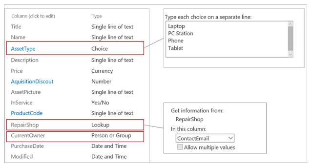

### Populate the RepairShop list with data

On your SharePoint site, enter sample data into the **RepairShop** list. That way, when you create **Assets** data, **RepairShop** entries are available to fill into the *Assets.RepairShop* lookup field.

## Create an app from the main list
Now you create an app that uses these lists.

1. Open PowerApps Studio.

	(New to PowerApps? [Sign up for free](https://powerapps.microsoft.com) using your organizational email address and follow the instructions to download PowerApps Studio from the Windows store)

2. In PowerApps Studio, click or tap New --> ”SharePoint”
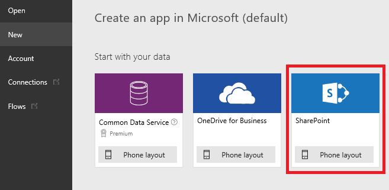

3. Choose your SharePoint site from the **Recent sites** list or enter your site's url directly into the text box. Click or tap **GO**.
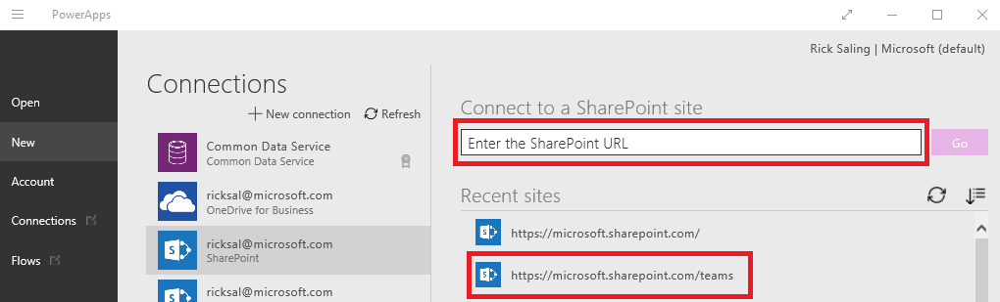

4. Choose the main list from your SharePoint site, in this example, **Assets**. Click or tap the **Connect** button in the lower right.
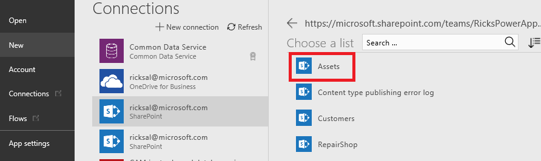

## Add data to your main list
Now that the app is generated, let’s run the app and see how the view details screen looks for the three lookup fields.

1. Click or tap F5 or the "run triangle" on the upper right of the PowerApps Studio tool bar.

2. Enter an *AssetName*.

3. Click or tap the **AssetType** dropdown arrow. The values displayed are those you entered when you created this column. Choose one of the entries.
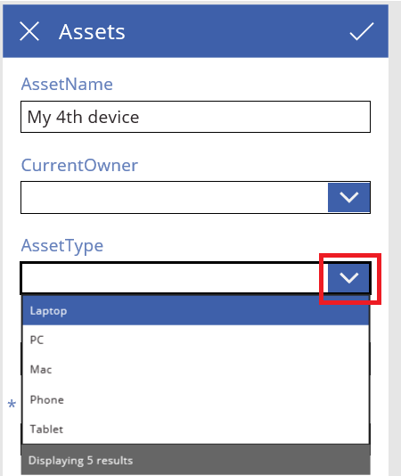

4. Click or tap the **RepairShop** dropdown arrow. Choose one of the entries.
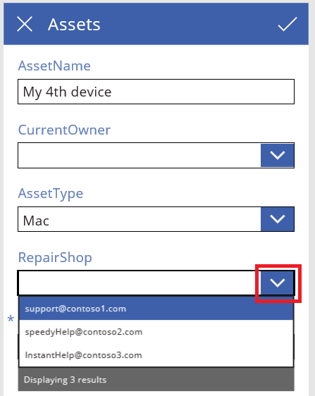

5. Click or tap the **CurrentOwner** dropdown arrow. Choose one of the entries or enter someone directly.
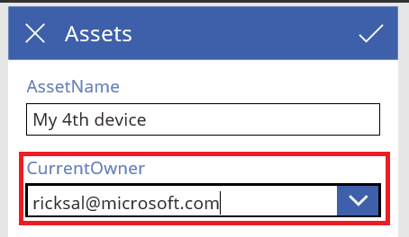

6. Enter a **Title** and click the check mark in the upper right corner of the app.

7. You can repeat this procedure to enter as many items in your list as you want.

8. Press *escape* to return to the Studio designer. To save your app, press **File** and **Save as**.

[!INCLUDE [testing-requirements](../includes/testing-requirements.md)]

<!--
[AZURE.INCLUDE]
-->

## Multiple fields in Lookups

PowerApps supports using multiple fields from your lookup data source.

For example, let’s assume your data source contains a lookup field to your employee list, and in your company there are multiple people with the same first and last name.  So that users of your app can properly distinguish between “Anne Smith” from accounting and “Anne Smith” from engineering you can configure your lookup to show more than one field.

Multiple field support is available for both SharePoint and the Microsoft Common Data Model today, with more connector support on the way.

The existing app allows you to look up **CurrentOwner** by email address. Lets change it to allow you to look up the owner by *DisplayName* and *Department*.

1. In the PowerApps Studio, click or tap **Open**, find your app in the list, and click or tap the edit icon.
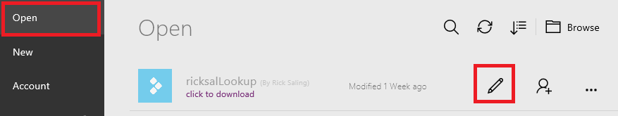

2. Click or tap on the **EditScreen** in the left panel.
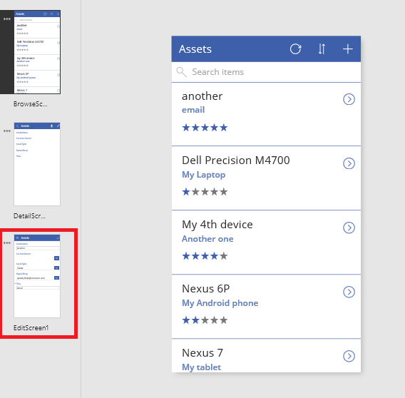

3. Click or tap the **CurrentOwner** field, then click or tap **Advanced**, and finally click or tap **Unlock to change properties**.

4. Change **Value1** to *DisplayName*.
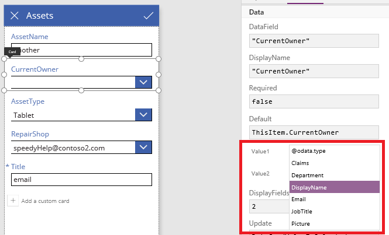

5. Change **Value2** to *Department*.

6. Now run the app, and start typing a name into the **CurrentOwner** text box. Names and departments appear in the dropdown list as you type, enabling you to use both fields to choose.
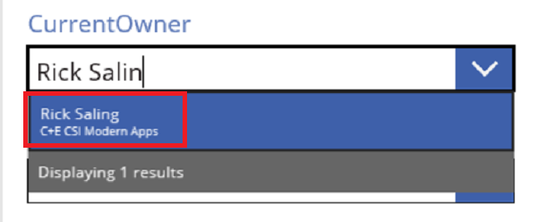

[!INCLUDE [testing-requirements](../includes/testing-requirements.md)]
<!--
[AZURE.INCLUDE]
-->

## For more information ##
- [Introducing support for lookups and a new sample app](https://powerapps.microsoft.com/en-us/blog/support-for-lookups/)
- [Performance, Refresh button, ForAll, and multiple field lookups](https://powerapps.microsoft.com/en-us/blog/performance-refresh-forall-multiple-field-lookups-531/)
- [Generate an app by using a Common Data Service database](data-platform-create-app.md)
- [Create an app from scratch using a Common Data Service database](data-platform-create-app-scratch.md)
