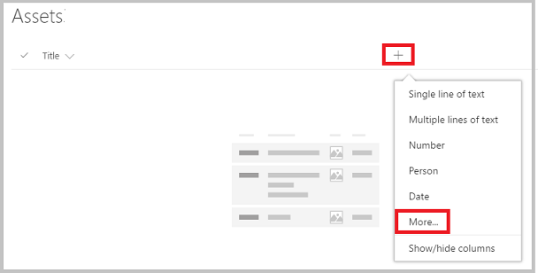
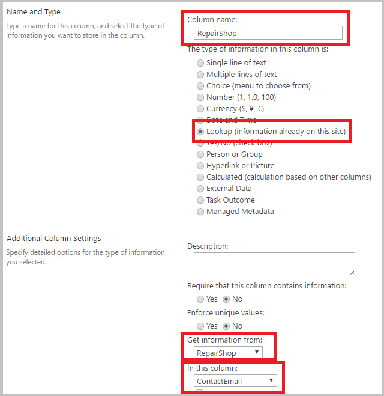

<properties
	pageTitle="Create relationships between SharePoint lists via lookup field | Microsoft PowerApps"
	description="Create relationships between SharePoint lists by using lookup fields."
	services="powerapps"
	documentationCenter="na"
	authors="RickSaling"
	manager="anneta"
	editor=""
	tags=""/>

<tags
   ms.service="powerapps"
   ms.devlang="na"
   ms.topic="article"
   ms.tgt_pltfrm="na"
   ms.workload="na"
   ms.date="01/05/2017"
   ms.author="ricksal"/>

# How to link SharePoint lists with lookup fields

This tutorial shows how lookup fields can connect two SharePoint lists.

SharePoint provides three types of lookup fields:

* **Choice**: clicking or tapping the field displays a small menu of items that you choose from;
* **Lookup**: links to another list: for example an *Orders* list may have a lookup field that links to customers in a *Customer* list;
* **Person or group**: links to people or groups.

In this tutorial, you build an app that uses all three kinds of lookup fields.

## What do you use lookup fields for?

Data in an enterprise is large and complex. Data in one SharePoint list often relates to data in another list. Lookup fields are the primary way such business data comes together.

For example, you might have an **Orders** list which has a lookup link to a **Customers** list, to show which customer placed the order. The lookup field in the **Orders** list lets you get other data from the **Customers** list for that customer. You might also use a lookup field to connect the **Orders** list to a **Product** list, and bring in information you need about the product ordered, such as product pictures, specifications, manufacturer details, etc.

## Create the lists in SharePoint

In this tutorial, you link two SharePoint custom lists together, **Assets** and **RepairShop**. The **Assets** list is used to track hardware equipment in a team. Since hardware gets broken from time to time, we use the **RepairShop** list to track the local shops which can fix it.

### The lookup fields used in this example

The **RepairShop** list uses the *ContactEmail* field to identify the shop. This list is defined first so that each row in the **Assets** list has something to point to.

The **Assets** list has three lookup columns:
* one called *RepairShop*, of type *lookup*, which points to email addresses in the **RepairShop** list. Picking an email address is how you specify what **RepairShop** has this asset.
* one called *AssetType*, of type *choice*, which lists the kind of hardware that this asset might be;
* one called *CurrentOwner*, of type *Person or Group*, which is the person responsible for this asset.

You most likely would define additional columns, depending on the information you need to track.

The schema looks like this:

### Define the RepairShop list and add data

You must do this first, so that when you add data to the **Assets** list, **RepairShop** entries are available so you can choose one from the *Assets.RepairShop* lookup field.

1. On your SharePoint site, create a new **RepairShop** list.

2. Add a *ContactEmail* field of type "Single line of text".

3. Add any other fields you need.

4. Enter sample data into the list, at least 3 rows with different *ContactEmail* values. When an asset needs to be repaired, you choose one of these.

### Define the Assets list

1. On your SharePoint site, create a new **Assets** list.

2. Click or tap the plus sign and choose **More**.

	

3. Add an *AssetType* column of type **Choice**, and in the **Type each choice on a separate line** text box, fill in the values you want to appear in the choice menu. Then click or tap **OK**.

4. Add another column, just like in step 2, and click or tap **More**.

5. Add an *RepairShop* column of type **Lookup**, choose **RepairShop** from the **Get information from** text box, and choose *ContactEmail* from the **In this column** text box. Then click or tap **OK**.

6. Add another column, just like in step 2, and click or tap **More**.

7. Add an *CurrentOwner* column of type **Person or Group**. There are a number of options you can choose from, but for this tutorial, leave the default settings. Then click or tap **OK**.

8. Add an **AssetName** column of type **Single line of text**, and define any additional columns you want.

## Create an app from the Assets list
You use this app to add data to the **Assets** list.
1. Open PowerApps Studio.

	(New to PowerApps? [Sign up for free](https://powerapps.microsoft.com) using your organizational email address and follow the instructions to download PowerApps Studio from the Windows store)

2. In PowerApps Studio, click or tap New --> ”SharePoint”.

3. Choose your SharePoint site from the **Recent sites** list or enter your site's url directly into the text box. Click or tap **GO**.

4. Choose the main list from your SharePoint site, in this example, **Assets**. Click or tap the **Connect** button in the lower right.

## Add data to your main list
Now that the app is generated, you run the app and see how the view details screen looks for the three lookup fields.

1. Press F5 or select Preview (  ). Click or tap the **+** symbol in the upper right corner to add an entry.

2. Enter an *AssetName*.

3. Click or tap the **AssetType** dropdown arrow. The values displayed are those you entered when you created this column. Choose one of the entries.

	

4. Click or tap the **RepairShop** dropdown arrow. Choose one of the entries.

	

5. Click or tap the **CurrentOwner** dropdown arrow. Choose one of the entries or enter someone's email alias directly.

	

6. Enter a **Title** and click the check mark in the upper right corner of the app.

7. You can repeat this procedure to add as many items to the list as you want.

8. Press *escape* to return to the PowerApps Studio.

[!INCLUDE [testing-requirements](../includes/testing-requirements.md)]

<!--
[AZURE.INCLUDE]
-->

## For more information ##
- [Introducing support for lookups and a new sample app](https://powerapps.microsoft.com/en-us/blog/support-for-lookups/)
- [Performance, Refresh button, ForAll, and multiple field lookups](https://powerapps.microsoft.com/en-us/blog/performance-refresh-forall-multiple-field-lookups-531/)
- [Generate an app by using a Common Data Service database](data-platform-create-app.md)
- [Create an app from scratch using a Common Data Service database](data-platform-create-app-scratch.md)
