<properties
   pageTitle="Create a flow to manage project approvals | Microsoft PowerApps"
   description="In this task we'll create a flow that drives the process of approving projects."
   services=""
   suite="powerapps"
   documentationCenter="na"
   authors="mgblythe"
   manager="anneta"
   editor=""
   tags=""/>
<tags
   ms.service="powerapps"
   ms.devlang="na"
   ms.topic="article"
   ms.tgt_pltfrm="na"
   ms.workload="na"
   ms.date="06/12/2017"
   ms.author="mblythe"/>

# Create a flow to manage project approvals

**Note:** This article is part of a tutorial series on using PowerApps, Microsoft Flow, and Power BI with SharePoint Online. Make sure you read the [series introduction](sharepoint-scenario-intro.md) to get a sense of the big picture, as well as related downloads.

In this task we'll create a flow that drives the process of approving projects. Flow is integrated with SharePoint, so it's easy to create a flow directly from a list. The flow we'll create is triggered when an item is added to the **Project Requests** list. The flow sends an email to the project approver, who approves or rejects the request directly in email. The flow then sends an approval or rejection email to the project requestor and updates our SharePoint lists appropriately.

## Step 1: Configure the flow template

1. In the **Project Requests** list, click or tap **Flow**, then **Create a flow**.

    

2. In the right pane, click or tap **Send approval email when a new item is added**.

    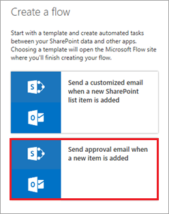

3. If you're not already signed in, sign into SharePoint and Outlook, then click or tap **Continue**.

    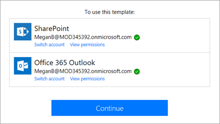

    You now see the template for this flow, ready for you to complete. The boxes in the flow represent steps. They take input from previous steps, as well as input that you provide. Each step can then provide output to subsequent steps. For example, the **Send approval email** step gets list information from the previous step, uses the email address you provide, and outputs an approve or reject value to the next step.

    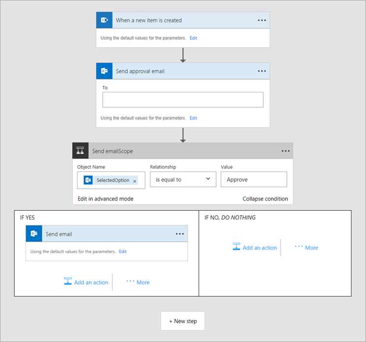

4. Enter a valid email address in the **To** box. The address should resolve to a name in your tenant, as shown in the following image.

    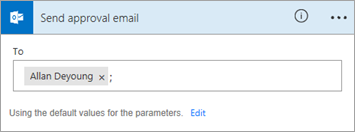

    The next box in the flow responds to the project approver's email and routes the flow to one of two *branches*: **IF YES** or **IF NO**.

    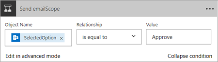

## Step 2: Create actions for Approve = YES

1. In the **IF YES** branch, click or tap the **Send email** box.

    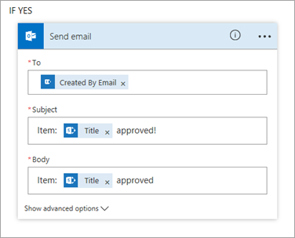

2. By default, an email is sent to the person who created the list item, with the subject line and message body that you see. You can update these if you like.

3. Click or tap **Add an Action**.

    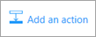

4. Under **Choose an action**, search for "SharePoint", then click or tap **SharePoint – Update item**.

    

5. Enter the SharePoint site URL and list name.

    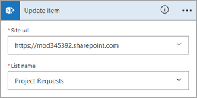

6. Select the **ID** box, then click or tap **ID** in the *dynamic content* dialog box.

    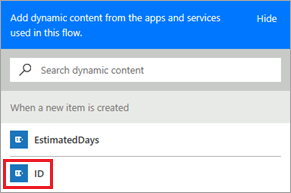

    Dynamic content is available throughout the flow, based on previous steps. In this case, the SharePoint list information is available, and we can use it in the actions that we create.

7. Select the **Title** box, search for "Title" in the dynamic content dialog box, then click or tap **Title**.

    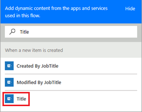

8. In the **Approved** box, enter "Yes". This part of the flow should now look like the following image.

    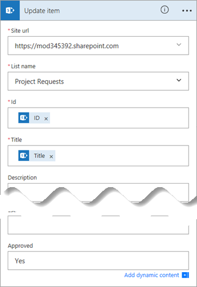

9. Click or tap **Add an Action** again. This time we'll add an item to the **Project Details** list for the project that was approved.

    

10. Under **Choose an action**, search for "SharePoint", then select **SharePoint – Create item**.

    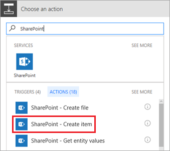

11. Enter the SharePoint site URL and list name.

    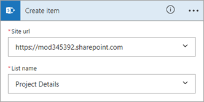

12. Select the **Title** box, search for "Title" in the dynamic content dialog box, then click or tap **Title**.

    

13. Select the **RequestId** box, then click or tap **ID** in the dynamic content dialog box.

    

14. In the **PMAssigned** box, enter "Unassigned". This part of the flow should now look like the following image.

    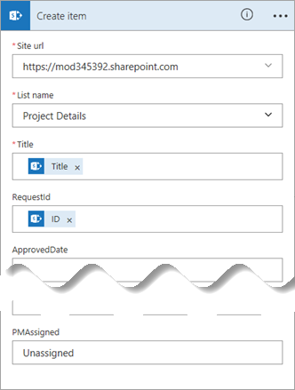

## Step 3: Create actions for Approve = NO

By default, there are no actions at all for this branch. We will create an email to send to the project requestor, and update the **Project Requests** list. We won't add an item to the **Project Details** list because the project isn't moving forward.

1. In the **IF NO** branch, click or tap **Add an Action**.

    

2. Under **Choose an action**, search for "Outlook", then select **Office 365 Outlook – Send an email**.

    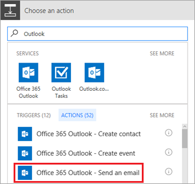

3. In the **To** box, add **Created By Email** from the dynamic content dialog box.

    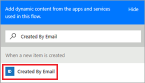

4. In the **Subject** and **Body** boxes, add **Title** from the dynamic content dialog box.

    

5. Add to the subject and body of the email, as in the following image.

    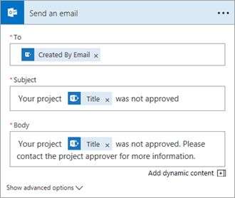

6. Now we'll update the **Project Requests** list. Click or tap **Add an Action**.

    

7. Under **Choose an action**, search for "SharePoint", then select **SharePoint – Update item**.

    

8. Enter the SharePoint site URL and list name.

    

9. Select the **ID** box, then click or tap **ID** in the dynamic content dialog box.

    

10. Select the **Title** box, search for "Title" in the dynamic content dialog box, then click or tap **Title**.

    

11. In the **Approved** box, enter "No". This part of the flow should now look like the following image.

    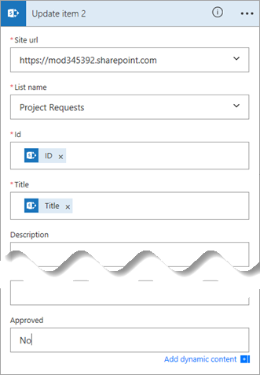

12. At the top right of the screen, click or tap **Create flow**, then **Done**.

    

    The flow is now complete, and it should look like the following image if you collapse the boxes.

    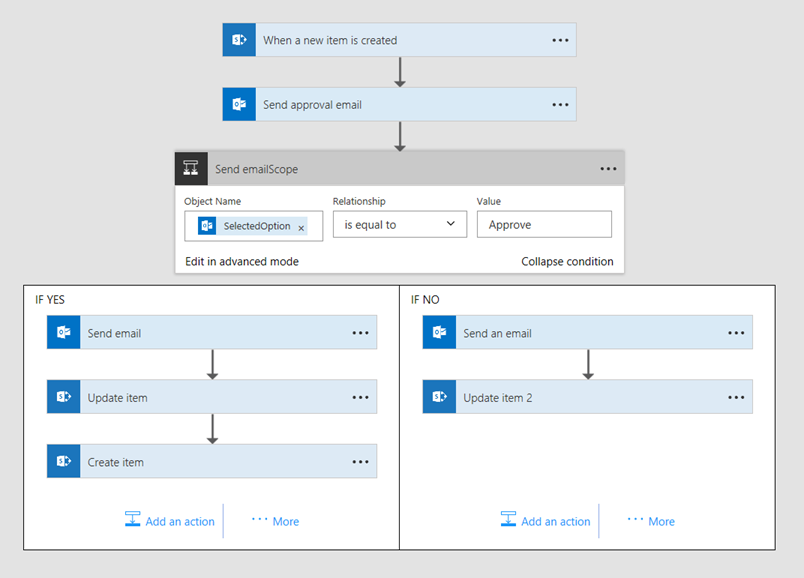

## Step 4: Run the approval flow

1. In the **Project Requests** list, click **Quick Edit** and add an item like the following:

    - **Title** = "New monitor for Megan"

    - **Approved** = "Pending"

    - **Description** = "Megan needs a 24" monitor"

    - **EstimatedDays** = "1"

    - **ProjectType** = "New hardware"

    - **RequestDate** = "02/03/2017"

    - **Requestor** = "Megan Bowen"

    

2. Click **Done** at the top of the page when you're finished.

    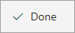

3. Check the inbox of the approver's email account. You should have an email like the following.

    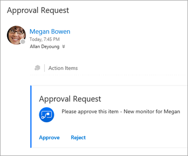

    Note that the email is sent *to* the approver, Allan DeYoung. It is sent *from* Megan Bowen, because she set up the flow.

4. After you click **Approve** or **Reject**, the flow runs another process, and you get feedback like the following, directly in the email.

    

5. The flow sends an email *to* Megan with Allan's response, as in the following image. This email also comes *from* Megan because she owns the flow.

    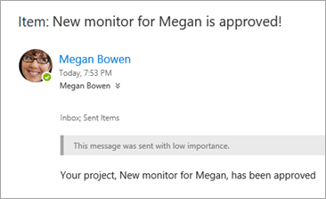

## Next steps

The next step in this tutorial series is to [create an app to manage projects](sharepoint-scenario-build-app.md).
