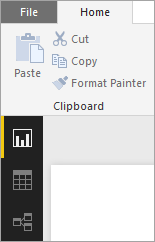
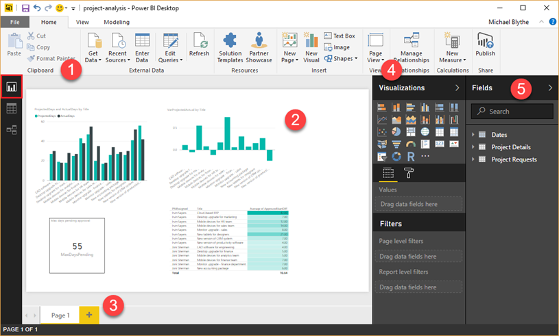
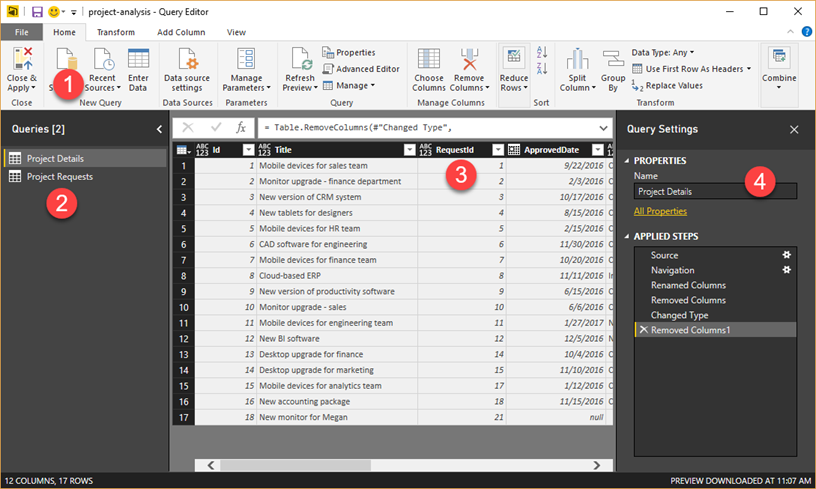
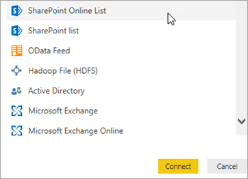
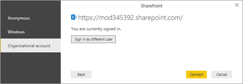
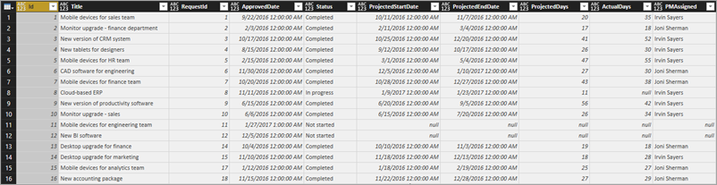

<properties
   pageTitle="Create a Power BI report to analyze projects | Microsoft PowerApps"
   description="Create a Power BI report as part of a tutorial series on using PowerApps, Microsoft Flow, and Power BI with SharePoint Online."
   services=""
   suite="powerapps"
   documentationCenter="na"
   authors="mgblythe"
   manager="anneta"
   editor=""
   tags=""/>

<tags
   ms.service="powerapps"
   ms.devlang="na"
   ms.topic="article"
   ms.tgt_pltfrm="na"
   ms.workload="na"
   ms.date="06/12/2017"
   ms.author="mblythe"/>

# Create a Power BI report to analyze projects

**Note** : This article is part of a tutorial series on using PowerApps, Microsoft Flow, and Power BI with SharePoint Online. Make sure you read the [series introduction](sharepoint-scenario-intro.md) to get a sense of the big picture, as well as related downloads.

In this task, we'll create a Power BI report based on the two SharePoint lists. We'll bring the list data into Power BI Desktop and clean it up a little, do some basic data modeling, and create a set of visuals that tell us something about the data.

**Tip** : The [download package](https://aka.ms/o4ia0f) for this scenario includes a finished version of this report: project-analysis.pbix.

## Quick review of Power BI Desktop

Before we dive into report creation, let's review Power BI Desktop. This is a powerful tool, with a lot of features, so we will focus on an overview of the areas that you will use in this task. There are three main work areas or _views_ in Power BI Desktop:  **Report** view, **Data** view, and **Relationships** view. Power BI Desktop also includes **Query Editor** , which opens in a separate window.

The following screen shows the three view icons along the left of Power BI Desktop: **Report** , **Data** , and **Relationships** , from top to bottom. The yellow bar along the left indicates the current view; in this case, **Report** view is displayed. Change views by selecting any of those three icons.

The **Report** view has five main areas:

1. The ribbon, which displays common tasks associated with reports and visualizations.
2. The **Report** view, or canvas, where visualizations are created and arranged.
3. The **Pages** tab area along the bottom, which lets you select or add a report page.
4. The **Visualizations** pane, where you change visualizations, customize colors or axes, apply filters, drag fields, and more.
5. The **Fields** pane, where query elements and filters can be dragged onto the **Report** view, or dragged to the **Filters** area of the **Visualizations** pane.

The **Data** view has three main areas:

1. The ribbon, which has the **Modeling** tab selected below. On this tab, you create calculated tables and columns, and make other changes to the data model.
2. The center pane, which shows data for the selected table.
3. The **Fields** pane, where you control how fields are displayed in your reports.

    

We don't use the **Relationships** view in this task, but you can check it out later after we bring the list data into Power BI Desktop.

In **Query Editor** , you build queries and transform data, then load that refined data model into Power BI Desktop. **Query Editor** has four main areas:

1. The ribbon, which has many options for shaping and transforming the data that you bring in.
2. The left pane, where queries are listed and available for selection, viewing, and shaping.
3. The center pane, where data from the selected query is displayed and available for shaping.
4. The **Query Settings** window, which lists the query's properties and data transform steps that have been applied.

## Step 1: Get data into Power BI Desktop

In this step, we'll first connect to the two lists. Then we'll clean up the data by removing columns we don't need for our data analysis. We'll also change the data types on some of the remaining columns so that calculations work properly. For more information on getting and cleaning data in Power BI Desktop, see the [Getting Data](https://powerbi.microsoft.com/guided-learning/powerbi-learning-1-1-overview-of-power-bi-desktop) section in our Guided Learning course.

### Connect to SharePoint lists

1. In Power BI Desktop, on the **Home** tab, click or tap **Get Data** , then **More…**

    

2. In the **Get Data** dialog box, click or tap **SharePoint Online List** , then **Connect**.

    

3. Enter the URL for your SharePoint site, then click or tap **OK**.

    

4. If you get the following dialog box, make sure you're signed in with the right credentials, then click or tap **Connect**.

    

5. Select **Project Details** and **Project Requests** , then click or tap **Edit**.

    

    The lists are now displayed as tables in Query Editor.

    

### Remove unnecessary columns from tables

1. In the left navigation pane, click or tap **Project Details**.
2. In the middle pane, select the **FileSystemObjectType** column, then click or tap **Remove Columns**.

    

1. Remove the two columns after the **Id** column: **ServerRedirectedEmbedURL** and **ContentTypeId**. Tip: use the Shift key to select both columns, then click or tap **Remove Columns**.
2. Remove all columns to the right of the **PMAssigned** column (a total of 22 columns). The table should match the following image:

    

1. Repeat the process you went through for **Project Details** , and remove all columns to the right of the **Approved** column (a total of 22 columns). The table should match the following image:

    

### Change the data type on Project Details columns

1. Select the **ProjectedDays** column, click or tap **Data Type: Any** , then **Whole Number**.

    

2. Repeat the previous step for the **ActualDays** column.
    1. indented list
        - more indented bullet
            1. how 
            2. far
                - can I go?

3. Select the **ApprovedDate** column, click or tap **Data Type: Any** , then **Date**.

    

4. Repeat the previous step for the **ProjectedStartDate** and **ProjectedEndDate** columns.

### Change the data type on Project Requests columns

1. Select the **EstimatedDays** column, click or tap **Data Type: Any** , then **Whole Number**.
2. Select the **RequestDate** column, click or tap **Data Type: Any** , then **Date**.

### Apply changes and save

1. On the **Home** tab, click **Close and Apply** to close Query Editor and go back to the main Power BI Desktop window.

    

2. Click or tap **File** , then **Save** , and save with the name project-analysis.pbix.