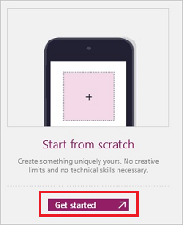
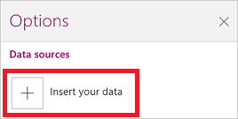
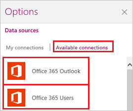
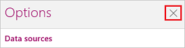

<properties
   pageTitle="Show data from Office 365 | Microsoft PowerApps"
   description="Show data about users (such as name, job title, and department) from Office 365 Users, and send mail from Office 365 Outlook."
   services=""
   suite="powerapps"
   documentationCenter="na"
   authors="aftowen"
   manager="erikre"
   editor=""
   tags=""/>

<tags
   ms.service="powerapps"
   ms.devlang="na"
   ms.topic="article"
   ms.tgt_pltfrm="na"
   ms.workload="na"
   ms.date="02/10/2016"
   ms.author="anneta"/>

# Show data from Office 365 in PowerApps #

Connect to Office 365 Users, and then configure your app to search for one or more users or to show information about a user, such as name, job, title, and direct reports. Connect to Office 365 Outlook, and then configure your app to send mail.

**Prerequisites**

Know how to [add and configure a control](add-configure-controls.md).

## Connect to Office 365 ##
1.  Open PowerApps, select **New** on the **File** menu (near the left edge), and then select **Get started** under **Start from scratch**.

	

1. In the lower-right corner, select **Options**, and then select **Insert your data**.

	

1. Select **Available connections**, and then select **Office 365 Users** or **Office 365 Outlook**.

	

1. Select **Connect**, provide your credentials, and then select **Add Data Source**.

	Your connection appears under **Data sources**.

1. Close the **Options** pane by selecting the **X** in its upper-right corner.

	

## Show information about the current user ##
1. Add a text box, and set its **[Text](controls/properties-core.md)** property to any of these formulas:

	- **office365users.MyProfile().Department**
	- **office365users.MyProfile().DisplayName**
	- **office365users.MyProfile().GivenName**
	- **office365users.MyProfile().Id**
	- **office365users.MyProfile().JobTitle**
	- **office365users.MyProfile().Mail**
	- **office365users.MyProfile().MailNickname**
	- **office365users.MyProfile().Surname**
	- **office365users.MyProfile().TelephoneNumber**
	- **office365users.MyProfile().UserPrincipalName**
	- **office365users.MyProfile().AccountEnabled**

	The text box shows the information that you specified about the current user.

## Show information about another user ##
1. Add a text-input control, and rename it **InfoAbout**.

1. In **InfoAbout**, type or paste the email address of a user in your organization.

1. Add a text box, and set its **[Text](controls/properties-core.md)** property to any of these formulas:

	- To show information about another user: 
		- **office365users.UserProfile(InfoAbout.Text).Department**
		- **office365users.UserProfile(InfoAbout.Text).DisplayName**
		- **office365users.UserProfile(InfoAbout.Text).GivenName**
		- **office365users.UserProfile(InfoAbout.Text).Id**
		- **office365users.UserProfile(InfoAbout.Text).JobTitle**
		- **office365users.UserProfile(InfoAbout.Text).Mail**
		- **office365users.UserProfile(InfoAbout.Text).MailNickname**
		- **office365users.UserProfile(InfoAbout.Text).Surname**
		- **office365users.UserProfile(InfoAbout.Text).TelephoneNumber**
		- **office365users.UserProfile(InfoAbout.Text).UserPrincipalName**
		- **office365users.UserProfile(InfoAbout.Text).AccountEnabled**

	- To show information about another user's manager: 
		- **office365users.Manager(InfoAbout.Text).Department**
		- **office365users.Manager(InfoAbout.Text).DisplayName**
		- **office365users.Manager(InfoAbout.Text).GivenName**
		- **office365users.Manager(InfoAbout.Text).Id**
		- **office365users.Manager(InfoAbout.Text).JobTitle**
		- **office365users.Manager(InfoAbout.Text).Mail**
		- **office365users.Manager(InfoAbout.Text).MailNickname**
		- **office365users.Manager(InfoAbout.Text).Surname**
		- **office365users.Manager(InfoAbout.Text).TelephoneNumber**
		- **office365users.Manager(InfoAbout.Text).UserPrincipalName**
		- **office365users.Manager(InfoAbout.Text).AccountEnabled**

	The text box shows the information that you specified about the user whom you specified or that user's manager.

## Show the direct reports of another user ##
1. Add a text-input control, and rename it **InfoAbout**.

1. In **InfoAbout**, type or paste the name of a user in your organization.

1. Add a text gallery, and set its **[Items](controls/properties-core.md)** property to this formula:

	**office365users.DirectReports(InfoAbout.Text)**

	The gallery shows information about the direct reports of the user that you specified.

1. With the gallery still selected, select **Options** in the lower-right corner, and then select **Mail** in the first list, **DisplayName** in the second list, and **JobTitle** in the third list.

## Search for users ##
1. Add a text-input control, rename it **SearchTerm**, and then type a search term in it.

1. Add a text gallery, and set its **[Items](controls/properties-core.md)** property to this formula:

	**office365users.SearchUser({searchTerm: SearchTerm.Text})**

	The gallery shows users whose name contains the term that you specified.

1. With the gallery still selected, select **Options** in the lower-right corner, and then select **Mail** in the first list, **DisplayName** in the second list, and **JobTitle** in the third list.

## Send email ##
For this function, you must specify the first three arguments, but all other arguments are optional:
 **office365.SendEmail(Subject, Body, To[, Attachments, From, CC, BCC, Importance, IsHtml])**

1. Add three text-input controls, arrange them in a column, and give them these names:

	- **inputTo**
	- **inputSubject**
	- **inputBody**

1. Add a button, and set its **[OnSelect](controls/properties-core.md)** property to this formula: 
**office365.SendEmail(inputSubject.Text, inputBody.Text, inputTo.Text)**

1. Move the button so that it appears under all the other controls, and set its **[Text](controls/properties-core.md)** property to show **Send email**.

1. Press F5, type a valid email address in **inputTo**, and type whatever you want in the other two text-input controls.

1. Select **Send email** to send the message, and then press Esc to return to the default workspace.
