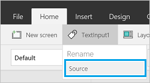

<properties
   pageTitle="Show data from Microsoft Translator | Microsoft PowerApps"
   description="Translate text into another language and play an audio version of the translation in an app"
   services=""
   suite="powerapps"
   documentationCenter="na"
   authors="aftowen"
   manager="erikre"
   editor=""
   tags=""/>

<tags
   ms.service="powerapps"
   ms.devlang="na"
   ms.topic="article"
   ms.tgt_pltfrm="na"
   ms.workload="na"
   ms.date="06/06/2016"
   ms.author="anneta"/>

# Show data from Microsoft Translator in PowerApps

Connect to Microsoft Translator, translate text into another language, and play an audio version of the translation.

**Prerequisites**

Know how to [add and configure a control](add-configure-controls.md).

## Connect to Microsoft Translator
1.  Open PowerApps, select **New**, and then create a **Blank app**. Choose phone or tablet layout. Tablet layout gives you more workspace:  

	

2. In the lower-right corner, select **Options**, and then select **Add data source**.

3. Select **Add connection**, and then select **Microsoft Translator**:  

	

	

4. Select **Connect**. Your connection appears under **Data sources**:  

	

5. Close the **Screen** pane by selecting the **X** in its upper-right corner:  

	

## Translate text
1. On the **Insert** menu, select **Text**, and then select **Text input**. Rename the text input control to **Source**:  

	

2. Add a **Drop down** list (**Insert** menu > **Controls**), rename it to **TargetLang**, and move it below **Source**. 

3. Set the **[Items](controls/properties-core.md)** property of **TargetLang** to the following formula:  

	`MicrosoftTranslator.Languages()`

4. Add a text box, move it below **TargetLang**, and set its **[Text](controls/properties-core.md)** property to the following formula:  

	`MicrosoftTranslator.Translate(Source.Text, TargetLang.Selected.Value)`

5. Type some text into **Source**, and select a language in **TargetLang**. The text box shows the text that you entered in the language you chose:  

	

## Speak translated text
If you haven't already, follow the steps in the previous section to translate some text. These next steps use the same controls. 

1. Set the **[Items](controls/properties-core.md)** property of the **TargetLang** drop-down list to the following formula:  
	
	`MicrosoftTranslator.SpeechLanguages()`

2. Rename the second text box (not the **Source** box) to **Target**.

3. Add an **Audio** control (**Insert** menu > **Media**), and set its **Media** property to the following formula:  

	`MicrosoftTranslator.TextToSpeech(Target.Text, TargetLang.Selected.Value)`

4. Press F5, or select the Preview button (). Type some text into **Source**, select a language in **TargetLang**, and then select the play button in the audio control.

	The app plays an audio version of the text that you entered in the language you chose.

5. Press Esc to return to the default workspace.

## Detect the source language
These next steps use the same **Source** text input and **Target** text controls. You can create new controls if you prefer, just update the names in the formula.

1. Select the **Target** text control, and set the **[Text](controls/properties-core.md)** property to the following formula:  

	`MicrosoftTranslator.Detect(Source.Text).Name`

2. Type some text into **Source**. 

	The text box shows you the language of the text that you typed. For example, the text box shows **French** if you type **bonjour**, or **Italian** if you type **ciao**.
