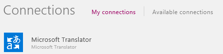

<properties
   pageTitle="Show data from Microsoft Translator | Microsoft PowerApps"
   description="Translate text into another language and play an audio version of the translation in an app"
   services=""
   suite="powerapps"
   documentationCenter="na"
   authors="aftowen"
   manager="dwrede"
   editor=""
   tags=""/>

<tags
   ms.service="powerapps"
   ms.devlang="na"
   ms.topic="article"
   ms.tgt_pltfrm="na"
   ms.workload="na"
   ms.date="01/15/2016"
   ms.author="anneta"/>

# Show data from Microsoft Translator in PowerApps #

Connect to Microsoft Translator, translate text into another language, and play an audio version of the translation.

**Prerequisites**

Learn how to [add and configure a control](add-configure-controls.md).

## Connect to Microsoft Translator ##
1.  Open PowerApps, select **Connections** on the **File** menu (near the left edge), and then select **Add connection**.

1.  In the list of connection types, select **Microsoft Translator**, and then select **Connect**.

	The connection that you created appears under **My connections**.

	

1. On the **File** menu, select **New**, and then select **Get started** under **Start from scratch**.

	

1. In the lower-right corner, select **Options**, and then select **Insert your data** in the **Screen** pane.

1. Select the connection you added earlier, and then select **Add Data Source**.

	Your selection appears under **Data Sources**.

1. Close the **Screen** pane by selecting the **X** in its upper-right corner.

	

### Translate text ###
1. Add a text-input control, and rename it **Source**.

1. Add a drop-down list, rename it **TargetLang**, and move it below the **Source** box.

1. Set the **Items** property of **TargetLang** to this formula: 
**microsofttranslator.Languages()**

1. Add a text box, move it below **TargetLang**, and set the text box's **Text** property to this formula:
 **microsofttranslator.Translate(Source.Text, TargetLang.Selected.Value)**

1. Type text into **Source**, and select a language in **TargetLang**.

	The text box shows the text that you specified in the language that you specified.

### Speak translated text ###
1. If you haven't already, follow the steps in the previous procedure for translating text.

1. Set the **Items** property of the **TargetLang** drop-down list to this formula: 
**microsofttranslator.SpeechLanguages()**

1. Rename the text box (not the **Source** box) to **Target**.

1. Add an audio control, and set its **Media** property to this formula: 
**microsofttranslator.TextToSpeech(Target.Text, TargetLang.Selected.Value)**

1. Press F5, type text into **Source**, select an option in **TargetLang**, and then select the play button in the audio control.

	The app plays an audio version of the text that you specified in the language that you specified.

1. Press Esc to return to the default workspace.

### Detect the source language ###
1. Add a text-input control, and name it **Source**.

1. Add a text box, and then move it under **Source**.

1. Set the **Text** property of the text box to this formula:
 **microsofttranslator.Detect(Source.Text)**

1. Type text into **Source**.

	The text box indicates the language of the text that you typed. For example, the text box shows **fr** (for French) if you type **bonjour** or **it** (for Italian) if you type **ciao**.
