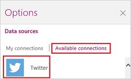
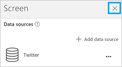

<properties
   pageTitle="Show data from Twitter | Microsoft PowerApps"
   description="Show a timeline, user information, a list of followers, and other information from Twitter"
   services=""
   suite="powerapps"
   documentationCenter="na"
   authors="aftowen"
   manager="erikre"
   editor=""
   tags=""/>

<tags
   ms.service="powerapps"
   ms.devlang="na"
   ms.topic="article"
   ms.tgt_pltfrm="na"
   ms.workload="na"
   ms.date="02/11/2016"
   ms.author="anneta"/>

# Show data from Twitter in PowerApps #

Connect to Twitter, and then configure your app to send a tweet, search for tweets, show a timeline, or show information such as a user's name, bio, and followers.

**Prerequisites**

Know how to [add and configure a control](add-configure-controls.md).

## Connect to Twitter ##
1.  Open PowerApps, select **New** on the **File** menu (near the left edge), and then select **Get started** under **Start from scratch**.

	

1. In the lower-right corner, select **Options**, and then select **Insert your data**.

	

1. Select **Available connections**, and then select **Twitter**.

	

1. Select **Connect**, provide your credentials, and then select **Add Data Source**.

	Your connection appears under **Data sources**.

1. Close the **Options** pane by selecting the **X** in its upper-right corner.

	

## Show a timeline ##
1. Add a text gallery, and follow either of these steps:

	- To show the current user's timeline, set the **Items** property of the gallery to this formula: **twitter.HomeTimeline()**

	- To show another user's timeline, set the **Items** property of the gallery to this formula: 
	**twitter.UserTimeline(** *UserID* **)**

		Specify a *UserID* by including a Twitter handle enclosed in double quotation marks or an equivalent value. For example, specify **"satyan"** directly in the formula, or add a text-input control named **Tweep**, specify **Tweep.Text** in the formula, and then type a Twitter handle such as **satyan** (without quotation marks) in **Tweep**.

	**Tip:** Show only the most recent tweets in a timeline (for example, the last five tweets) by specifying the maxResults argument, as these formulas show: 
	**twitter.HomeTimeline({maxResults:5})** 
	**twitter.UserTimeline(Tweep.Text, {maxResults:5})**

1. With the gallery selected, select **Options** near the lower-right corner, and then select **TweetText** in the first list, **TweetedBy** in the second list, and **CreatedAt** in the third list.

## Show followers ##
1. Add a text gallery, and then follow either of these steps:

	- To show the current user's followers, set the **Items** property of the gallery to this formula: **twitter.MyFollowers()**

	- To show the another user's followers, set the **Items** property of the gallery to this formula: 
	**twitter.Followers(** *UserID* **)**

	Specify a *UserID* by including a Twitter handle enclosed in double quotation marks or an equivalent value. For example, specify **"satyan"** directly in the formula, or add an input-text control named **Tweep**, specify **Tweep.Text** in the formula, and then type a Twitter handle such as **satyan** (without quotation marks) in **Tweep**.

	**Tip:** Show only, for example, five followers by specifying the maxResults argument, as these formulas show: 
	**twitter.MyFollowers({maxResults:5})** 
	**twitter.Followers(Tweep.Text, {maxResults:5})**

1. With the gallery selected, select **Options** near the lower-right corner, and then select **Description** in the first list, **UserName** in the second list, and **FullName** in the third list.

## Show followed users ##

1. Add a text gallery, and then follow either of these steps:

	- To show which users the current user is following, set the **Items** property of the gallery to this formula: **twitter.MyFollowing()**

	- To show which users another user is following, set the **Items** property of the gallery to this formula: 
	**twitter.Following(** *UserID* **)**

	Specify a *UserID* by including a Twitter handle enclosed in double quotation marks or an equivalent value. For example, specify **"satyan"** directly in the formula, or add an input-text control named **Tweep**, specify **Tweep.Text** in the formula, and then type a Twitter handle, such as **satyan** (without quotation marks), in **Tweep**.

	**Tip:** Show only, for example, five followed users by specifying the maxResults argument, as these formulas show: 
	**twitter.MyFollowing({maxResults:5})** 
	**twitter.Following(Tweep.Text, {maxResults:5})**

1. With the gallery selected, select **Options** near the lower-right corner, and then select **Description** in the **Body1** list, **UserName** in the **Heading1** list, and **FullName** in the **Subtitle1** list.

## Show information about a user ##
Add a text box, and then set its **Text** property to one of these formulas:
- **twitter.User(** *UserID* **)!Description**
- **twitter.User(** *UserID* **)!FullName**
- **twitter.User(** *UserID* **)!Location**
- **twitter.User(** *UserID* **)!UserName**
- **twitter.User(** *UserID* **)!FollowersCount**
- **twitter.User(** *UserID* **)!FriendsCount**
- **twitter.User(** *UserID* **)!Id**
- **twitter.User(** *UserID* **)!StatusesCount**

	Specify a *UserID* by including a Twitter handle enclosed in double quotation marks or an equivalent value. For example, specify **"satyan"** directly in the formula, or add an input-text control named **Tweep**, specify **Tweep.Text** in the formula, and then type a Twitter handle such as **satyan** (without quotation marks) in **Tweep**.

## Search tweets ##
1. Add a text gallery, and set its **Items** property to this formula: 
**twitter.SearchTweet(** *SearchTerm* **)**

	Specify a *SearchTerm* by enclosing a term in double quotation marks or by referring to an equivalent value. For example, specify **"PowerApps"** directly in the formula, or add an input-text control named **SearchTerm**, specify **SearchTerm.Text** in the formula, and then type **PowerApps** (no quotation marks) in **SearchTerm**.

	**Tip:** Show only, for example, the first five results by specifying the maxResults argument, as this formula shows: 
	**twitter.SearchTweet(SearchTerm.Text, {maxResults:5})**

1. With the gallery selected, select **Options** near the lower-right corner, and then select **TweetText** in the first list, **TweetedBy** in the second list, and **CreatedAt** in the third list.

## Send a tweet ##
1. Add a text-input control, and then rename it **MyTweet**.

1. Add a button, and then set its **OnSelect** property to this formula: 
**twitter.Tweet({tweetText: MyTweet.Text})**

1. Press F5, type some text into **MyTweet**, and then select the button to tweet the text that you specified.

1. Press Esc to return to the default workspace.
