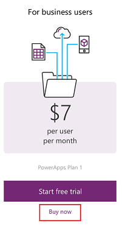
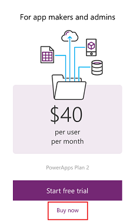
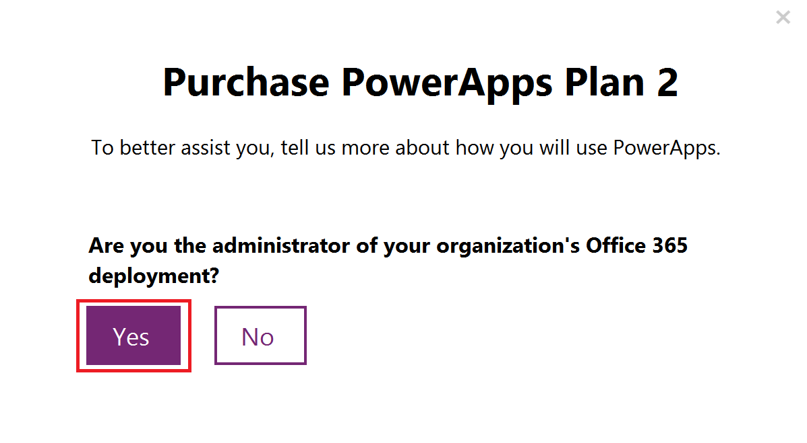
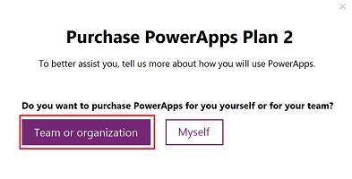
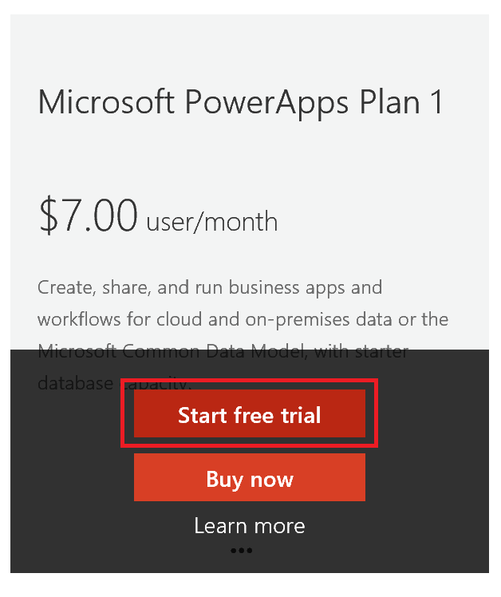
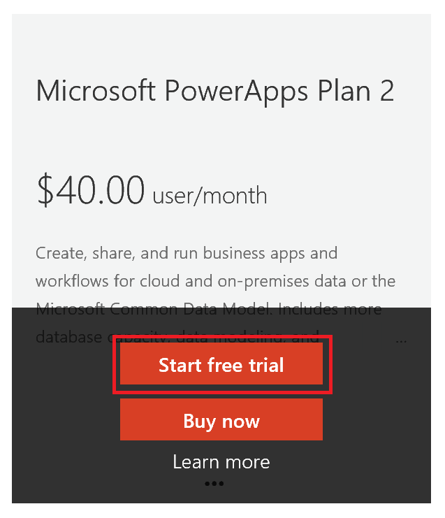
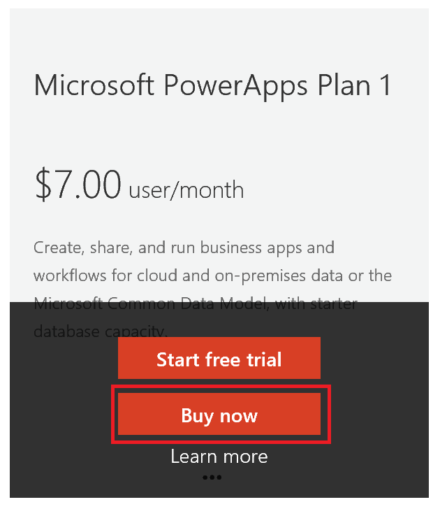

<properties
    pageTitle="Purchase PowerApps for your organization | Microsoft PowerApps"
    description="Follow these steps in order to sign up for PowerApps as an administrator."
    services=""
    suite="powerapps"
    documentationCenter="na"
    authors="jamesol-msft"
    manager="anneta"
    editor=""
    tags=""
 />
<tags
    ms.service="powerapps"
    ms.devlang="na"
    ms.topic="article"
    ms.tgt_pltfrm="na"
    ms.workload="na"
    ms.date="10/23/2016"
    ms.author="ricksal;jamesol"/>

# Purchase PowerApps for your organization #
This article shows you how to purchase PowerApps for your organization as an administrator. You can purchase PowerApps through the PowerApps website directly, the Office 365 admin center, or your Microsoft representative or partner. This article will look at the trial options available for PowerApps Plan 1 or Plan 2 and then explain how to purchase PowerApps Plan 1 or Plan 2 as an organization. For more information, see [PowerApps in your organization Q&A](signup-question-and-answer.md).

> **NOTE**  To complete the sign-up flows outlined in this article, you must be an Office 365 Global or Billing Admin of your existing tenant or create a new tenant.

## Choosing the right plan

You can choose from a variety of pricing plan options. For information about the different scenarios and considerations, see [PowerApps pricing][3].

For details about what licenses you can choose for your organization, see [billing and pricing plans](billing-pricing-skus.md).

## Purchase subscriptions from powerapps.com

You can purchase PowerApps subscriptions for your organization from [powerapps.microsoft.com][4] and then you can assign PowerApps licenses to your users. [Learn more][5].

### Purchase PowerApps Plan 1

1. Browse to [powerapps.microsoft.com][4], and then select **Pricing**.

1. Select **Buy now** for PowerApps Plan 1.

	

1. Answer the questions that are presented to guide the purchase.

	If you are the admin of an existing Office 365 tenant, there will be an option to select **Yes**.

	

  If you are creating a new tenant, there will be an option to select **Team or organization**.

	

1. You will need to provide information to make the purchase.

1. When the purchase is complete, navigate to the [Office 365 admin center][6] to assign PowerApps licenses to your users.

### Purchase PowerApps Plan 2 subscription from powerapps.com
1. Browse to [powerapps.microsoft.com][4].

1. Select **Pricing**.

1. Select **Buy now** for PowerApps Plan 2.

	

1. Answer the questions that are presented to guide the purchase.

	If you are the admin of an existing Office 365 tenant, there will be an option to select **Yes**.

	

	If you are creating a new tenant, there will be an option to select **Team or organization**.

	

1. You will need to provide information to make the purchase.

1. When the purchase is complete, navigate to the [Office 365 admin center][6] to assign PowerApps licenses to your users.

## Purchasing PowerApps subscriptions in Office 365
You can purchase PowerApps subscriptions for your organization from [Office 365 admin center][6]. Once you have the subscription, you can assign PowerApps licenses to your users. [Learn more][5].

### Purchasing PowerApps Plan 1 trial for my organization
1. Browse to the [Office 365 admin center][6].

1. On the left navigation pane, select **Billing -> Subscriptions**.

1. Select **+ Add subscriptions** on the right side.

1. Under **Other Plans**, hover over the ellipse (...) for Microsoft PowerApps Plan 1, and then select **Start free trial**.

	

1. On the screen for confirming your order, select **Try now**.

Under **Billing -> Subscriptions**, you will see **Microsoft PowerApps Plan 1 Trial** listed with 100 licenses available.  This is a 90-day trial.

### Purchasing PowerApps Plan 2 trial for my organization
1. Browse to the [Office 365 admin center][6].

1. On the left navigation pane, select **Billing -> Subscriptions**.

1. Select **+ Add subscriptions** on the right side.

1. Under **Other Plans**, hover over the ellipse (...) for Microsoft PowerApps Plan 2, and then select **Start free trial**.
  

1. On the screen for confirming your order, select **Try now**.

Under **Billing -> Subscriptions**, you will see **Microsoft PowerApps Plan 2 Trial** listed with 100 licenses available. This is a 90-day trial.

### Purchasing PowerApps Plan 1 subscription for my organization
1. Browse to the [Office 365 admin center][6].

1. On the left navigation pane, select **Billing -> Subscriptions**.

1. Select **+ Add subscriptions** on the right side.

1. Under **Other Plans**, hover over the ellipse (...) for Microsoft PowerApps Plan 1, and then select **Buy now**.
  

1. Enter the number of licenses you would like to add, and then select **Check out now** or **Add to cart**.

  > **NOTE** You can add more later if needed.

1. Enter the needed information in the Checkout flow,

Under **Billing -> Subscriptions**, you will see **Microsoft PowerApps Plan 1** listed.  If you decide later that you want to add more licenses, you can go back to **Add subscriptions** and then select **Change license quantity**.

### Purchasing PowerApps Plan 2 subscription for my organization
1. Browse to the [Office 365 admin center][6].

1. On the left navigation pane, select **Billing -> Subscriptions**.

1. Select **+ Add subscriptions** on the right side.

1. Under **Other Plans**, hover over the ellipse (...) for Microsoft PowerApps Plan 2, and then select **Buy now**.

	

1. Enter the number of licenses you would like to add, and then select **Check out now** or **Add to cart**.

	> **NOTE** You can add more at a later date if needed.

1. Enter the needed information in the Checkout flow.

Under **Billing -> Subscriptions**, you will see **Microsoft PowerApps Plan 2** listed.  If you decide later that you want to add more licenses, you can go back to **Add subscriptions** and then select **Change license quantity**.

## Add-ons
These are coming soon but are not supported yet.

## See also
[PowerApps in your organization Q&A](signup-question-and-answer.md)  
[Self-service sign up for PowerApps](signup-for-powerapps.md)  
More questions? [Try the PowerApps Community][7]

<!--Reference links in article-->
[1]: http://go.microsoft.com/fwlink/p/?LinkId=715583
[2]: http://go.microsoft.com/fwlink/p/?LinkId=708209
[3]: https://go.microsoft.com/fwlink/?linkid=832550
[4]: https://go.microsoft.com/fwlink/?linkid=832551
[5]: https://support.office.com/article/997596b5-4173-4627-b915-36abac6786dc
[6]: https://portal.office.com/admin/default.aspx
