<properties
    pageTitle="Self-service sign up for PowerApps | Microsoft PowerApps"
    description="Follow these steps in order to signup for PowerApps as an individual."
    services=""
    suite="powerapps"
    documentationCenter="na"
    authors="jamesol-msft"
    manager="anneta"
    editor=""
    tags=""
 />
<tags
    ms.service="powerapps"
    ms.devlang="na"
    ms.topic="article"
    ms.tgt_pltfrm="na"
    ms.workload="na"
    ms.date="10/23/2016"
    ms.author="ricksal;jamesol"/>

# Self-service sign up for PowerApps #
Signing up for PowerApps, as an individual, is easy! You can choose to use a PowerApps trial account, purchase PowerApps Plan 1, or purchase PowerApps Plan 2, even if you are in an existing organization. Once you have determined which you would like to use, this article will walk you through the steps to get up and running.

For administration information, see [Purchase PowerApps for your organization](signup-for-powerapps-admin.md) or [PowerApps in your organization Q&A](signup-question-and-answer.md).

> **NOTE** If you are in an organization, individual sign up may be disabled. See [Individual signup has been turned off](#Individual-sign-up-turned-off) (in this topic) for more information if you get an error indicating it has been turned off.

## What email addresses can you use with PowerApps ##
To sign up for PowerApps, enter your work or school email address.

> **NOTE** Currently, consumer email services, telecommunication providers, government, and military addresses are not supported. This includes:  
>
> - outlook.com, hotmail.com, gmail.com, and so on  
> - .gov and .mil

If you try to sign up with a personal email address, a message indicates that you must use a work or school email address.

## Existing Office 365 or Dynamics 365 user? You may already have access to PowerApps, just sign-in! ##
PowerApps is included in select Office 365 and Dynamics 365 plans. See [PowerApps pricing][3] to determine if your license includes PowerApps.

If your Office 365 or Dynamics 365 plan includes PowerApps, you can access Power with the following steps:

1. Browse to [powerapps.microsoft.com][4]

1. Select **Sign in**

  

1. You're then taken to [powerapps.com][2], and you can start to use PowerApps.

  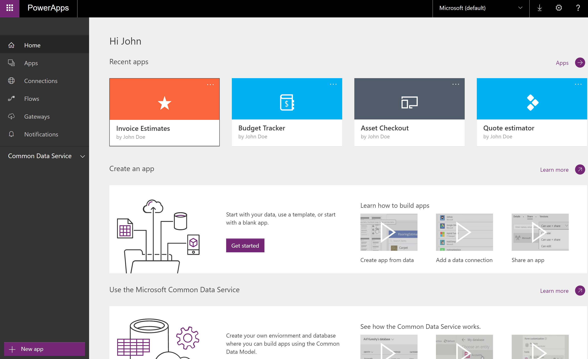

## PowerApps 90 days trial ##
PowerApps does not offer a free account, but you can choose to try PowerApps Plan 2 for free for 90 days.  You will have access to all of the PowerApps Plan 2 features for the duration of the trial.  PowerApps Plan 2 has all of the features of Plan 1, and additional access to the Common Data Services and administrative features.  It also provides higher flow run capacity and data & file storage capacity in the Common Data Service.   To try a 90-day free trial of PowerApps Plan 2, you can do the following.

1. Browse to [powerapps.microsoft.com][4]

1. Near the upper-right corner, click or tap **Sign up free**.

	If you're viewing this content on a phone, click or tap the menu icon in the upper-right corner, and then click or tap **Sign up free**.

  

  Or you can go to **Pricing** and select **Start free trial**.

    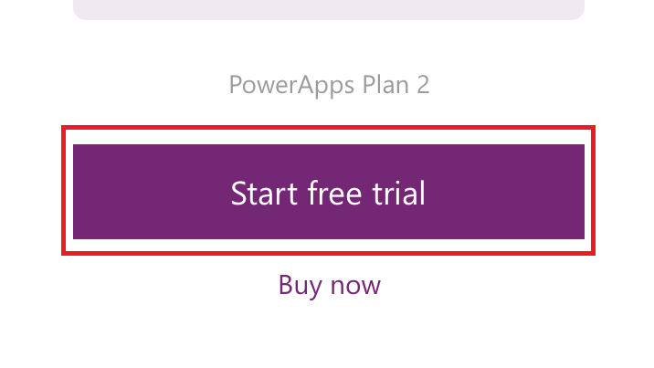

1. In the dialog box, type your work or school email address, and then click or tap **Sign up**.  

	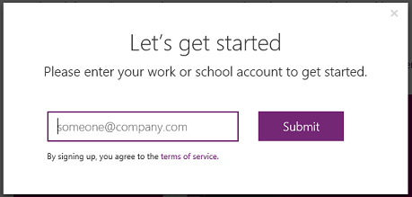

1. If your account doesn't exist within an organization, you get a message to check your email:

	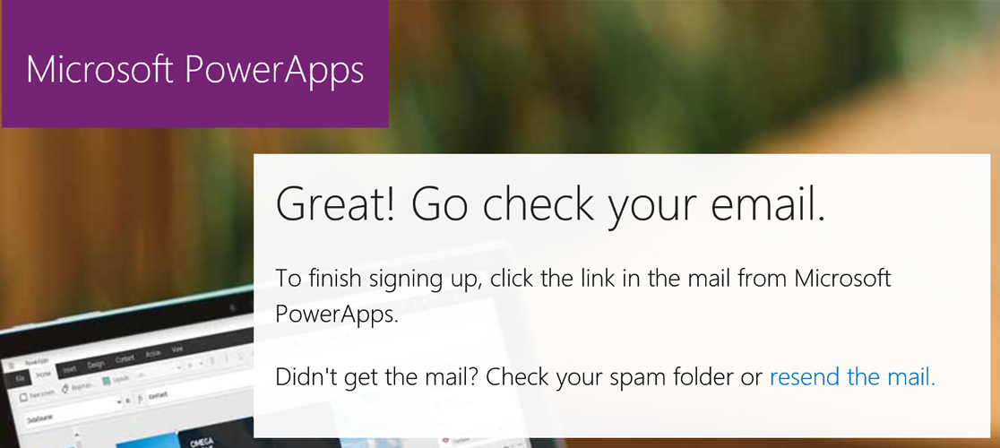

	If your account is part of an existing organization, you get a message asking you to sign in with that account. Select **Sign in**, and sign in with your work account:  

	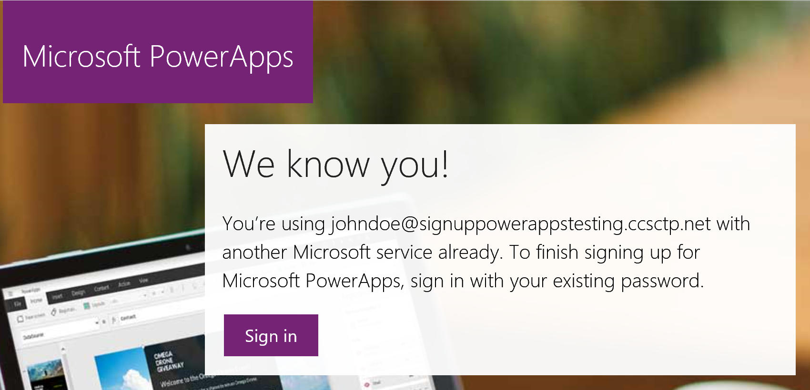

1. If you received an email, select the link within the email to verify your email address. After you verify your address, you may need to enter some additional information about yourself.

1. If you have an existing organizational account, you see a message asking you to select **Start**:  
  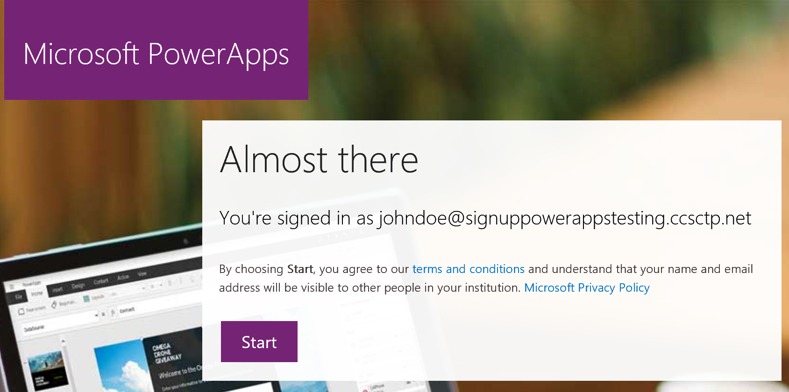

1. You're then taken to [powerapps.com][2], and you can start to use PowerApps.

  

### Signing up for PowerApps Plan 2 trial as a Office 365, Dynamics 365, or PowerApps Plan 1 user
If you already have access to PowerApps as a Office 365, Dynamics 365, or PowerApps Plan 1 user, you can optionally choose to try PowerApps Plan 2 for free. To try a 90-day free trial of Plan 2, sign into PowerApps, and try one of these PowerApps Plan 2 features:
  - [Create and manage instances](signup-for-powerapps-admin.md)  of the Common Data Service.
  - [Model your data](data-platform-intro.md) using the Common Data Service.
  - [Create and manage environments](environments-administration.md) and [user policies](prevent-data-loss.md) from the [PowerApps admin center][5].
  - [ Manage an on-premises data gateway](gateway-management.md) in PowerApps.  

When you try any of these features, you will be prompted to start your free trial, just select **Start my trial**.

  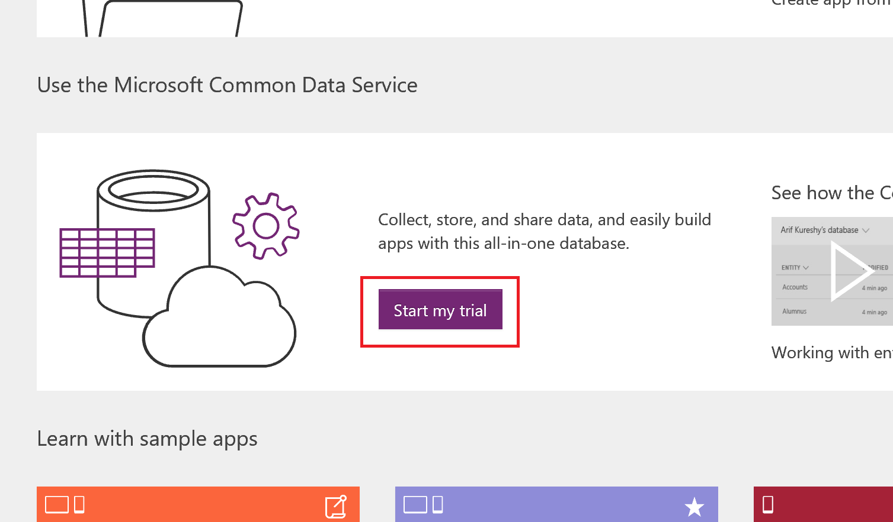

You will need to consent to the terms of use by selecting **Start my trial** in order to being your 90-day Plan 2 trial.

  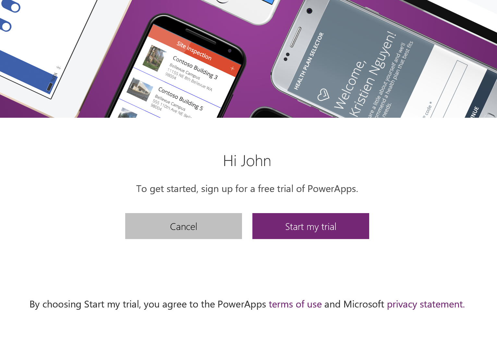

<@ricksal Need this in italics> **NOTES**
- If you need more time to evaluate powerApps, you can request to extend your trial period for 90 more days
- Users taking advantage of this in-product PowerApps trial do not appear in the Office 365 admin portal as PowerApps Plan 2 trial users (unless they have another license to Office 365, Dynamics 365, or PowerApps).
- If you are an IT Administrator wishing to acquire and deploy PowerApps trial licenses to multiple users in your organization without requiring individual users to accept terms, you can sign up for a [PowerApps Plan 2 subscription trial][6].  You will need to be an Office 365 Global or Billing Admin or create a new tenant to sign up for an admin trial.  [Learn more](signup-for-powerapps-admin.md)

## Purchase PowerApps Plan 1 as an individual ##
You can purchase PowerApps Plan 1 from the start, or you can choose to upgrade to Plan 1 after your free Plan 2 trial has ended, however not all of the features of the trial may still be available to you (See [PowerApps pricing][3]). If your account is a part of an organization, you can purchase PowerApps Plan 1 as an individual if your organization has not disabled individual purchases.

To purchase PowerApps Plan 1 as an individual, you can do the following.

1. Browse to [powerapps.microsoft.com][4]

1. Select **Pricing**

1. Select **Buy now** for PowerApps Plan 1

  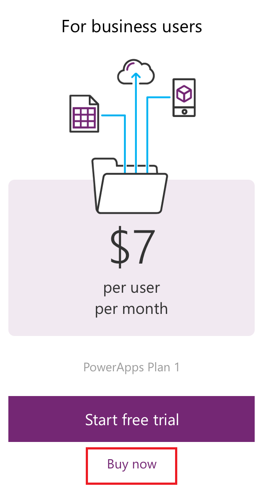

1. Answer the questions that are presented to guide the purchase. As an individual, there will be an option to select **Myself**.

  

  <<italics> **Note:** If you are interested in the option to purchase for your team or organization, you can about purchasing PowerApps for your organization. [Learn more](signup-for-powerapps-admin.md)

1. You will need to provide information to make the purchase.

## Purchase PowerApps Plan 2 as an individual ##
You can purchase PowerApps Plan 2 from the start, or you can choose to upgrade to Plan 2 after your free Plan 2 trial has ended. If your account is a part of an organization, you can purchase PowerApps Plan 2 as an individual if your organization has not disabled individual purchases.

To purchase PowerApps Plan 2 as an individual, you can do the following.

1. Browse to [powerapps.microsoft.com][4]

1. Select **Pricing**

1. Select **Buy now** for PowerApps Plan 2

  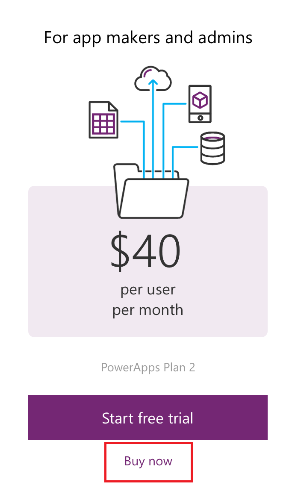

1. Answer the questions that are presented to guide the purchase. As an individual, there will be an option to select **Myself**.

  

  <@ricksal Need this in italics> **Note:** If you are interested in the option to purchase for your team or organization, you can about purchasing PowerApps for your organization. [Learn more](signup-for-powerapps-admin.md)

1. You will need to provide information to make the purchase.

## Individual signup has been turned off ##
When trying to sign up for PowerApps, you may encounter the following message.

<@ricksal Need this in a gray box> Your IT department has turned off signup for PowerApps.

  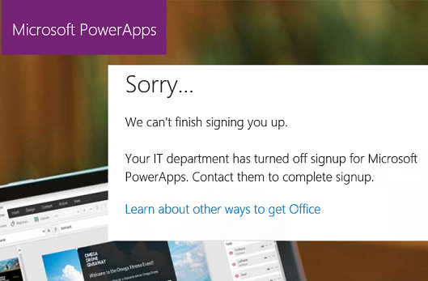

This could be because your organization has disabled individual sign ups. It could also be because you purchased Office 365 through a partner. Learn more.

If your organization has disabled individual sign ups, you will need to work with your IT group to get a PowerApps license assigned to your account in order to continue.

## Troubleshoot ##
In many cases, you register for PowerApps by following the sign-up steps in this topic. However, sign-up may fail because of any of several reasons. The following table summarizes some of the most common reasons and ways you can workaround these issues.

| Symptom / Error Message |Cause and Workaround|
|---|---|
| **Personal email addresses (e.g. nancy@gmail.com)**     You receive a message like the following during signup:     `You entered a personal email address: Please enter your work email address so we can securely store your company's data.`     or     `That looks like a personal email address. Enter your work address so we can connect you with others in your company. And don’t worry. We won’t share your address with anyone.`| PowerApps does not support email addresses provided by consumer email services or telecommunications providers.     To complete signup, try again using an email address assigned by your work or school.|
| **.gov or .mil email addresses**     You receive a message like the following during signup:     `PowerApps unavailable: PowerApps is not available for users with .gov or .mil email addresses at this time. Use another work email address or check back later.`     or     `We can't finish signing you up. It looks like Microsoft PowerApps isn't currently available for your work or school.` | PowerApps does not support .gov or .mil addresses at this time.|
| **Self-service signup disabled**     You receive a message like the following during signup:     `We can't finish signing you up. Your IT department has turned off signup for Microsoft PowerApps. Contact them to complete signup.`     or     `That looks like a personal email address. Enter your work address so we can connect you with others in your company. And don’t worry. We won’t share your address with anyone.` | Your organization’s IT administrator has disabled self-service signup for PowerApps.     To complete signup, contact your IT administrator and ask them to allow existing users to sign up for PowerApps and to allow new users to join your existing tenant.|
| **Email address is not an Office 365 ID**      You receive a message like the following during signup:     `We can't find you at contoso.com.  Do you use a different ID at work or school? Try signing in with that, and if it doesn't work, contact your IT department.` | Your organization uses IDs to sign in to Office 365 and other Microsoft services that are different than your email address.  For example, your email address might be Nancy.Smith@contoso.com but your ID is nancys@contoso.com.     To complete signup, use the ID that your organization has assigned to for signing in to Office 365 or other Microsoft services.  If you don't know what this is, contact your IT administrator. |

## Next steps

After you successfully sign up for PowerApps, you can start to create some apps. Here are some good resources:

[Get started](getting-started.md)  
[Run a sample app](open-and-run-a-sample-app.md)  
[Run an app in a browser](run-app-browser.md)  
[Run an app on a phone](run-app-client.md)  
[PowerApps in your organization Q&A](signup-question-and-answer.md)  

<!--Reference links in article-->
[1]: http://go.microsoft.com/fwlink/p/?LinkId=715583
[2]: http://go.microsoft.com/fwlink/p/?LinkId=708209
[3]: https://go.microsoft.com/fwlink/?linkid=832550
[4]: https://go.microsoft.com/fwlink/?linkid=832551
[5]: https://go.microsoft.com/fwlink/?linkid=832552
[6]: https://portal.office.com/Signup?OfferId=767ad45e-9508-479c-8109-2022f6ea4362
