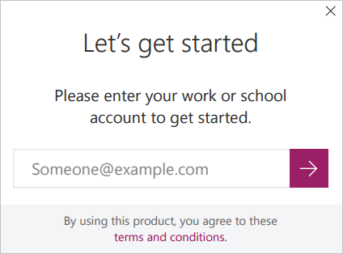
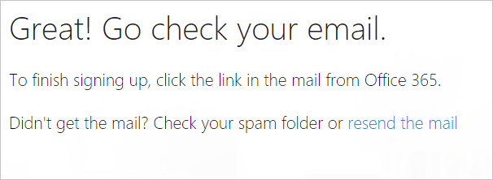
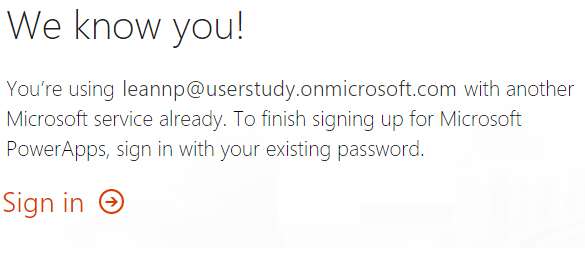
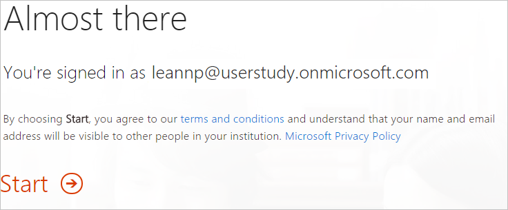

<properties
    pageTitle="How to sign up for PowerApps | Microsoft PowerApps"
    description="Follow these steps in order to signup for PowerApps."
    services=""
    suite="powerapps"
    documentationCenter="na"
    authors="jamesol-msft"
    manager="darshand"
    editor=""
    tags=""
 />
<tags
    ms.service="powerapps"
    ms.devlang="na"
    ms.topic="article"
    ms.tgt_pltfrm="na"
    ms.workload="na"
    ms.date="04/28/2016"
    ms.author="jamesol"/>

# Sign up for PowerApps

This article shows you how to sign up for a PowerApps account.

## What email addresses can be used with PowerApps ##
To sign up for PowerApps, enter your work or school email address.

> [AZURE.NOTE] Currently, consumer email services, telecommunication providers, government, and military addresses are not supported. This includes:
> - outlook.com, hotmail.com, gmail.com, and so on
> - .gov and .mil

If you try to sign up with a personal email address, you get a message indicating to use a work or school email address.

## Sign up for PowerApps

1. Go to [powerapps.com][1].

2. Select **Get started**.

3. In the dialog, enter the work or school email address you are signing up with, and then select the **arrow**. Be sure your email address is allowed for sign up.  

	

4. Make sure you have entered the correct email address and click **Sign up**:  
	

5. If your account does not exist within an organization, you get a message to check your email:  
	

	If your account is part of an existing organization, you get a message asking you to sign in with that account. Select **Sign in**, and sign in with your work account:  

	

6. If you received an email, select the link within the email to verify your email address. After you verify your address, you may need to enter some additional information about yourself.

7. If you have an existing organizational account, you see a message asking you to select **Start**:  

8. You are then taken to [powerapps.com][2], and you can begin using PowerApps.

## Troubleshoot##
In many cases, registering for PowerApps is achieved by following the sign up steps in this topic. However, there are several reasons sign up may fail.  The following table summarizes some of the most common reasons, and ways you can workaround these issues.

| Symptom / Error Message |Cause and Workaround|
|---|---|
| **Personal email addresses (e.g. nancy@gmail.com)**     You receive a message like the following during signup:     `You entered a personal email address: Please enter your work email address so we can securely store your company's data.`     or     `That looks like a personal email address. Enter your work address so we can connect you with others in your company. And don’t worry. We won’t share your address with anyone.`| PowerApps does not support email addresses provided by consumer email services or telecommunications providers.     To complete signup, try again using an email address assigned by your work or school.|
| **.gov or .mil email addresses**     You receive a message like the following during signup:     `PowerApps unavailable: PowerApps is not available for users with .gov or .mil email addresses at this time. Use another work email address or check back later.`     or     `We can't finish signing you up. It looks like Microsoft PowerApps isn't currently available for your work or school.` | PowerApps does not support .gov or .mil addresses at this time.|
| **Self-service signup disabled**     You receive a message like the following during signup:     `We can't finish signing you up. Your IT department has turned off signup for Microsoft PowerApps. Contact them to complete signup.`     or     `That looks like a personal email address. Enter your work address so we can connect you with others in your company. And don’t worry. We won’t share your address with anyone.` | Your organization’s IT administrator has disabled self-service signup for PowerApps.     To complete signup, contact your IT administrator and ask them to allow existing users to sign up for PowerApps and to allow new users to join your existing tenant.|
| **Email address is not an Office 365 ID**      You receive a message like the following during signup:     `We can't find you at contoso.com.  Do you use a different ID at work or school? Try signing in with that, and if it doesn't work, contact your IT department.` | Your organization uses IDs to sign in to Office 365 and other Microsoft services that are different than your email address.  For example, your email address might be Nancy.Smith@contoso.com but your ID is nancys@contoso.com.     To complete signup, use the ID that your organization has assigned to for signing in to Office 365 or other Microsoft services.  If you don't know what this is, contact your IT administrator. |

## Next steps

After you successfully sign up for PowerApps, you can start creating some apps. Here are some good resources:

[Get started](./getting-started.md)  
[Run a sample app](./open-and-run-a-sample-app.md)  
[Run an app in a browser](./run-app-browser.md)  
[Run an app on a phone](./run-app-client.md)  

<!--Reference links in article-->
[1]: http://go.microsoft.com/fwlink/?LinkId=715583
[2]: http://go.microsoft.com/fwlink/?LinkId=708209
