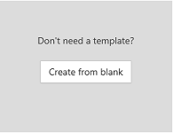
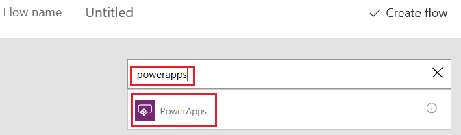
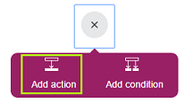
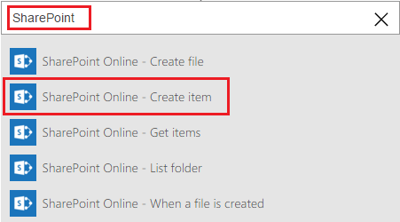
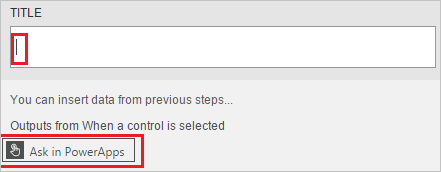
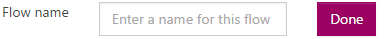
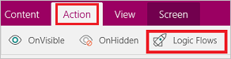
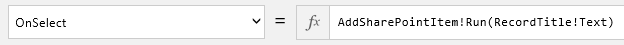

<properties
	pageTitle="Start a flow in an app | Microsoft PowerApps"
	description="Create a flow that performs one or more tasks after an event, such as a user selecting a button, occurs in an app."
	services=""
	suite="powerapps"
	documentationCenter=""
	authors="aftowen"
	manager="erikre"
	editor=""/>

<tags
   ms.service="powerapps"
   ms.devlang="na"
   ms.topic="article"
   ms.tgt_pltfrm="na"
   ms.workload="na"
   ms.date="04/08/2016"
   ms.author="anneta"/>

# Start a flow in an app #

You can use Microsoft Flow to create logic that performs one or more tasks when an event occurs in an app. For example, configure a button so that, when a user selects it, an item is created in a SharePoint list, an email or meeting request is sent, a file is added to the cloud, or all of these. You can configure any control in the app to start the flow, which runs even if you close PowerApps.

**Prerequisites**

- [Sign up](signup-for-powerapps.md) for PowerApps, [install](http://aka.ms/powerappsinstall) it, open it, and then sign in by providing the same credentials that you used to sign up.
- Learn how to [configure a control](add-configure-controls.md).

## Create a flow ##
1. Sign in to [powerapps.com](http://web.powerapps.com), select **Flows** in the left-hand navigation bar, and then select **Create a flow**.

1. Select **Create from blank**.

	

1. Under **How would you like to start?**, select **PowerApps - When a control is selected**.

	

1. Select the plus icon, and then select **Add an action**.

	

1. In the box that shows **What would you like to do next?**, specify an action for your flow.

	For example:
	1. Type **SharePoint** in the box, and then select **SharePoint Online - Create item** in the list under that box.

		

	1. If prompted, provide credentials to connect to SharePoint.

	1. In the **SITE URL** box, type or paste the URL of a SharePoint Online site that contains a list.

		**Note:** Specify the URL for the site itself, not including the list.

	1. In the **LIST NAME** box, select the list that you want to use.

	1. Select the **TITLE** box, and then select **Ask in PowerApps**.

		

1. In the **Flow name** box, type or paste a name for your flow, and then select **Done**.

	

## Add a flow to an app ##

1. In PowerApps, select **New** in the **File** menu (near the left edge of the screen).

1. Under **Create an app**, select either **Phone layout** or **Tablet layout** on the **Blank app** tile.

1. Add a **Text input** control, and name it **RecordTitle**.

1. Add a **Button** control, and move it under **RecordTitle**.

1. With the **Button** control selected, select **Add a flow** on the **Action** tab.

	

1. In the pane that appears, select the flow that you created in the previous procedure.

1. In the formula bar, type or paste **RecordTitle.Text)** at the end of the formula that's been automatically added.

	

## Test the flow ##
1. Open Preview by pressing F5 (or by selecting the arrow near the upper-right corner).

	

1. Type or paste text in **RecordTitle**, and then click the **Button** control.

	A SharePoint item is created with the text you specified as the title.
