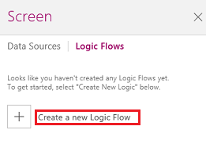
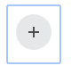

<properties
	pageTitle="Create Logic Flows | Microsoft PowerApps"
	description="Business User: How to use Logic Flows in PowerApps"
	services=""
	suite="powerapps"
	documentationCenter=""
	authors="prkumarms"
	manager="dwrede"
	editor=""/>

<tags
   ms.service="powerapps"
   ms.devlang="na"
   ms.topic="article"
   ms.tgt_pltfrm="na"
   ms.workload="na"
   ms.date="11/05/2015"
   ms.author="prkumarms"/>

# Logic Flows in PowerApps #

Logic Flows provides an easy way to run a series of actions from PowerApps. These actions can be to read or update data, send notifications on email, update your calendar or tasks in Office 365 or SharePoint, and even wait on tasks to be updated by you or other people you work with. You can configure any control in your PowerApp to start the flow, which runs in the cloud even when you have closed PowerApps to carry out the steps automatically.

[What are PowerApps?](http://aka.ms/pamktg)

**Prerequisites**
- [Install PowerApps](http://aka.ms/installpowerapps)
- Learn how to [configure a control](get-started-test-drive.md#configure-a-control) in PowerApps

## Create a logic flow ##

1. Open PowerApps, and then select **Get started** under **Start from scratch**.

	

1. On the **Action** tab, select **Logic Flows**.

	

1. In the **Logic Flows** pane, select **Create a new Logic Flow**.

	

1. Provide the credentials for your account to open powerapps.com in your browser.

1. Under **Make a workflow**, select **Create a flow**.

	

1. Select **Create from blank**.

	

1. Under **How would you like to start?**, select **PowerApps - When a control is selected**.

	

1. Select the plus icon to add an action to your logic flow.

	

1. Select **Add action**.

	

1. In the box that shows **What would you like to do next?**, specify an action for your logic flow.

	For example:
	1. Type **SharePoint** in the box, and then select **SharePoint Online - Create item** in the list under that box.

	

	1. In the **SITE URL** box, type or paste the URL of a SharePoint Online site that contains a list.

	**Note:** Specify the URL for the site itself, not including the list.

	1. In the **LIST NAME** box, select the list that you want to use.

	1. Select the **TITLE** box, and then select **Ask in PowerApps**.

	

1. In the **Flow name** box, type or paste a name for your logic flow, and then select **Done**.

	

## Use a Logic Flow in a PowerApp ##

1. In PowerApps, open the Logic Flows pane if it isn't open already. The new flow that you created on powerapps.com would now appear in the list of flows on the task pane under "All Logic Flows".

	**Note:** Only flows that are have the trigger *When a control is selected* will be available to run in the Task Pane.

	You can associate your logic flow as an action with any control in your app:

1. Select the control using which you want to run the flow (for example, you can add a button in your app and configure it to run a flow when the button is selected by a user).

2. From the **Actions** tab, select **Logic Flows** to open the task pane.

3. From the list of "All flows", select the flow you want to run. It may take a few seconds while the flow is added to your app:

	

4. Once the flow is added, the formula bar will be partly filled with the formula to run the flow. It will look something like this:

	

5. If your flow doesn't require any parameters, simply close the parenthesis to complete the formula.

Your app is now ready to run the flow when this button is selected.

## Sending data to a flow ##
With Logic Flows, you can not only pass data between the various steps of the flow, but also send data to a flow to use when the steps execute. This can be useful in cases where you don't know all the settings for each of the steps when you create the flow, but these would be known when users of your app fill in data in the app.
For example, consider an app that registers information about a new user into a SharePoint list and sends a welcome email to the user who just registered. For this, your logic flow will need to use the email address provided by the user when filling up data in the app.

1. To identify an input in a flow step that will be specified in a PowerApp, simply fill in the value with the "Ask in PowerApps" token:

	

1. The value will be automatically filled in with the name of the action and the setting. For example, if you need to use the email address provided by a user of the app, just select the "To" configuration of the "Send Email" action. This tells the flow that the "SendEmail_To" value will be provided later when using the flow in app.

	

1. Next, when you use the flow in a PowerApp (as described in the **Using a Logic Flow in a PowerApp** section, the formula will be partly filled and PowerApps will assist you in filling up the values for the formula to run the Logic Flow. Any values you choose when filling up the formula will be used at the corresponding places when the flow runs.

	
