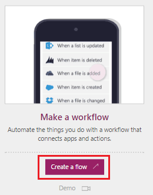
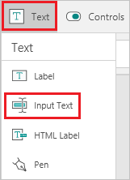
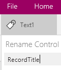
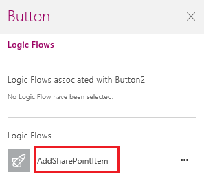

<properties
	pageTitle="Start a logic flow in an app  | Microsoft PowerApps"
	description="Create a logic flow that performs one or more tasks after an event, such as a user selecting a button, occurs in an app."
	services=""
	suite="powerapps"
	documentationCenter=""
	authors="prkumarms"
	manager="dwrede"
	editor=""/>

<tags
   ms.service="powerapps"
   ms.devlang="na"
   ms.topic="article"
   ms.tgt_pltfrm="na"
   ms.workload="na"
   ms.date="11/05/2015"
   ms.author="prkumarms"/>

# Start a logic flow in an app #

Create a logic flow that performs one or more tasks when an event occurs in an app. For example, configure a button so that, when a user selects it, an item is created in a SharePoint list, an email or meeting request is sent, a file is added to the cloud, or all of these. You can configure any control in the app to start the flow, which runs even if you close PowerApps.

[What is PowerApps?](http://aka.ms/pamktg)

**Prerequisites**
- [Install PowerApps](http://aka.ms/installpowerapps)
- Learn how to [configure a control](get-started-test-drive.md#configure-a-control) in PowerApps

## Create a logic flow ##
1. Open [powerapps.com](http://go.microsoft.com/fwlink/?LinkId=708209) in your browser.

1. Under **Make a workflow**, select **Create a flow**.

	

1. Select **Create from blank**.

	

1. Under **How would you like to start?**, select **PowerApps - When a control is selected**.

	

1. Select the plus icon, and then select **Add action**.

	

1. In the box that shows **What would you like to do next?**, specify an action for your logic flow.

	For example:
	1. Type **SharePoint** in the box, and then select **SharePoint Online - Create item** in the list under that box.

	

	1. In the **SITE URL** box, type or paste the URL of a SharePoint Online site that contains a list.

	**Note:** Specify the URL for the site itself, not including the list.

	1. In the **LIST NAME** box, select the list that you want to use.

	1. Select the **TITLE** box, and then select **Ask in PowerApps**.

	

1. In the **Flow name** box, type or paste a name for your logic flow, and then select **Done**.

	

## Add a logic flow to an app ##

1. Open PowerApps, and then select **New** in the **File** menu (near the left edge of the screen).

1. Under **Start from scratch**, select **Get started**.

	

1. On the **Insert** tab, select **Text**, and then select **Input text**.

	

1. On the **Content** tab, name the new control **RecordTitle**.

	

1. On the **Insert** tab, add a button, and move it under the text box.

1. With the button selected, select **Logic Flows** on the **Action** tab.

	

1. In the pane that appears, select the logic flow that you created in the previous procedure.

	

1. In the formula bar, type or paste **RecordTitle!Text)** at the end of the formula that's been automatically added.

	

## Test the logic flow ##
1. Open Preview by pressing F5 or selecting the arrow near the upper-right corner.

	

1. Type or paste text in the text box, and then click the button.

	A SharePoint item is created with the text you specified as the title.
