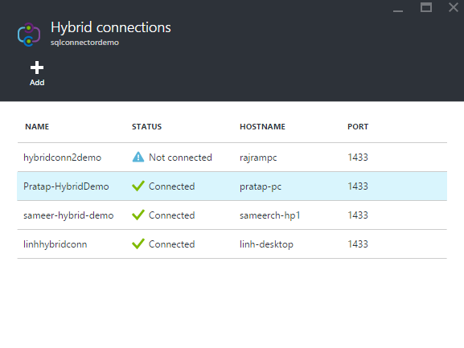

<properties
	pageTitle="PowerApps: Using your organization's data"
	description="In PowerApps, create an app automatically based on data that has been configured by your IT."
	services="powerapps"
	documentationCenter="na"
	authors="linhtranms"
	manager="gautamt"
	editor=""
	tags=""/>

<tags
   ms.service="powerapps"
   ms.devlang="na"
   ms.topic="article"
   ms.tgt_pltfrm="na"
   ms.workload="na"
   ms.date="11/09/2015"
   ms.author="litran"/>

# Using your organization's data #

With PowerApps Enterprise, as an IT administrator, not only you can manage all apps published by users in your organization, you can also create APIs that connect to your organization data and let your business users use these APIs to connect to the data, on-premise or in the cloud. You can tightly manage the permissions to the APIs and connections to your data. You can use any API from this [list of APIs](https://github.com/Azure/azure-content-pr/blob/release-power-apps/articles/power-apps/powerapps-create-api-azuremarketplace.md) we have in the marketplace or create your own custom APIs *insert link to create custom APIs here once it's submitted*.

Below are the tutorials on how you can configure and enable your business users to connect to data on a SQL database on-premise and to data in Saleforces.

## Tutorial 1 - Enable your business users to connect to data on SQL database on-premise

There are several steps an IT administrator needs to do to enable this scenario.

1. Create a new SQL Server API in your organization App Service Environment following [these instructions](https://github.com/Azure/azure-content-pr/blob/release-power-apps/articles/power-apps/powerapps-create-api-azuremarketplace-sql.md).

2. In order to connect to SQL Server on-premise, you need to establish a hybrid connectivity. Select the SQL Server API you just created and click on the Resource group

	

3.  Select resources and select the web app with the same name as your SQL Server API.
	

4.   Select on Networking under Settings and follow [these instructions](https://github.com/Azure/azure-content-pr/blob/release-power-apps/articles/power-apps/powerapps-create-api-azuremarketplace-sql.md) to create the hybrid connection.
	

5. Once your hybrid connection is created and connected, you have enabled the connection to your on-premise server. Next step, you will create the connection to your data and give users access.
	

6. Select the SQL Server API you create in step 1 and follow [these steps](https://github.com/Azure/azure-content-pr/blob/release-power-apps/articles/power-apps/powerapps-create-connection-sql-connector.md) to create a connection to your database.

12. Now that you have created the connection, you can follow [these steps](https://github.com/Azure/azure-content-pr/blob/release-power-apps/articles/power-apps/powerapps-create-new-connector.md) to configure the users or groups who have access to use this connection to build apps. For example, you grant business user *Linh Tran* access to *Sql* connection that you create, *Linh Tran* will see this connection in her list of *connections* to use when she opens PowerApps to build apps.
	

## Tutorial 2 - Enable your business users to connect to data on Saleforces

You have data in Saleforces that you want only a set of users to access the data and build apps using this data. Here are the steps.

1. Create a new Saleforces API in your organization App Service Environment following [these instructions](https://github.com/Azure/azure-content-pr/blob/release-power-apps/articles/power-apps/powerapps-create-api-azuremarketplace-salesforce.md)

2. Select the Saleforces API you just create and follow [these steps](https://github.com/Azure/azure-content-pr/blob/release-power-apps/articles/power-apps/powerapps-create-new-connector.md) to give users or groups access to that API. For example, you grant business user *Linh Tran* access to Saleforces API that you create, *Linh* will see this API under her list of *connections* to use in PowerApps.

	
