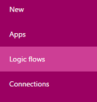
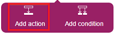
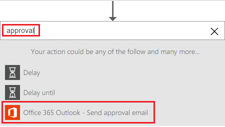
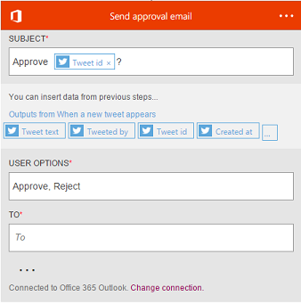
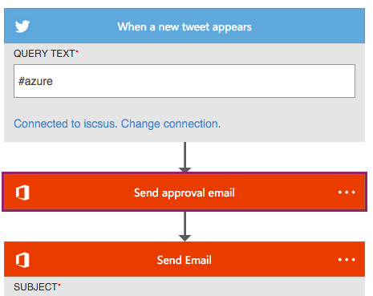

<properties
    pageTitle="Wait for approval in a flow | Microsoft Flow"
    description="Flows can wait for external events, such as users indicating approval in email or SharePoint."
    services=""
    suite="flow"
    documentationCenter="na"
    authors="stepsic-microsoft-com"
    manager="dwrede"
    editor=""
    tags=""/>

<tags
   ms.service="flow"
   ms.devlang="na"
   ms.topic="article"
   ms.tgt_pltfrm="na"
   ms.workload="na"
   ms.date="04/08/2016"
   ms.author="stepsic"/>

# Wait for approval in a flow #

Create a flow that performs one or more tasks only after a user indicates approval by either clicking a link in email or updating an item in a SharePoint list.

**Prerequisites**

- [Create a flow from scratch](get-started-logic-flow.md)

## Request approval in email ##

1. In [flow.microsoft.com](https://flow.microsoft.com), select **My flows** in the top navigation bar.

	

1. In the list of flows, select the edit icon for the flow that you created from scratch.

	

1. Select the plus icon after the action, and then select **Add action**.

	

1. In the box that shows **What would you like to do next?**, type or paste **approval**, and then select **Office 365 Outlook - Send approval email**.

	

1. (optional) Edit the subject line, the approval options, or both.

    

1. In the **TO** box, type or paste the email address of the approver.

1. Drag the approval action so it appears between the Twitter event and the other email action, and then save your flow.

	

If you send a tweet with the keyword, an email message is sent to the approver you specified in the first action. If the approver selects **Approve** in that message, a message is sent to the person you specified in the second action.
