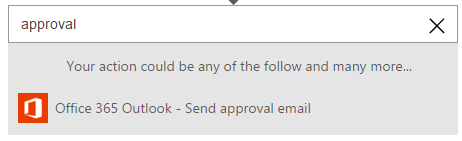
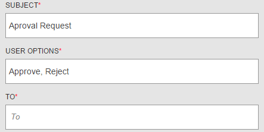
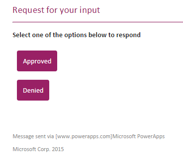

<properties
    pageTitle="PowerApps: Wait for an approval"
    description="Logic flows can wait for external events, such as when an approver approves a task assigned to them."
    services="powerapps"
    documentationCenter="na"
    authors="stepsic-microsoft-com"
    manager="dwrede"
    editor=""
    tags=""/>

<tags
   ms.service="powerapps"
   ms.devlang="na"
   ms.topic="article"
   ms.tgt_pltfrm="na"
   ms.workload="na"
   ms.date="11/14/2015"
   ms.author="stepsic"/>

# Wait for an approval in a Logic Flow #

One very common scenario in business processes is to have an approver check an request and then approve or reject it. With Logic Flows you can wait for external events, such as an approval. 

**Prerequisites**

- An Office 365 account (from which you can send email)

## Approvals via Email ##

In this procedure, you'll add an action that will wait for approval when an item is added to a SharePoint list.

1. Follow the steps in [Create a Logic Flow](get-started-logicflow.md) to add a trigger to your logic flow.

2. Instead of adding **Send email**, search for **Approval**

    
    
3. By default the approval options are *Approve* and *Reject*, but you can edit to choose your set of options.

    
    
4. Fill out the other fields including **To** and the **Subject**. 

5. Add another step using the Add button, such as **Send email**, which can say that the approver either approved or rejected.

6. Save your logic flow.

Now, add an item to the SharePoint list. The Approver should receive an email: 

After the approver chooses the option your final step will fire.

## Approval via a data source

You can also use a data source to indicate approval.

1. Create a SharePoint list with a column called **Status**. 

2. Instead of adding the approval action, add **Create an item** and create an item in the list with the **Status** equal to pending.

3. Add a step **When an item is updated in a list**. Flow the ID into the step. 

Now, the approver can updated the status in the list, and the item will be approved (or rejected).

