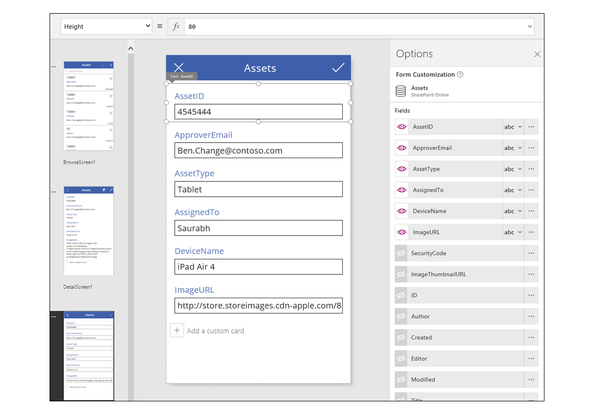
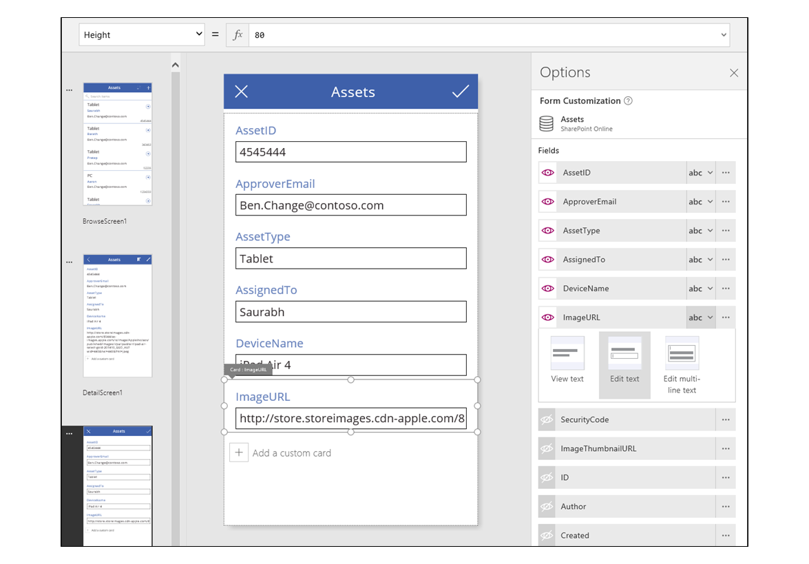
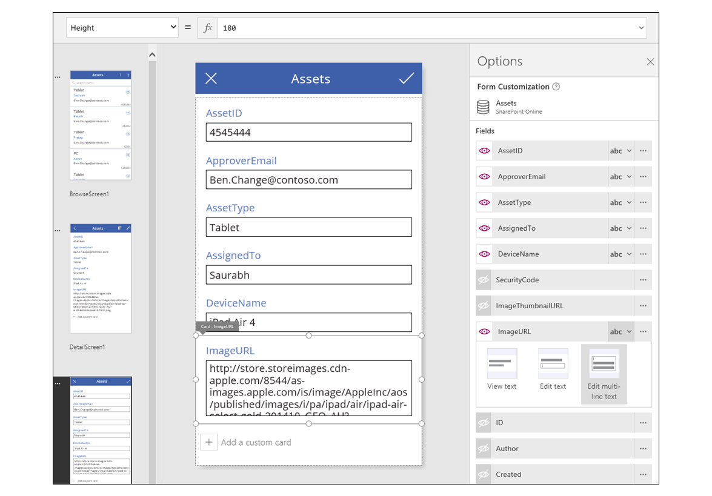
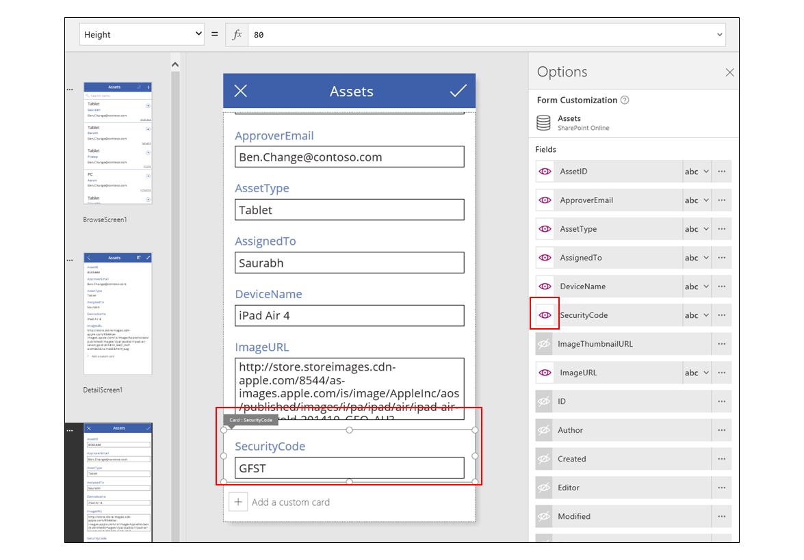
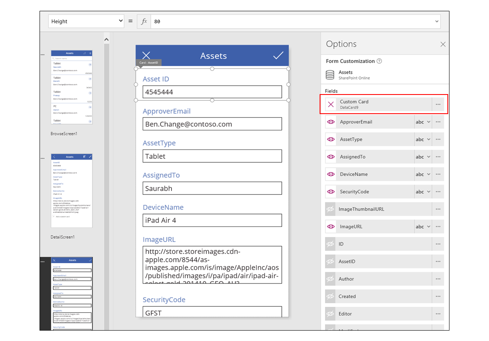

<properties
	pageTitle="Understand data cards | Microsoft PowerApps"
	description="Use form cards to collect and display information from a data source."
	services=""
	suite="powerapps"
	documentationCenter="na"
	authors="gregli-msft"
	manager="erikre"
	editor=""
	tags=""/>

<tags
   ms.service="powerapps"
   ms.devlang="na"
   ms.topic="article"
   ms.tgt_pltfrm="na"
   ms.workload="na"
   ms.date="04/08/2015"
   ms.author="gregli"/>

# Understanding data cards #

**Card** controls are the building blocks of the **Edit form** and **Display form** controls.  Whereas the form represents the entire record, each card represents a single field of that record.

The easiest way to interact with cards is through the "Options" pane when a form control has been selected on the canvas.  Here you can choose which fields to show, pick how each field should be shown, and rearrange the fields.

To get started with cards, see [add a form](add-a-form.md) and [understand data forms](working-with-forms.md).  The remainder of this article goes into the details of how cards work, how you can customize and create your own cards.

## Predefined cards ##

PowerApps comes with a predefined set of cards for strings, numbers, and other data types.  Using the "Options" pane you can see the variations available and change the card used for a field:

Currently we are using a single line text card, but the URL's text is longer than can be shown on a single line.  Let's change this to a multi-line text card to give our users more room to edit:

You will also notice that are a number of fields of this data source that are not currently being shown.  We can turn these on and off with the eye icon:

## Customizing a card ##

Cards are made up of other controls.  The text box for data entry is a standard **Input text** control that you would pull from the "Insert" tab.  

Let's walk through some examples of changing the card's appearance by manipulating controls.

1. First, let's return to the last card we inserted, for the "SecurityCode" field.  Let's click on this card once, which will select the card:

	

2. Now, let's click again, directly on the text box.  This will select the **Input text** control that is inside the card:

	

3. With grab handles, we can now resize and move this control within the card:

	  

	Note that while you can resize, move, and make other modifications to the control, you cannot delete the control. To do this, you must first unlock the card, which is covered in the next section.

4. We can even insert new controls into the card, such as this star shape from the "Insert" tab, "Shapes" menu:

	

	This new control is now a part of the card, and will travel with the card if for example we reorder the cards within the form.

Let's take another example.  We have a field that contains an image URL, but the user's experience would be much better if we could see the image.  

1. The card that has been chosen shows a text box for this field, making the URL editable:

	

2. Let's place an image control below it, from the "Insert" tab:

	

3. Using the formula bar, set the **Image** property of this control to **TextBox.Text**, where **TextBox** is the name of the **Input text** control holding the URL (press the Alt key to see control names):

	

	And now we can see our images as well as edit their URLs.  Note that we could have used **Parent.Default** as the **Image** property, but it would not have updated as the user entered a new URL.

4. We can do the same thing on the second screen of this app, where we use a **Display form** control to display the details of a record.  Here we may want to make the text box invisible (set the **Visible** property of the text box control, not the card, to *false*) since there is no need to edit the URL on that screen:

	

## Unlock a card ##

Besides containing controls, cards themselves are controls.  They have properties and formulas just like any other control.  When you choose to display a field on a form, the "Options" pane automatically creates the card for you and generates the needed formulas.  We can see these formulas in the "Advanced" pane, available from the "View" tab:

Immediately we see one of the most important properties of the card, the **DataField** property.  This property indicates which field of the data source is displayed and edited by this card.  

You will notice something else about the "Advanced" view: the large banner at the top indicating that the properties of this card are locked.  There is also a lock icon next to the **DataField**, **Default**, and **DisplayName** properties.  Since the "Options" pane created these formulas, and to prevent accidental changes, these properties are protected by this lock.  

Let's unlock the card so we can modify these properties, by clicking the banner at the top:

Let's modify the **DisplayName** to put a space between "Asset" and "ID".  After doing this change, we have altered what had been previously generated for us.  If we return to the "Options" pane, we will notice that this card now has a different label:

We have now taken control over this card and can make further modifications to fit our need.  But we have lost the ability to change the card from one representation to another, for example single-line to multi-line as we did before.  We have transformed the predefined card into a "custom card" that we now control.  

A word of caution: once a card is unlocked, it cannot be relocked.  To get back to a locked state, remove the card and reinsert it with the "Options" pane.   

## Collaborating with the form ##

Now that we have unlocked the card, we can change how it interacts with its form host.

Below we provide some guidelines for how controls should work with their card, and how the card should work with the form.  These are only guidelines.  As with any control in PowerApps, you can create formulas that reference any other control in PowerApps, and that is true for cards and controls within cards too.  Be creative, there are many ways to create an app.  

### DataField property ###

The most important property on the card is the **DataField** property.  This property drives validation, what field is updated, and other aspects of the card.

### Information flowing in ###

As a container, the form makes **ThisItem** available to all cards within it.  This record contains all of the fields for the current record of interest.  

Cards should set their **Default** property to **ThisItem.*FieldName***.  There may be situations in which you want to transform this value on the way in, for example to translate the value from one language to another, or to add formatting to a string.

Controls within the card should reference **Parent.Default** to get at the field's value.  This provides a level of encapsulation for the card, so that the card's **Default** property can be changed without needing to change the internal formulas of the card.

By default, **DefaultValue** and **Required** properties are taken from the data source's meta-data based on the **DataField** property.  You can override these formulas with your own logic, integrating the data source's meta-data by using the **DataSourceInfo** function.

### Information flowing out ###

After the user has modified the record, by using controls on the cards, it is time to save those changes to the data source by using the **SubmitForm** function.  

When the **SubmitForm** function is called, the form control will read the values of each card's **DataField** property to know what field to change.  

The form control will also read the value of each card's **Update** property.  This is the value that will be stored in the data source for this field.  This is the place to again apply a transform, perhaps to reverse the transform that was applied in the card's **Default** formula.

The **Valid** property is driven from the meta-data of the data source, based on the **DataField** property.  It is also based on the **Required** property, and if the **Update** property contains a value.  If the value on the **Update** property is not valid, the **Error** property will provide a user friendly error message. 

The **DataField** property of a card can be *blank*.  In this case, the card is just a container of controls and its **Valid** and **Update** properties do not participate when the form is submitted. 
   
## Dissecting an example ##

Let's look at the controls that make up a basic data entry card.  The space between controls has been increased to make it easier to see each clearly:

Hold down the Alt key, and you will see the names of the controls which make up this card:

We see four controls that make this card work:

| Control name | Control type | Description |
|--------------|--------------|-------------|
| **TextRequiredStar** | **Text** control | Displays the common star, used on data entry forms to indicate that a field is required. |
| **TextFieldDisplayName** | **Text** control | Displays the user friendly name of this field.  This name can differ from what is in the data source's schema. |
| **InputText** | **Input text** control | Displays the initial value of the field, and allows the user to change that value. |
| **TextErrorMessage** | **Text** control | Displays a user friendly error message to the user if there is a problem with validation.  Also checks to ensure the field has a value if it is required. |

To feed these controls with information, their properties can be driven from the properties of the card, through these key formulas.  Note that none of these formulas refer to a specific field, instead all information comes from the card.

| Control name | Formula | Description | 
| -------------|---------|-------------|
| **TextRequiredStar** | **Visible = Parent.Required** | The star is only shown if the field is required.  Required is a formula driven by the meta-data of the data source or the author of the app. |
| **TextFieldDisplayName** | **Text = Parent.DisplayName** | The text control shows the value of the user friendly name, provide by the meta-data or by the author and set on the card's **DisplayName** property. |
| **InputText** | **Default = Parent.Default** | The input text control initially shows the value of the field from the data source, as provided by the card's default value. |
| **TextErrorMessage** | **Text = Parent.Error** | If there is a validation problem, the card's **Error** property will provide an appropriate error message.

To pull information out of these controls, to push back into the data source, we have the following key formula:

| Control name | Formula | Description | 
| -------------|---------|-------------|
| **DataCard** | **DataField = "ApproverEmail"** | The name of the field that this card is displaying and editing. |  
| **DataCard** | **Update = InputText.Text** | The value to validate and push back into the data soruce when **SubmitForm** is called. |

