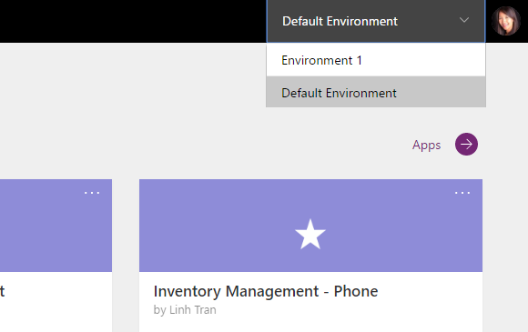
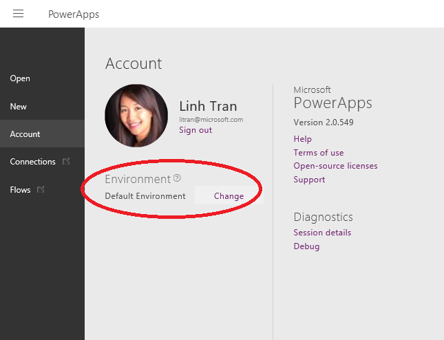
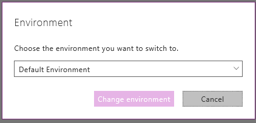
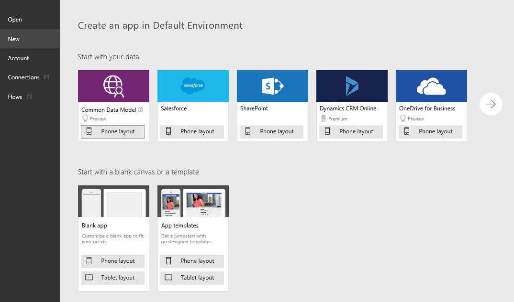

<properties
    pageTitle="Working with environments and Microsoft PowerApps"
    description="Switch environments and understand how the content on your pages change."
    services=""
    suite="powerapps"
    documentationCenter="na"
    authors="linhtranms"
    manager="anneta"
    editor=""
    tags=""
 />
<tags
    ms.service="powerapps"
    ms.devlang="na"
    ms.topic="article"
    ms.tgt_pltfrm="na"
    ms.workload="na"
    ms.date="10/14/2016"
    ms.author="litran"/>

# Working with environments and Microsoft PowerApps #

With PowerApps, you can work in different environments and easily switch among them. To learn more about environments, please read this [article](environment article url) which explains in details why use environments, how you can create and manage them. The scope of this article will cover the following topics on environment:
  1. How to switch environment in our web portal
  2. How to create app in the right environment
  3. How to view app in the right environment

## Switch environment##

When you first sign up and login to the PowerApps portal, you will likely landed on a default environment. You can view this by looking at the top right corner of the page.

The *Default environment* is accessible to everyone. You can start creating apps in this environment and share your apps with other users. You may also have access to other environments such as those [you create yourself](link to create env article) or those created by others but you have access to. You can switch environment by clicking on the environment dropdown at the top right corner and select a different environment. In this example, I am switching from *Default environment* to *Environment 1*.

Once you switch to a different environment i.e. Environment 1, you will see all the apps you created or have access to in this new environment.

## Create apps in the right environment ##

You can create new app in existing environments that you have access to or in new environment. Creating your own environment, however, requires a specific plan that you can read about [here](plan and licenses article). Before you create an app, always **make sure you select the environment you want to app to be in**. Otherwise, you will have to deal with moving apps between environments.

1. If you are in the [PowerApps portal](http://web.powerapps.com), select the environment you would like to create your app in. If you are in *PowerApps Studio* or *PowerApps Studio for web*, skip to step 4.
2. Select **+ New app**
3. Select **Open PowerApps Studio** or **PowerApps Studio for web**
4. Once your *PowerApps Studio* or *PowerApps Studio* for web launches, select the environment again at the top right corner. We will improve this experience in the future but after October's release, you are required to select this every time you want to create an app in a new environment.

  

5. You are now on **Account** page, select **Change** next to the environment's name

  

6. Select the environment you want to create your app in

  

7. Select **New** to start creating app. Your app now will reside in the selected environment in step 6.

  

## View apps in the right environment ##

Whether you are working in the *[PowerApps portal](http://web.powerapps.com)* or *PowerApps Studio* or *PowerApps Studio* for web, the list of apps, connections, etc. you see is always filtered based on the selected environment in the dropdown. If you don't see the apps you are looking for, always double check to see if you have the right environment selected.

Again, to switch environment in *[PowerApps portal](http://web.powerapps.com)*:

To switch environment in *PowerApps Studio* or *PowerApps Studio for web*:

  

For more information on environment, see [article for environment by james](environment.md).
