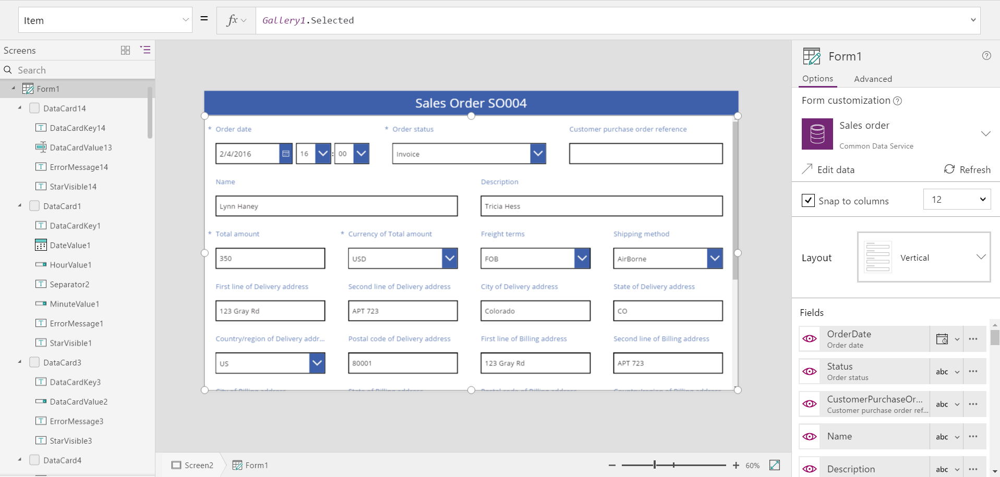

<properties
	pageTitle="Understand data form layout | Microsoft PowerApps"
	description="Create great looking form layouts using rows and columns."
	services=""
	suite="powerapps"
	documentationCenter="na"
	authors="gregli-msft"
	manager="anneta"
	editor=""
	tags=""/>

<tags
   ms.service="powerapps"
   ms.devlang="na"
   ms.topic="article"
   ms.tgt_pltfrm="na"
   ms.workload="na"
   ms.date="05/23/2017"
   ms.author="gregli"/>

# Understand data form layout in Microsoft PowerApps #

PowerApps makes it easy to create forms that are attractive and efficient to use.  For example, consider this basic sales order form:

Let's walk through the steps to create this form.

## Getting started ##

To begin, create a new tablet app in PowerApps.  Everything discussed here applies to phone layouts as well but phone apps often only use one vertical column.

Connect to a data source.  In this example, we are using the "Sales order" entity in the Common Data Service.  Any data source can be used.

You will want a way to select a particular record from this data source.  On your first screen, insert a gallery control and connect it to the data source.  We can then use **Gallery1.Selected** to refer to the currently selected record.

So we have plenty of room to work with, create another blank screen where we will put our form.  The Gallery and Edit form can be on the same screen and we'll show you how to do that later.

Insert a label control at the top of this screen.  Here we will have our title bar with sales order number displayed.  Change the fill color to blue, the text color to white, increase the font size as desired.  Enter the formula for the Text property as **"Sales Order " & Gallery1.Selected.SalesOrderId**.

Insert an Edit form control and enlarge it to fill the entire screen.  Connect this form control to the Sales order data source.  It may take a few moments for the data cards to be added and then a few more moments for the cards to settle into their final positions.  Connect the Item property to **Gallery1.Selected**.  And you should see a very basic form layout with three columns.

## Selecting fields to display ##

Initially, the form will be filled with a default set of fields.

You can turn fields on and off with the right hand panel under Options.  Simply select the eyeball icon to make the field visible or not.   

To reorder the fields you can drag and drop them in the right hand pane.  

## Data cards ##

Each field displayed has a corresponding data card on the form.  This card is made up of a set of controls for the field title, input box, required star, and validation error message.  

You can also select cards directly on the form.  When selected, a black caption appears above the card.  Once selected, to remove a card press the delete key.

You can also drag and drop cards in the form to reorder them.  Select the black caption and drag and drop it to a new location.

## Snap to columns ##

When turned on, "Snap to columns" will organize all the cards into the specified set of columns.  The default for tablet layouts is 3 columns and for phone layouts it is 1 column.  You can change the number of columns at any time and all the cards will be resized to fit the new number of columns.

Cards can span multiple columns.  Drag and drop the width of the card and it will "snap" to column boundaries.  

## 12 columns ##

The option for 6 or 12 columns is available.  When selected, by default cards will span 2 or 3 columns respectively, but can be resized smaller or lager.  This allows for finer control over the placement of cards.  12 columns is commonly used in user interface design as it is evenly divisible by 1, 2, 3, 4, and 6.

To have rows that contain a variety of 2, 3, or 4 columns, let's switch to 12 columns.  Initially, this doesn't look any different than 4 columns but now we have more snap points for the widths of cards.  We'll also start to reorder the cards to where we want the fields.

## Turning off snap to columns ##

You may want finer control over widths than 12 columns can provide.  In this case, you can turn off "Snap to columns".  The form will still snap to 12 columns as this will result in better alignment of cards by default, but you can also hold down the ALT key to manually resize a card to any desired width.

  

  

 

