<properties
	pageTitle="Understand data-form layout | Microsoft PowerApps"
	description="Create great-looking form layouts using rows and columns."
	services=""
	suite="powerapps"
	documentationCenter="na"
	authors="gregli-msft"
	manager="anneta"
	editor=""
	tags=""/>

<tags
	ms.service="powerapps"
	ms.devlang="na"
	ms.topic="article"
	ms.tgt_pltfrm="na"
	ms.workload="na"
	ms.date="05/23/2017"
	ms.author="gregli"/>

# Understand data-form layout in Microsoft PowerApps #
In PowerApps, you can easily create forms that are attractive and efficient to use. For example, consider this basic form for recording sales orders:

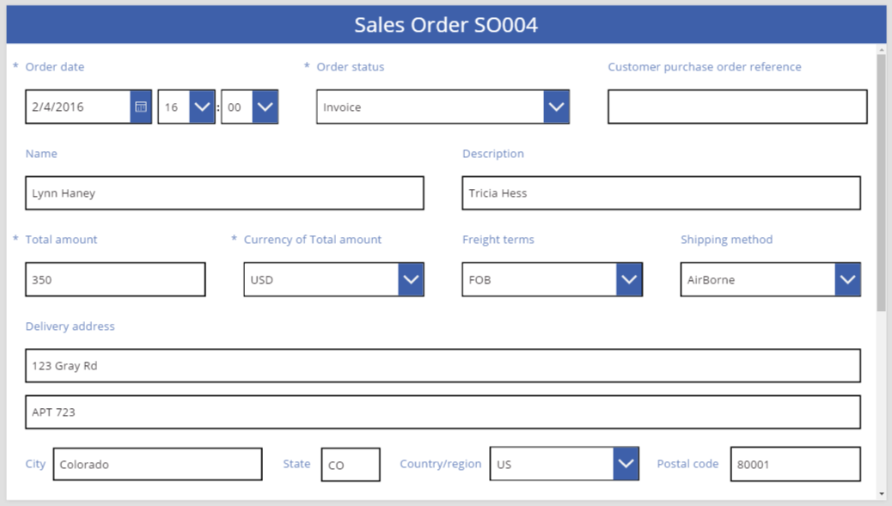

In this tutorial, we'll walk through the steps to create this form. We'll also look at some advanced topics, such as dynamic sizing of fields to fill available space.

## Before you start ##
If you're new to PowerApps (or have only generated apps automatically), you'll want to [build an app from scratch](get-started-create-from-blank.md) before you dive into this topic. By building an app from scratch, you'll become familiar with the concepts mentioned only in passing, such as adding data sources and controls.

## Add a gallery ##
1. Create a tablet app from scratch.

	Everything discussed in this topic also applies to phone layouts, but phone apps often have only one vertical column.

1. Add the **Sales order** entity in the [Common Data Service](data-platform-intro.md) as a data source for the app.

	Outside of this tutorial, you can use any data source, including SharePoint lists and Excel tables.

1. Add a vertical **Gallery** control, and set its **Items** property to **'Sales order'**.

	(optional) To match the examples in this tutorial, change the gallery's **Layout** to show only **Title and subtitle**.

	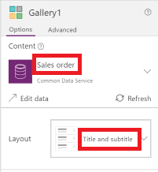

	The gallery resembles this example so that users can select a record in the gallery and show all its data in the form that you'll add on another screen.

	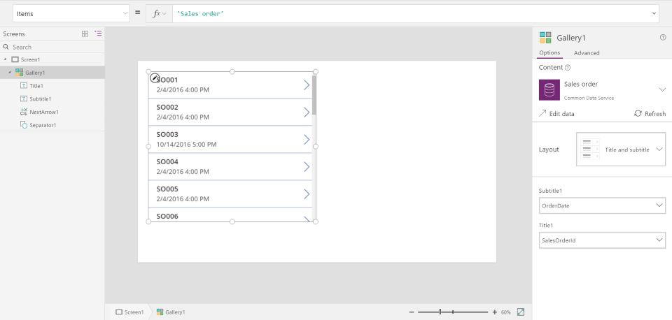

## Add a form ##
1. Add a blank screen where you'll put the form.

	Outside of this tutorial, you can put the **Gallery** and **[Edit form](controls/control-form-detail.md)** controls on the same screen, but you'll have more room to work with if you put them on separate screens.

1. At the top of the new screen, add a **[Label](controls/control-text-box.md)** control, and set its **Text** property to this expression:
 **"Sales Order " & Gallery1.Selected.SalesOrderId**

	The label shows the sales-order number of the record that the user selects in the gallery.

1. (optional) Configure the label as in the graphic at the end of this procedure.

1. Add an **Edit form** control, and then move and resize it to fill the screen under the label.

	In the next step, you'll connect the form control to the **Sales order** data source by using the right-hand pane, not the formula bar. If you use the formula bar, the form won't show any fields by default. You can always show any fields that you want by selecting one or more check boxes in the right-hand pane.

1. In the right-hand pane, click or tap the down arrow next to **No data source selected**, and then click or tap **Sales order**.

	A default set of fields from the **Sales order** data source will appear in a simple, three-column layout. However, many are blank, and they may take a few moments to settle into their final positions.  

1. Set the form's **Item** property to **Gallery1.Selected** to show a data from single record in the data source:

	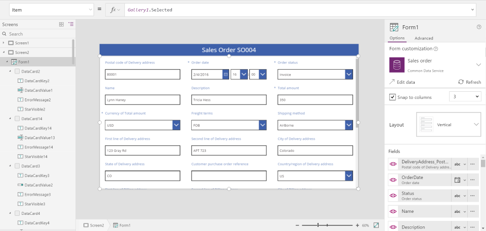

## Show, hide, or reorder fields ##
On the **Options** tab of the right-hand pane, you can show or hide a field by selecting or clearing its check box. You can also reorder fields by dragging one up or down and then dropping it in the location that you want.

## Select a data card ##
Each field displayed has a corresponding data card on the form. This card comprises a set of controls for the field title, an input box, a star (which appears if the field is required), and a validation error message.

You can also select cards directly on the form. When selected, a black caption appears above the card.

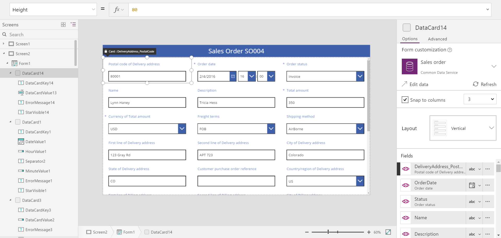

You can also reorder cards by dragging them in the form. Select the black caption, and then drag it to a different location. You can drop the card on either end of another card, and a gray drop zone appears while you hover. To delete a card (not just hide it), select it, and then press Delete.

## Arrange cards in columns ##
By default, forms in tablet apps have three columns, and those in phone apps have one. You can specify not only how many columns a form has but also whether all cards should fit within column borders.

In this graphic, the number of columns in the form was changed from three to four with the **Snap to columns** check box selected. The cards in the form were arranged automatically to fit the new layout

## Resize cards across multiple columns ##
Depending on the data in each card, you might want some cards to fit in a single column and other cards to span multiple columns. If a card contains more data than you want to show in a single column, you can widen the card by dragging the left or right border of its selection box. As you drag the border, the card will "snap" to column boundaries.

To make your design more flexible but retain some structure, you can increase the number of columns to 12. With that change, you can easily configure each card to span the entire form, half of the form, one-third, one-quarter, one-sixth, and so forth. Let's see this in action.

1. Set the number of columns in the form to 12.

	The form doesn't visibly change, but you have more snap points as you drag the left or right border of a card's selection box.

1. With the **Customer purchase order reference** card selected, drag it to several locations on the form to show how it guides you, and then drop the card just to the left of the **Freight terms** card.

	The cards automatically move to fill the empty space.

	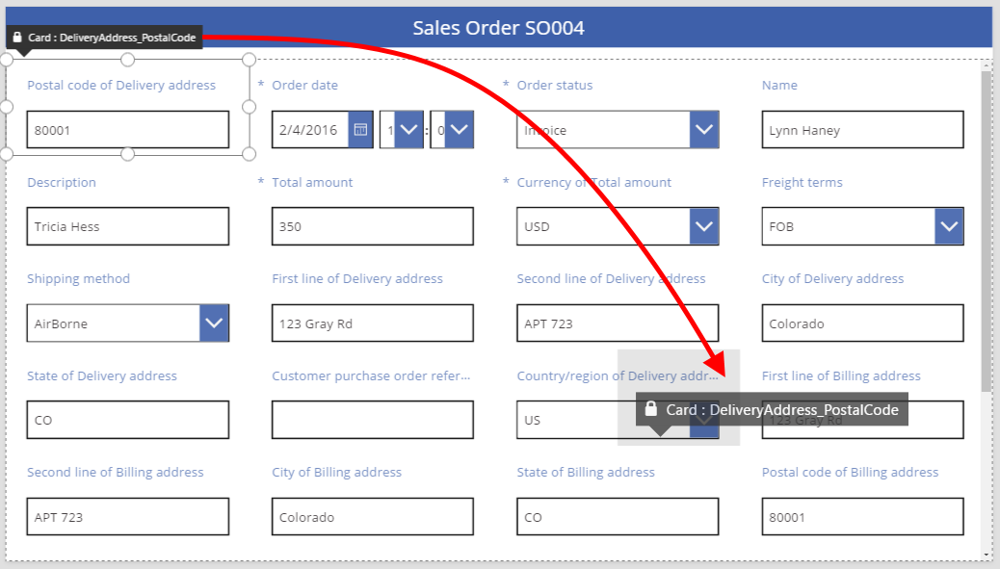

1. Hide the **Sales order ID** card.

	The label already shows that information, so the form doesn't need it.

2. Increase the width of the **Order date** card by dragging the right border of the selection box to the right one snap point.

	The card spans four of the form's 12 columns (or 1/3 of the form), instead of only three of the form's 12 columns (or 1/4 of the form). Whenever you increase a card's width by one snap point, the card spans an additional 1/12 of the form.

	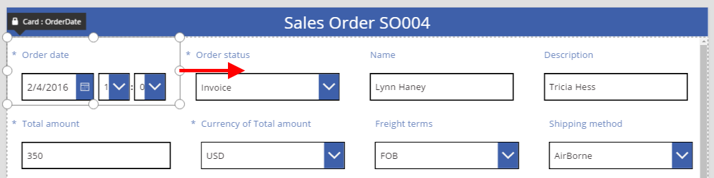

3. Increase the width of the **Order status** card to match the width of the **Order date** card.

	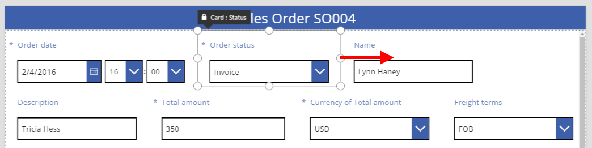

4. Drag the **Customer purchase order reference** card, and drop it after the **Order status** card.

	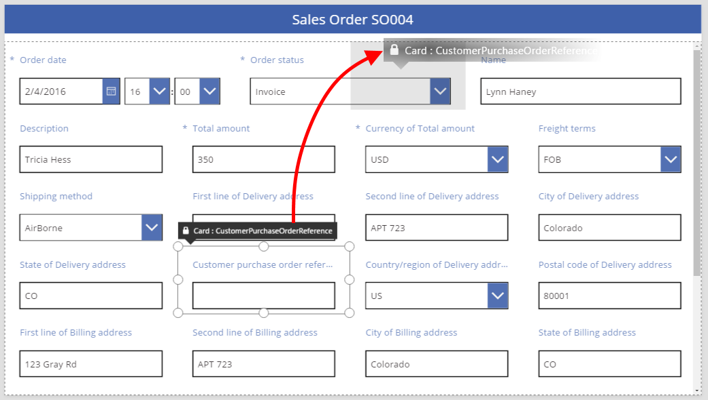

1. Resize the card you just moved to fill out the form.

	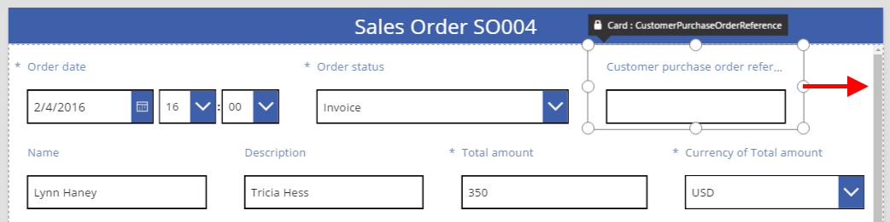

5. Resize the **Name** card to take up six columns (or 1/2) of the form.

	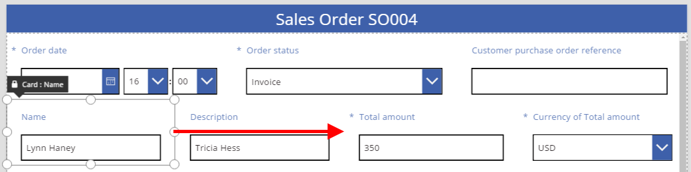

6. Resize the **Description** card to take up the other half of the same row.

	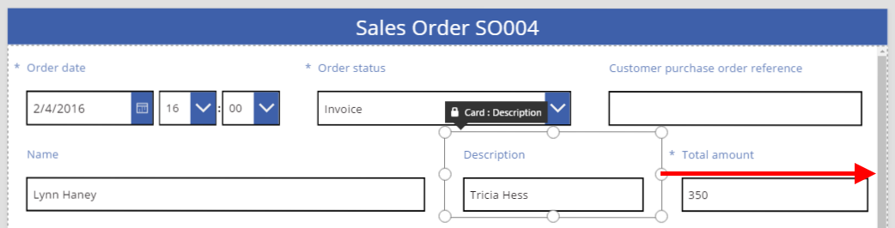

1. Make the first two lines of the delivery address stretch entirely across the form:

	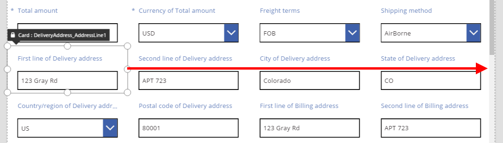

All done. We have our desired form, mixing rows with different numbers of columns:

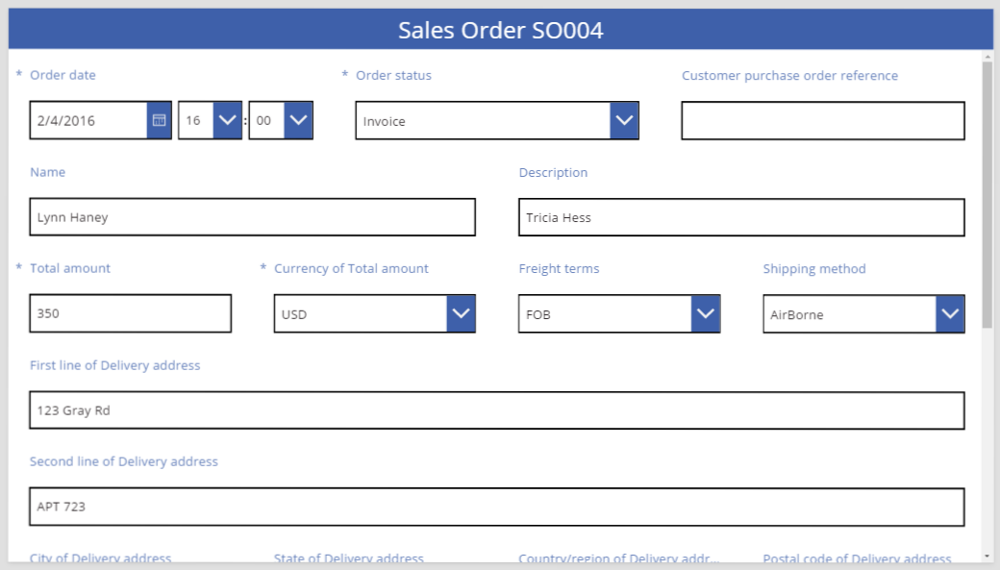

## Data-card manipulations ##

The delivery address comprises several pieces of information that we want to visually group together for the user. Each field will remain in its own data card, but we can manipulate the controls within the card to make them fit better together.

Let's start by changing the text of the **First line of Delivery address** to be the label for the group of controls, calling it simply **Delivery address**. We can do this by selecting the label control within the card and then removing the first three words from the text.

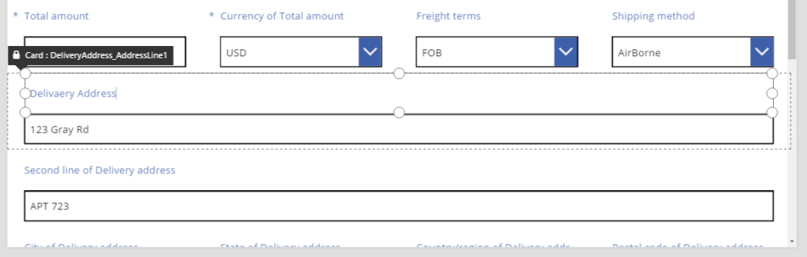

For the second line's label, we can select and delete the text. It's tempting to simply remove the label control and, in many cases, that will work fine. But formulas might depend on that control being present. The safer approach is to remove the text or to set the **Visible** property of the control to **false**.

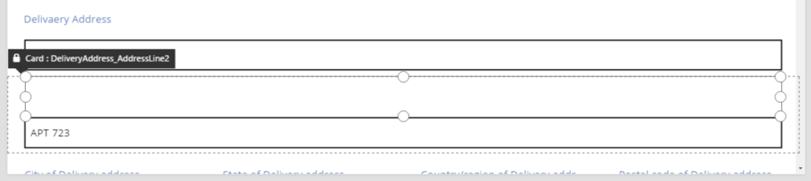

We can now move the Text input box over the label to reduce the space between the first and second lines of the address. The height of the card shrinks when its contents take up less space.

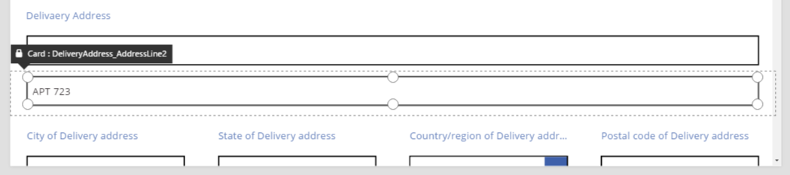

Now let's turn our attention to the third line of the address. Similar to what we just did, let's shorten the text of each label for these cards and arrange the Text input box to be to the right of each label. Here are the steps for the **State** card:

| Step | Description | Result |
|------|-------------|--------|
| 1 | Select the **State** card so that grab handles appear around it. | 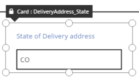 |
| 2 | Select the label within this card so that grab handles appear around it. | 
| 3 | Place the cursor to the right of the text, and then delete the portion that we don't need. |  |
| 4 | Using the grab handles on the sides, size the label control to fit the new text size. |  |
| 5 | Select the text input control within this card. |  |
| 6 | Using the grab handles on the sides, size the text input control to the size that you want. | 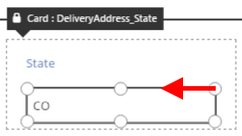 |
| 7 | Drag the text input box up and to the right of the label control, and then drop the text input box. |  |
|   | Our modifications to the **State** card are now complete. | 

The result for the complete third address line:

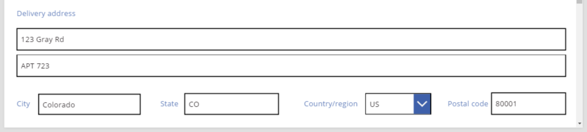

Note that many of the cards start out with dynamic formulas for their properties. For example, the Text input control that we resized and moved above had a **Width** property based on the width of its parent. When you move or resize a control, these dynamic formulas are replaced with static values. If you want, you can restore the dynamic formulas by using the formula bar.

## Turning off Snap to columns ##

Sometimes you'll want finer control than the standard 12 columns can provide. For these cases, you can turn off "Snap to columns" and position cards manually. The form will continue snapping to 12 columns, but you can also hold down the ALT key to manually position and size a card as desired.

In our example, the four components that make up the third line of the address all have exactly the same width. But this may not be the best layout, as City names are often longer than State names, and the input control for Country/region is short due to the length of its label.

To adjust this, turn off "Snap to columns" in the right hand pane. You can now hold down the ALT key while sizing and positioning these cards. While doing this, you will notice that all the controls on the screen will show black captions which is by design; this is a shortcut for seeing control names.

After careful positioning, the result has appropriate sizes for each field and even spacing horizontally between fields:

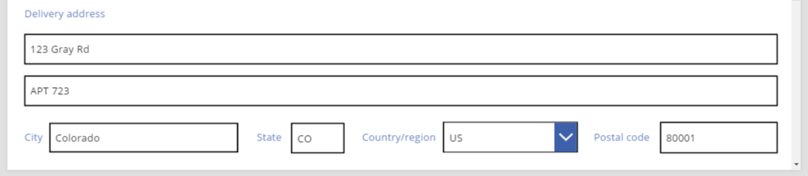

In summary, what are the differences when snap to columns is on versus off?

| Behavior | Snap to columns On | Snap to columns Off |
|---|----|----|
| Resize snaps to | Number of columns you select 1, 2, 3, 4, 6, or 12 | 12 |
| Resize snap can be overriden | No | Yes, with ALT key |
| Cards automatically re-layout between rows (more on this later) | Yes | No |

## Card properties ##

As with everything in PowerApps, the form's layout is governed by properties on the card controls. The drag-and-drop positioning and sizing we have covered so far all manipulate these properties on your behalf. But there will be situations in which you will want to understand and manipulate these properties yourself, especially when making your forms dynamic with formulas.

### Basic Layout: X, Y, and Width ###

The position of cards is controlled with the **X** and **Y** properties. When we are working with controls on the raw canvas these properties provide an absolute position. But when in a form, these properties have a different meaning:

- **X**: Order within a row.
- **Y**: Row number.

Similar to controls on the canvas, the **Width** property specifies the minimum width of the card (more on the minimum aspect in a moment).

Let's take a look at the **X**, **Y**, and **Width** properties of the cards in our form:

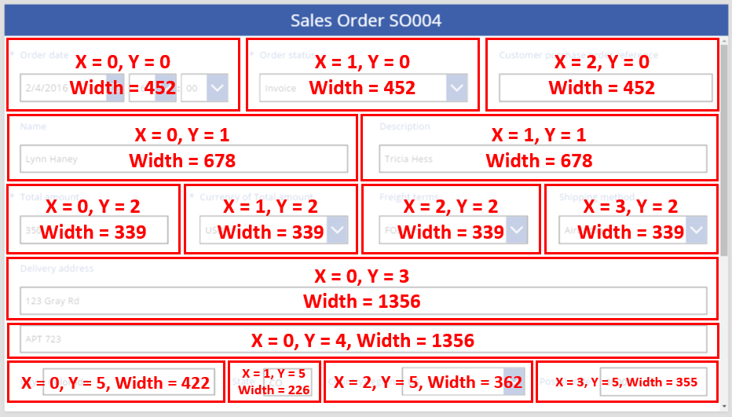

### Overflowing rows ###

What happens if the cards on a row are too wide to fit on that row? Normally you don't need to worry about this. With snap to columns on, these three properties will automatically be adjusted so that everything fits nicely within rows without overflowing.

But with snap to columns turned off or formula based **Width** on one or more of your cards, overflowing a row can happen. In this case, the cards will automatically wrap to create effectively a *new* row. For example, let's manually change the **Width** property of our "Customer purchase order reference" card (first row, third item) to 500 (first row, third card):

Notice that the three cards on the top row no longer fit in the horizontally and that effectively a new row has been created to wrap the overflow. The **Y** coordinate for all these cards is still the same at 0, and the "Name" and "Description" cards still have a **Y** of 1. Cards will not be merged across rows with different **Y** values.

You can use this behavior to create a fully dynamic layout where cards are placed based on a Z-order, filling across as much as possible and then moving to the next row. To do this, give all the cards the same **Y** value, and use **X** for the order of the cards.

### Filling spaces: WidthFit ###

The overflow in the last example created a space after the second "Order status" card of the first row. We could manually adjust the Width properties of the two remaining cards to fill this space but this is tedious.

As an alternative, use the **WidthFit** property. If one or more cards of a row have this property set to **True**, any remaining space on the row will be evenly divided between them. This is why we said earlier that the **Width** property of a card is a *minimum* and what is actually seen can be wider. Note that the card will not shrink in size, only expand.

If we set **WidthFit** on the second "Order status" card then the first card will remain unchanged while the second card fills the available space:

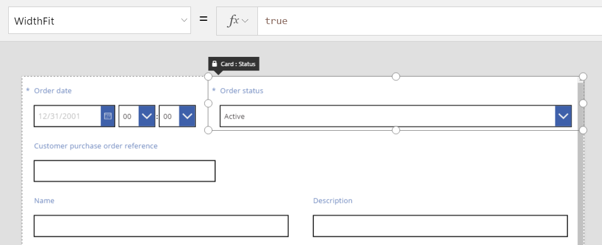

If we also set **WidthFit** on the first "Order date" card the both cards will evenly split the available space:

Note that grab handles on these cards take into account the extra width provided by **WidthFit**, not the minimum width provided by the **Width** property. It can be confusing to manipulate the **Width** property while **WidthFit** is turned on; 	you may want to turn it off, make changes to **Width**, and then turn it back on.

When might **WidthFit** be useful? If you have a field that is only used in certain situations, you can set its **Visible** property to **False** and the other cards on the row will automatically fill the space around it. You might want to use a formula that shows a field when another field has a particular value.

Here, we will set the **Visible** property of the "Order status" field to a static **False**:

With the second card effectively removed, the third card can now return to the same row as the first card. Since the first card still has **WidthFit** set to **True**, it alone expands to fill the available space.

Since it is now invisible, selecting the second card can become difficult. The screen explorer on the left hand side of the screen can be very helpful for selecting the card.

### Height ###

The **Height** property governs the height of each card. Be aware that cards have the equivalent of **WidthFit** for **Height**, and it's always set to **true**. Imagine there were a HeightFit property, but don't go looking for it in the product because it's not yet exposed.

You can't turn off this behavior, so changing the heights of cards can be challenging. All cards within a row will appear to be the same height as the tallest card. You may be looking at a row like this:

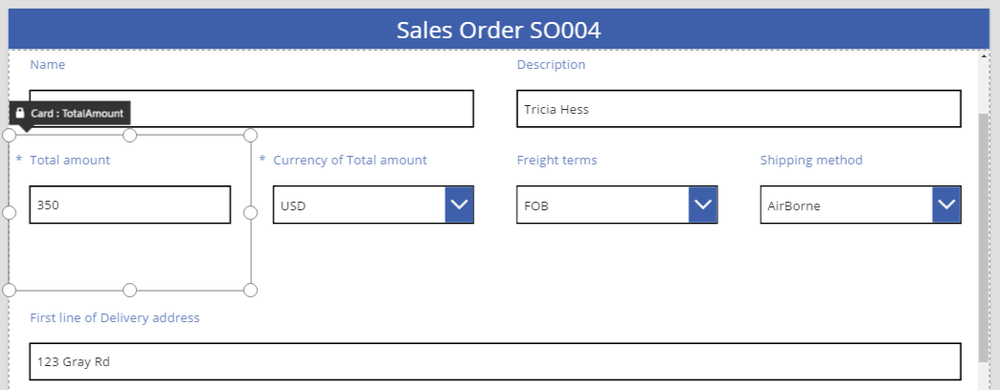

Which card is making the row tall? In the previous graphic, the "Total amount" card is selected and appears tall, but its **Height** property is set to 80 (same as the height of the first row). Except for the tallest card of the row, selecting any other card and attempting to change the height through drag-and-drop won't show any changes. You'll need to look at the **Height** property for each card to discover the one that's making the row tall.

### AutoHeight ###

Another factor that impacts the height of a card when rendered is if any controls within the card have their **AutoHeight** property set to **true**. Many cards provide a label to display an error message if the field's value causes a validation problem.

Without any text to display (no error) the label collapses to zero height. If you didn't know any better, you wouldn't know it was there, and that's as it should be:

The screen explorer in the left-hand pane shows **ErrorMessage1**, which is our label control. At authoring time only, selecting this control will give the control some height, providing grab handles that help you position and size the control. The "A" in a blue box indicates that the control has **AutoHeight**:

The **Text** property of this control is set to **Parent.Error**, which is used to obtain dynamic error information based no validation rules. For illustration purposes, let's statically set the **Text** property of this control, which will increase the height of the control (and, by extension, the card) to accommodate the length of the text:

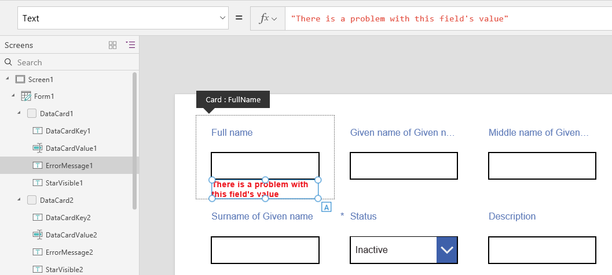

Let's make the error message a little longer, and again the control and the card grow to accommodate. Note that the row overall grows in height, retaining vertical alignment between the cards:

