<properties
	pageTitle="Getting started with forms | Microsoft PowerApps"
	description="Use forms to collect and display information from a data source."
	services=""
	suite="powerapps"
	documentationCenter="na"
	authors="gregli-msft"
	manager="erikre"
	editor=""
	tags=""/>

<tags
   ms.service="powerapps"
   ms.devlang="na"
   ms.topic="article"
   ms.tgt_pltfrm="na"
   ms.workload="na"
   ms.date="04/08/2015"
   ms.author="gregli"/>

# Understanding data forms #
Add three types of controls so that the user can browse for a record, display details about that record, and edit or create a record:

| Activity | Control | Description |
|---------|------------|---------|
| **Browse for a record** | **[Gallery](controls/control-gallery.md)** control | Filter, sort, search, and scroll through records in a data source, and select a specific record. Display only a few fields from each record to show more records at a time. |
| **Show details of a record** | **[Display form](controls/control-form-detail.md)** control | For a selected record, display many or all fields in that record. |
| **Edit or create a record** | **[Edit form](controls/control-form-detail.md)** control | Update one or more fields in a record (or create a record starting with default values), and save those changes back to the underlying data source. |

Put each control on a different screen to make them easier to distinguish:

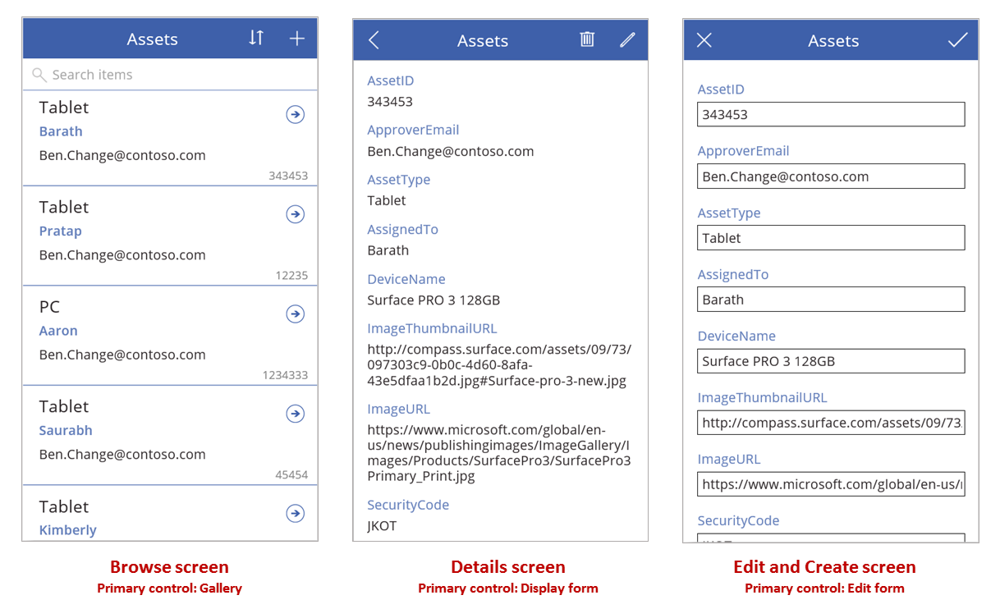

As this topic describes, combine these controls with formulas to create the overall user experience.

**Prerequisites**
- [Sign up](signup-for-powerapps.md) for PowerApps, [install](http://aka.ms/powerappsinstall) it, open it, and then sign in by providing the same credentials that you used to sign up.
- Learn how to [configure a control](add-configure-controls.md) in PowerApps.

## Explore a generated app ##
PowerApps can automatically generate an app based on a data source that you specify. Each app contains three screens with the controls described earlier, with formulas that connect them. Run these apps "out of the box," customize them for your specific goals, or examine how they work to learn useful concepts that apply to your own apps. In the following sections, inspect the screens, controls, and formulas that drive a generated app.  

### Browse screen ##

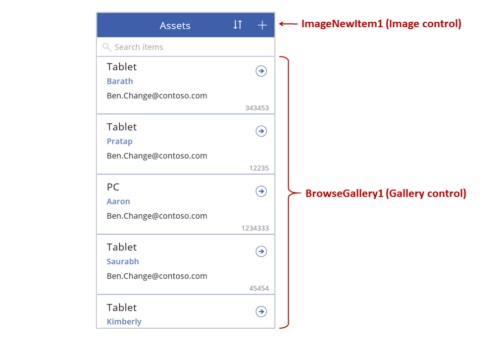

This screen features these key formulas:

| Control | Supported behavior | Formula |
|---------|--------|---------|
| **BrowseGallery1** | Display records from the **Assets** data source. | The **Items** property of the gallery is set to a formula that's based on the **Assets** data source. |
| **ImageNewItem1** | Display the **Edit and Create** screen, and help the user create a record by setting the fields to default values for the data source. | The **OnSelect** property of the image is set to this formula:  **NewForm( EditForm1 ); Navigate( EditScreen1, None )** |
| **NextArrow1** (in the gallery) | Display the **Details** screen to view many or all fields of the currently selected record. | The **OnSelect** property of the arrow is set to this formula: **Navigate( DetailScreen1, None )** |

The primary control on this screen, **BrowseGallery1**, covers most of the area of the screen. The user can scroll through the gallery to find a specific record to display more fields or update.

Set a gallery's **Items** property to show records from a data source in it. For example, set that property to **Assets** to show records from a data source of that name.

**Note**: In a generated app, **Items** is set to a significantly more complicated formula by default so that the user can sort and search for records. You'll learn how to build that formula later in this topic; the simpler version is enough for now.

Instead of finding a record to display or edit, the user can create a record by selecting the "+" symbol above the gallery. Create this effect by adding an **Image** control, showing a "+" symbol in it, and setting its **OnSelect** property to this formula:
 **NewForm( EditForm1 ); Navigate( EditScreen1, None )**

This formula opens the **Edit and Create** screen, which features an **Edit form** control named **EditForm1**. The formula also switches that form into **New** mode, in which the form shows default values from the data source so that the user can easily create a record from scratch.

To examine any control that appears in **BrowseGallery1**, select that control in the first section, which serves as a template for all other sections. For example, select the middle **Text box** control on the left edge:

In this example, the control's **Text** property is set to **ThisItem.AssignedTo**, which is a field in the **Assets** data source. The **Text** property of the other three **Text box** controls in the gallery are set to similar formulas, and each control shows a different field in the data source.  

Select the **Shape** control (the arrow), and confirm that its **OnSelect** property is set to this formula:
 **Navigate( DetailScreen1, None )**

If the user finds a record in **BrowseGallery1**, the user can select the arrow for that record to show more information about it in **DetailScreen1**. By selecting an arrow, the user changes the value of the **Selected** property of **BrowseGallery1**. In this app, that property determines which record appears in not only **DetailScreen1** but also, if the user decides to update the record, the **Edit and Create** screen.

### Detail screen ###

This screen features these key formulas:

| Control | Supported behavior | Formula |
|---------|--------|---------|
| **DetailForm1** | Displays a record in the **Assets** data source | Set the **DataSource** property to **Assets**. |
| **DetailForm1** | Determines which record to display. In a generated app, displays the record that the user selected in the gallery. | Set the **Item** property of this control to this value: **BrowseGallery1.Selected** |
| **Card** controls	| In a **Display form** control, displays a single field in a record. | Set the **DataField** property to the name of a field, enclosed in double quotation marks (for example, **"Name"**). |
| **ImageBackArrow1** |  When the user selects this control, opens **BrowseScreen1**. | Set the **OnSelect** property to this formula: **Back()** |
| **ImageDelete1** |  When the user selects this control, deletes a record. | Set the **OnSelect** property to this formula: **Remove( Assets, BrowseGallery1.Selected )** |
| **ImageEdit1** |  When the user selects this control, opens the **Edit and Create** screen to the current record. | Set the **OnSelect** property to this formula: **Navigate( EditScreen1, None )** |

At the top of the screen, three images sit outside of **DetailForm1** and act as buttons, orchestrating between the three screens of the app.

**DetailForm1** dominates this screen and displays the record that the user selected in the gallery (because the form's **Item** property is set to **BrowseGallery1.Selected**).The **DataSource** property of the form also provides metadata about the data source, such as a user-friendly display name for each field.

**DetailForm1** contains several **Card** controls. You can select either the **Card** control itself or the control that it contains to discover additional information.

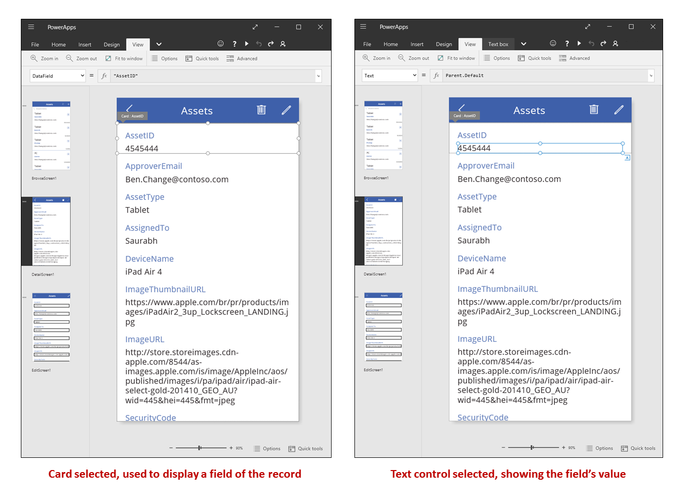

The **DataField** property of a **Card** control determines which field the card displays. In this case, that property is set to **AssetID**. The card contains a **Text box** control for which the **Text** property is set to **Parent.Default**. This control shows the **Default** value for the card, which is set through the **DataField** property.

In a generated app, **Card** controls are locked by default. When a card is locked, you can't modify some properties, such as **DataField**, and the formula bar is unavailable for those properties. This restriction helps ensure that your customizations don't break the basic functionality of the generated app. However, you can change some properties of a card and its controls if you open the **Options** pane for the form:

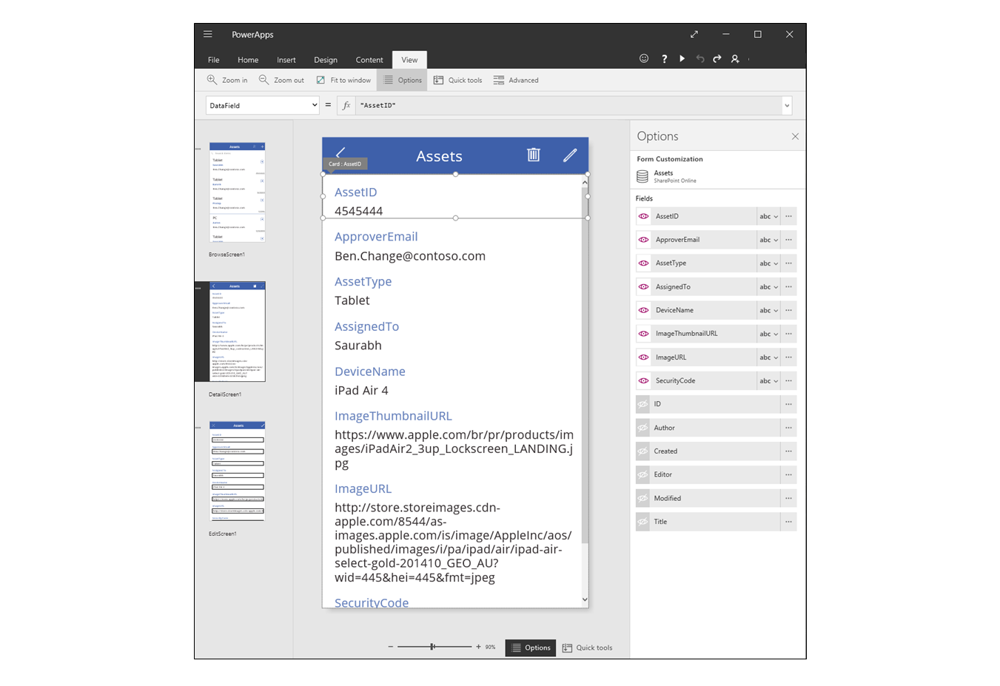

In the **Options** pane, you can select which fields to display and in which kind of control each field displays.

### Edit/Create screen ###

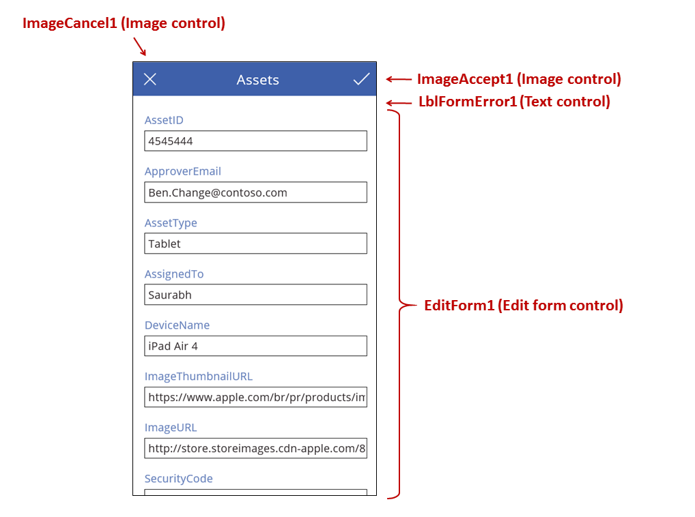

This screen features these key formulas:

| Control | Supported behavior | Formula |
|---------|--------|---------|
| **EditForm1** | Displays a record in the **Assets** data source. | Set the **DataSource** property to **Assets**. |
| **EditForm1** | Determines which record to display. In a generated app, displays the record that the user selected in **BrowseScreen1**. | Set the **Item** property to this value: **BrowseGallery1.Selected** |
| **Card** controls	| In a **Edit form** control, provides controls so that the user can edit one or more fields in a record. | Set the **DataField** property to the name of a field, enclosed in double quotation marks (for example, **"Name"**). |
| **ImageCancel1** | When the user selects this control, discards any changes in progress, and opens the **Details** screen. | Set the **OnSelect** property to this formula: **ResetForm( EditForm1 ); Back()** |
| **ImageAccept1** | When the user selects this control, submits changes to the data source. | Set the **OnSelect** property to this formula: **SubmitForm( EditForm1 )** |
| **EditForm1** | If changes are accepted, returns to the previous screen. | Set the **OnSuccess** property to this formula: **Back()** |
| **EditForm1** | If changes aren't accepted, remain on the current screen so that the user can fix any issues and try to submit again. | Leave the **OnFailure** property blank. |
| **LblFormError1** | If changes aren't accepted, shows an error message.  | Set the **Text** property to this value: **EditForm1.Error** |

As in the **Details** screen, a form control, named **EditForm1**, dominates the **Edit and Create** screen. In addition, the **Item** property of **EditForm1** is set to **BrowseGallery1.Selected**, so the form displays the record that the user selected in **BrowseScreen1**. While the **Details** screen shows each field as read-only, the user can update the value of one or more fields by using the controls in **EditForm1**. It also uses the **DataSource** property to access metadata about this data source, such as the user-friendly display name for each field and the location where changes should be saved.

If the user selects the "X" icon to cancel an update, the **ResetForm** function discards any unsaved changes, and the **Back** function opens the **Details** screen. Both the **Details** screen and the **Edit and Create** screen show the same record until the user selects a different one on **BrowseScreen1**. The fields in that record remain set to the values that were most recently saved, not any changes that the user made and then abandoned.

If the user changes one or more values in the form and then selects the "checkmark" icon, the **SubmitForm** function sends the user's changes to the data source.

- If the changes are successfully saved, the form's **OnSuccess** formula runs, and the **Back()** function opens the detail screen to show the updated record.
- If the changes aren't successfully saved, the form's **OnFailure** formula runs, but it doesn't change anything because it's *blank*. The **Edit and Create** screen remains open so that the user can either cancel the changes or fix the error. **LblFormError1** shows a user-friendly error message, to which the form's **Error** property is set.

As with a **Display form** control, an **Edit form** control contains **Card** controls, which contain other controls that show different fields in a record:

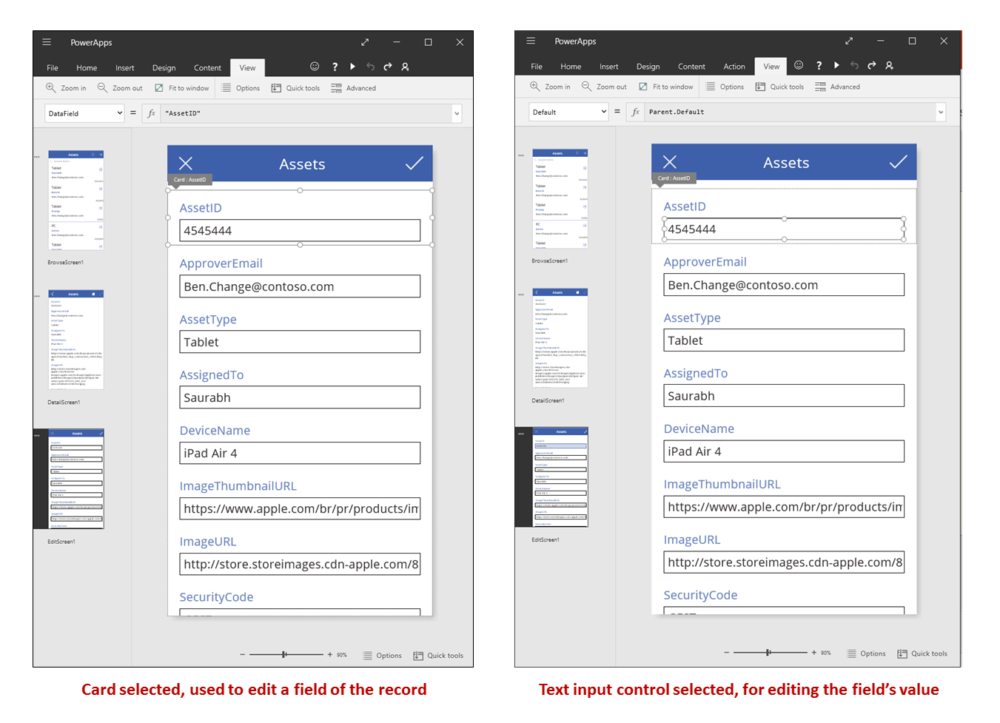

In the previous image, the selected card shows the **AssetID** field and  contains a **Text input** control so that the user can edit the value of that field. (In contrast, the detail screen shows the same field in a **Text box** control, which is read-only.) The **Text input** control has a **Default** property, which is set to **Parent.Default**. If the user were creating a record instead of editing one, that control would show an initial value that the user can change for the new record.

In the **Options** pane, you can show or hide each card, rearrange them, or configure them to show fields in different types of controls.

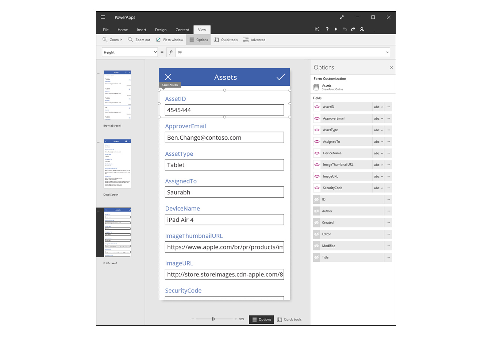

## Build an app from scratch ##
By understanding how PowerApps generates an app, you can build one yourself that uses the same building blocks and formulas discussed earlier in this topic.

## Identify test data ##
To get the most from this topic, start with a data source with which you can experiment. It should contain test data that you can read and update without concern. To follow the rest of this topic exactly, create a SharePoint list named "Ice Cream" that contains this data:

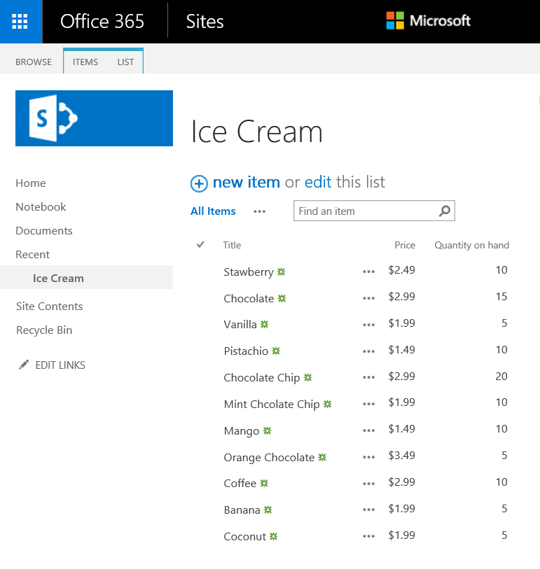

- Create an app from blank, for phones, and connect it to your data source.

	**Note:** Tablet apps are very similar, but you may want a different [screen layout](#screen-layouts) to make the most of the extra screen space.

	The examples in the rest of the topic are based on a data source named **Ice Cream**.

## Browse records ##
Get a quick piece of information from a record by finding it in a gallery on a browse screen.

1. Add a **Text gallery** control in the **Vertical** orientation, and set its **Items** property to **Ice Cream**.

	

	By default, the gallery shows the first three fields for this data source, which aren't the most useful. Next, you'll configure the gallery to show exactly the data you want.

1. Set the **Text** property of the first text control in the gallery to **ThisItem.Title**.

	Instead of showing the date/time when each record was created, the text box shows the value in the **Title** field for each record.

1. Remove the other two text boxes from the gallery, resize it to fill the screen, and set its **TemplateSize** property to **40**.

	The screen resembles this example, which shows all records in the data source:

	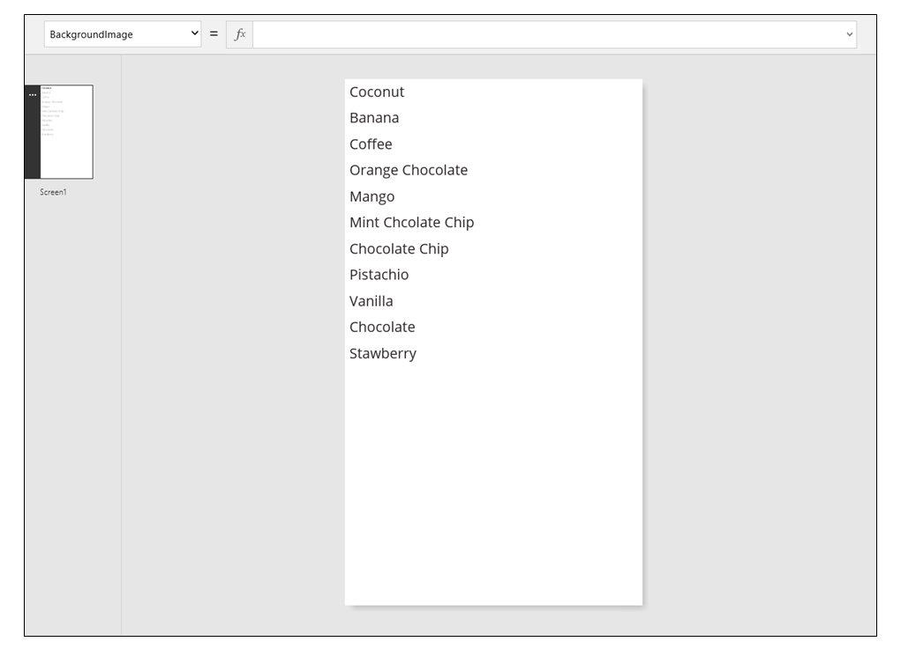

## View details ##
If the gallery doesn't show the information that you want, select the arrow for a record to open the details screen. A **Display form** control on that screen shows more, even all, fields for the record that you selected.  

The **Display form** control uses two properties to display the record:

* **DataSource** property.  The name of the data source that holds the record. This property is used to populate the **Options** panel with fields and is used to determine the display name and data type (string, number, date, etc) for each field.  

* **Item** property.  The record to display.  This is often connected to the **Selected** property of the **Gallery** control, allowing us to drill into the record that was selected in the **Gallery** control.

Once the **DataSource** property is set, you can add and remove fields through the options panel, and change how those fields are displayed.

At this stage, we do not wish to intentionally or accidentally change any values of the record.  The **Display form** control is a read-only control, it will not modify a record.

To use the **Display form** control in our sample app:

1. Add a new screen from the "Insert" tab.

2. Also from the "Insert" tab, open the "Forms" chunk, and select the "Display" form control.

3. Set the **DataSource** property to **'Ice Cream'**.

4. Open the Options pane.

You can now select the fields to display on your screen.  You can also select which type of card to display for each field.  As you make changes in the Options pane, the **DataField** property on each **Card** control is set to the field your user will interact with.  Your screen should look similar to this:

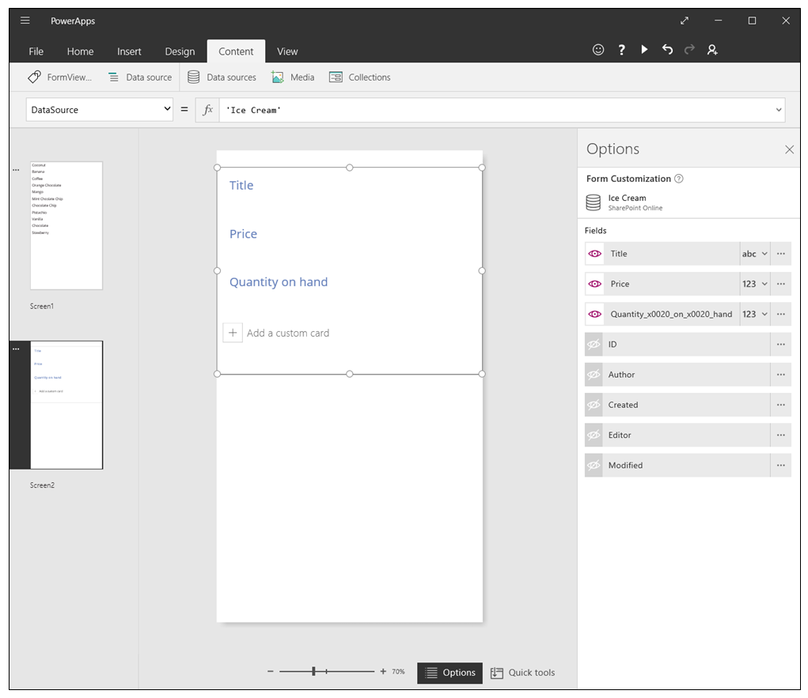

Finally, we need to connect the **Display form** control to the **Gallery** control, so we can look at details for a specific record.  As soon as we complete setting the **Item** property, we will see the first record from the gallery in our form.

1. Set the **Item** property on the **Display form** control: **Gallery1.Selected**.  You should immediately see the details for the selected item in the gallery.

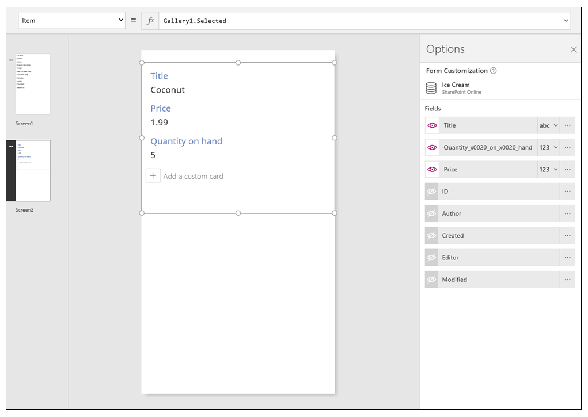

Great!  We now turn to navigation - how does a user get to this screen from the gallery screen and back again.

2. Add a **Button** control to the screen, and set its **OnSelect** property to: **Button1.OnSelect = Back()**.  This will return the user back to the gallery when they are done viewing details.  Set the label text on the button to "Back".

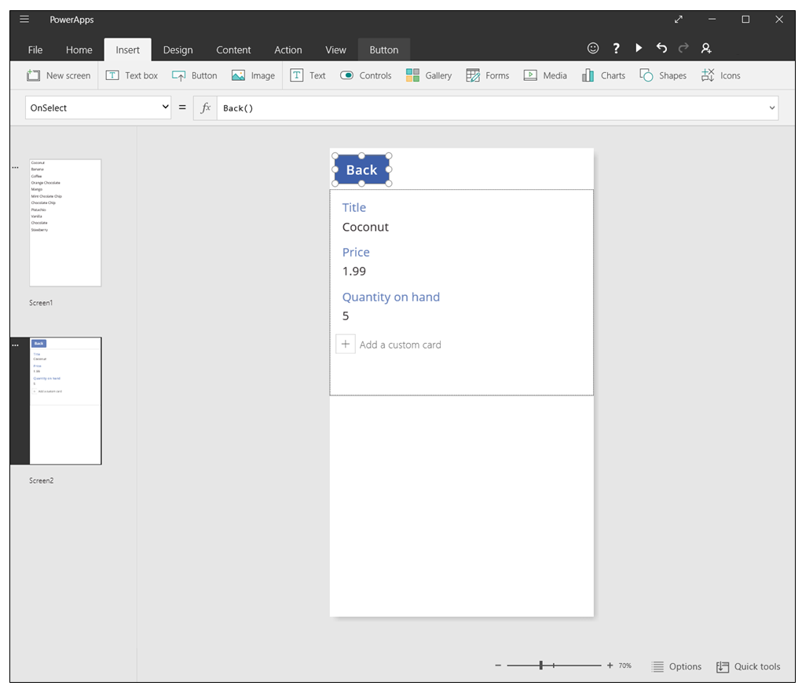

Now, let's return to the **Gallery** control and add some navigation to our detail screen.

1. Switch to the first screen, which is hosting our **Gallery** control.

2. Select the repeating region at the top of the gallery.

2. On the "Insert" tab, "Shapes" chunk, select the right arrow icon.  Place and resize as appropriate for the right hand side of the gallery.

3. Set the **OnSelect** property of the shape to **Navigate( Screen2, None )**.

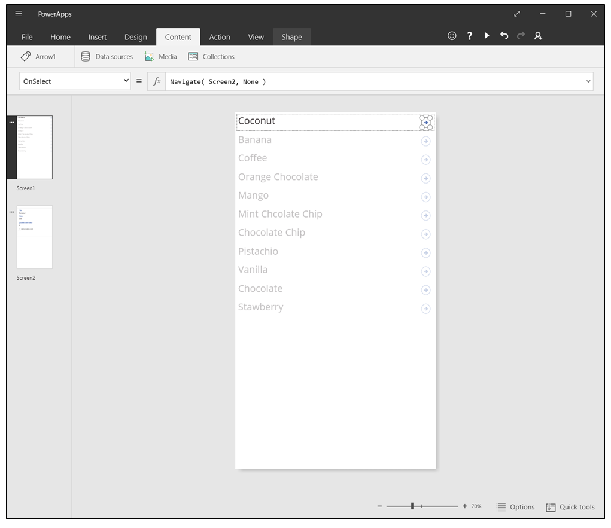

You can now preview your app.  Press an arrow button next to an item in the gallery and you will be taken to a screen to see the details for that item.  Press the "Back" button to return to the gallery to select a different product.

## Editing details ##

Finally, our last core activity is changing the contents of a record.  We accomplish this with the **Edit form** control.

The **Edit form** control uses two properties to display and edit the record:

* **DataSource** property.  The name of the data source that holds the record.  Just as with the **Display form** control, this property is used to populate the options panel with fields and is used to determine the display name and data type (string, number, date, etc) for each field.  This property is also used to determine if a field's value is valid before submitting to the underlying data source.

* **Item** property.  The record to edit.  This is often connected to the **Selected** property of the **Gallery** control, allowing us to edit the record that was selected in the **Gallery** control.

To use the **Edit form** control in our sample app:

1. Add a new screen from the "Insert" tab.

2. Also from the "Insert" tab, open the "Forms" chunk, and select the "Edit" form control.

3. Set the **DataSource** property to **'Ice Cream'**.

3. Set the **Item** property to **Gallery1.Selected**.

4. Open the Options pane.

You can now select the fields to display on your screen.  You can also select which type of card to display for each field.  As you make changes in the Options pane, the **DataField** property on each **Card** control is set to the field your user will interact with.  Your screen should look similar to this:

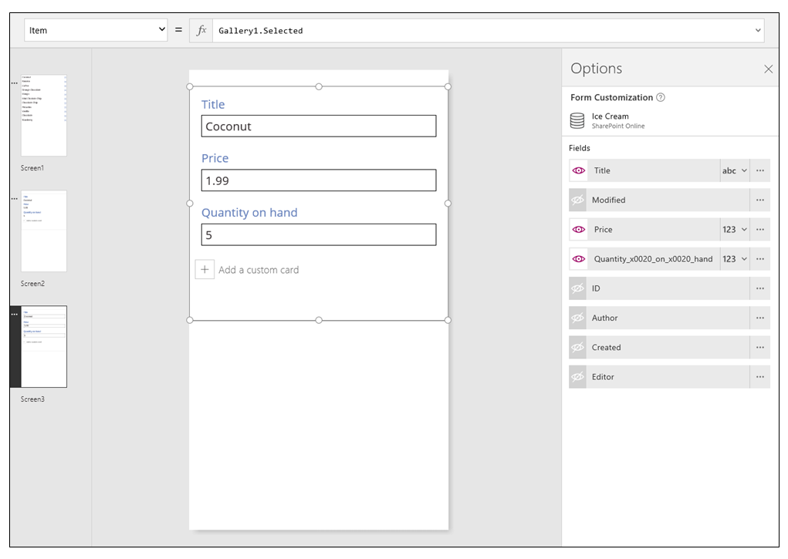

These two properties are the same as the properties on the **Display form** control.  And with these alone, we can display the details of a record.  

Where the **Edit form** control goes further is offering the **SubmitForm** function, to write back changes to the data source.  You use this with a button or image control to save a user's changes:

* **Button2.OnSelect = SubmitForm( EditForm )**

Let's add a "Save" button:

2. From the "Insert" tab, add a **Button** control to the screen.

3. Change the button's text to **"Save"**.

4. Set its **OnSelect** property to: **SubmitForm( Form1 )**.  

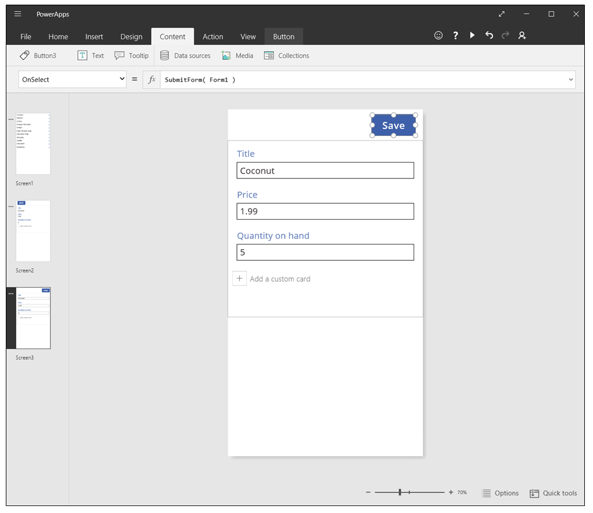

Finally, let's wire this screen in with the other screens.

2. From the "Insert" tab, add another **Button** control to the screen.

3. Change the button's text to **"Cancel"**.

4. Set its **OnSelect** property to: **ResetForm( Form1 ); Back()**.  This will clear out any user edits that may have been pending, and then return us to the previous screen.

	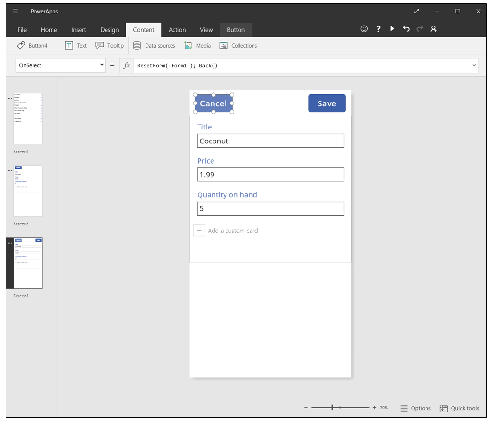

5. Select the **Edit form** control on the canvas.

6. Set the **OnSuccess** property to: **Back()**.  This will return us to the previous screen after a successful submission.

	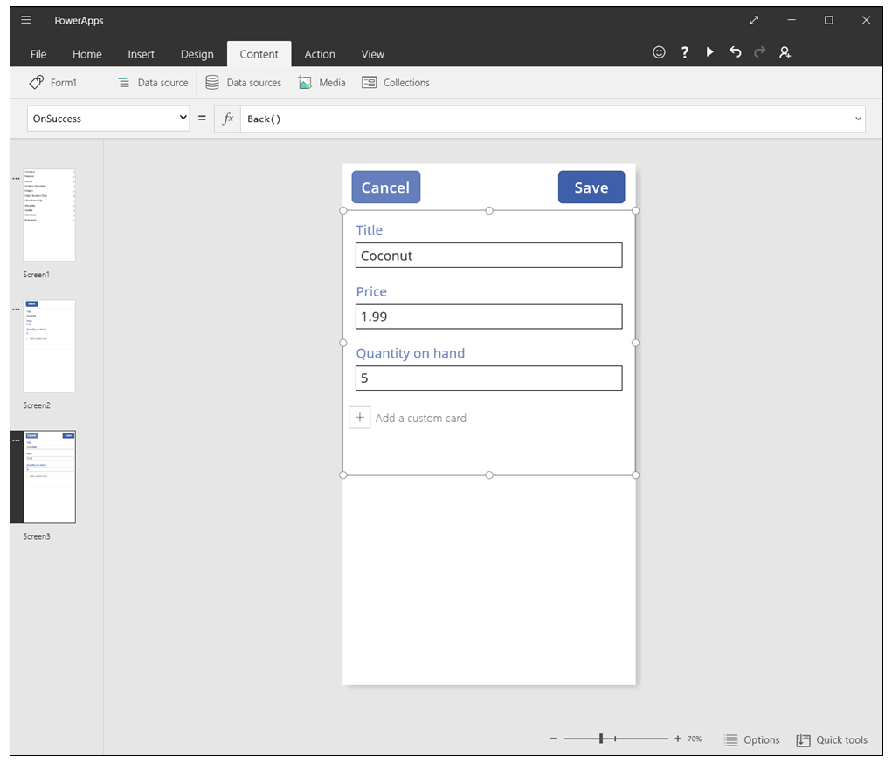

7. Return to the second screen, hosting our **Display form** control.

8. Insert another button from the "Insert" tab.

9. Change the caption of this button to **"Edit"**.

10. Change the **OnSelect** property of this control to: **Navigate( Screen3, None )**.

	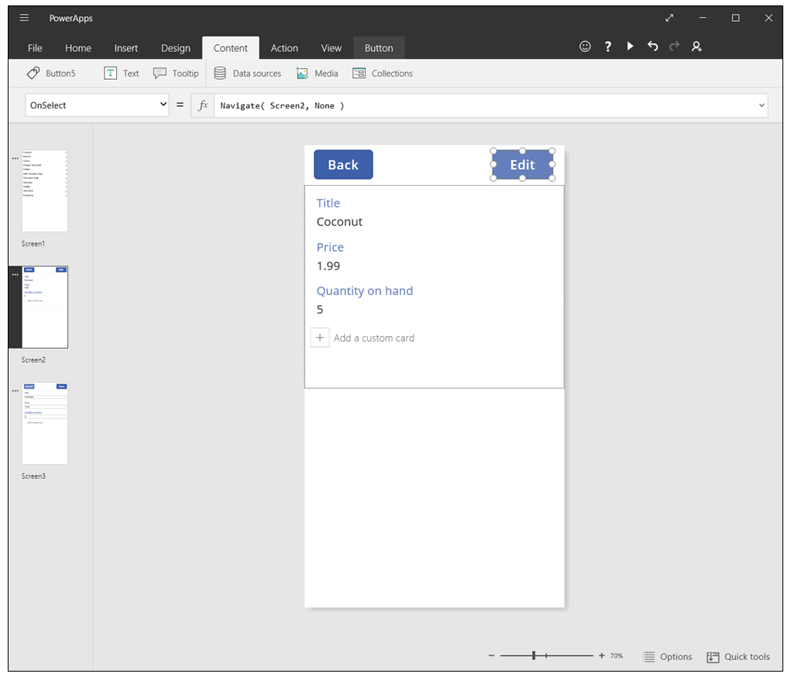

We have now completed our basic three screen data viewing and entry app.  Let's try it out: press the forward arrow "Preview" button at the top of the screen (or press F5).  The pink dot indicates where the user is tapping on the screen at each step.

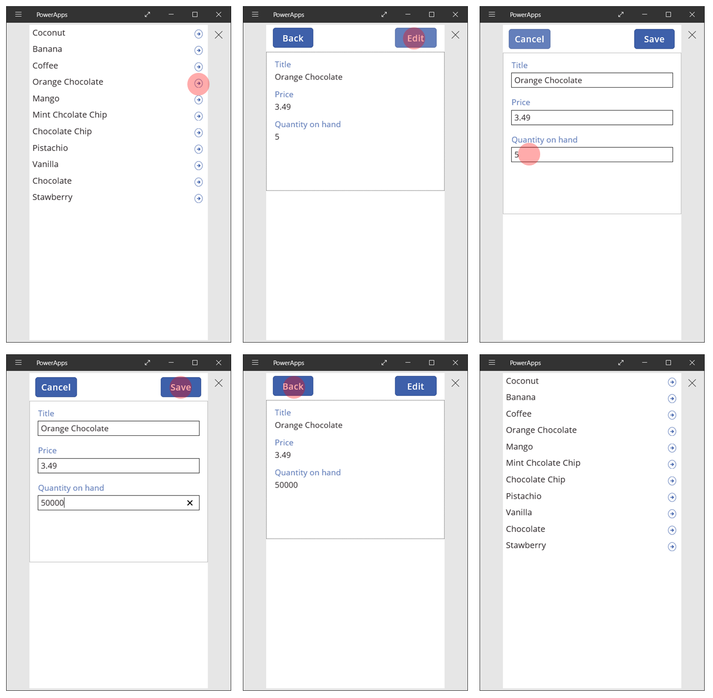

## Creating new records ##

The **Edit form** control is also used to create new records.  To shift from editing record to creating records, you call the **NewForm** function to place the form in to **New** mode.

When in **New** mode, the value of each field is taken from the defaults of the data source. The record provided to the form's **Item** property is ignored.  

When **SubmitForm** is called, a new record will be created instead of editing an existing record. Once the form has been successfully submitted the form is again returned to **EditMode**.  

Let's return to our first screen to add a "New" button:

1. Select the first screen, hosting our **Gallery** control.

2. Using the "Insert" tab, add a new **Button** control.

3. Change the caption to "New".

4. Set the **OnSelect** property for the button: **NewForm( Form1 ); Navigate( Screen3, None )**.  This will place the **Edit form** control on **Screen3** into "New" mode and take us to the third screen to fill it in.

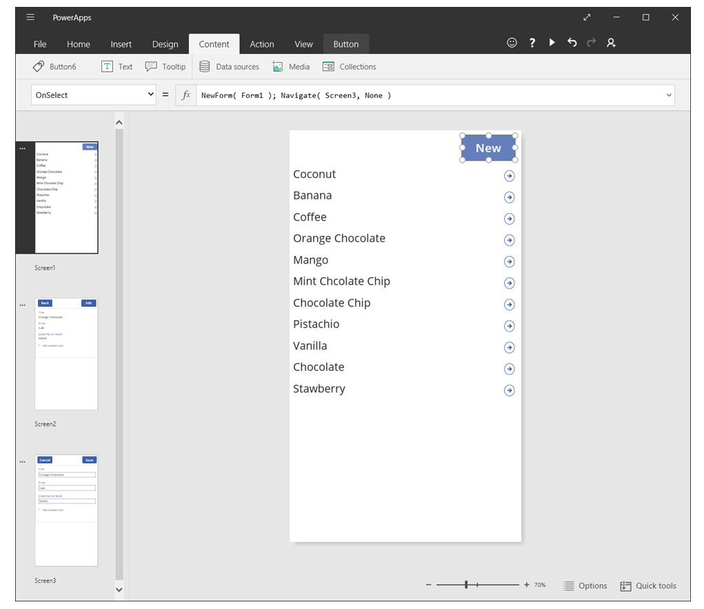

When we travel to the third screen now, the form will be empty, ready for us to add a new item.  Pressing "Save" now will create a record instead of editing an existing record (thanks to the **SubmitForm** function).  Without changing the formula, pressing "Cancel" will reset the form and exit "New" mode for the form (thanks to the **ResetForm** function), and return us to the gallery (thanks to the **Back** function).

## Deleting records ##

Your users may want to delete records too.  

2. Select the second screen, hosting our **Display form** control.

2. Using the "Insert" tab, add a new **Button** control.

3. Change the caption to "Delete".

4. Set the **OnSelect** property to: **Remove( 'Ice Cream', Gallery1.Selected ); Back()**

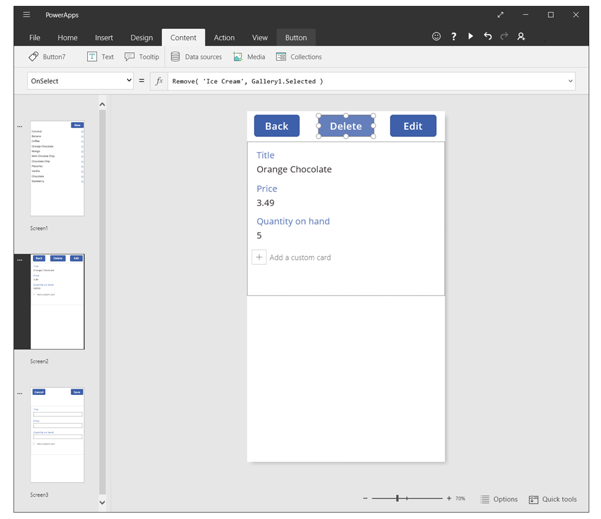

## Handling errors ##

Errors happen.  The value of a field may be invalid, a blank field may be required, you may be disconnected from the network, or any number of other problems may pop up.  

If **SubmitForm** fails for any reason, the **Error** property of the **Edit form** control will contain an error message to show the user.  With this information, the user should be able to correct the issue and resubmit, or they can choose to cancel the edit.

1. Select the third screen, hosting our **Edit form** control.

2. Insert a **Text** control.  Place it just below the "Save" button, so that the error is easy to see after the user has pressed this control to save their changes.

3. Set the **Text** property of this control to: **Form1.Error**.

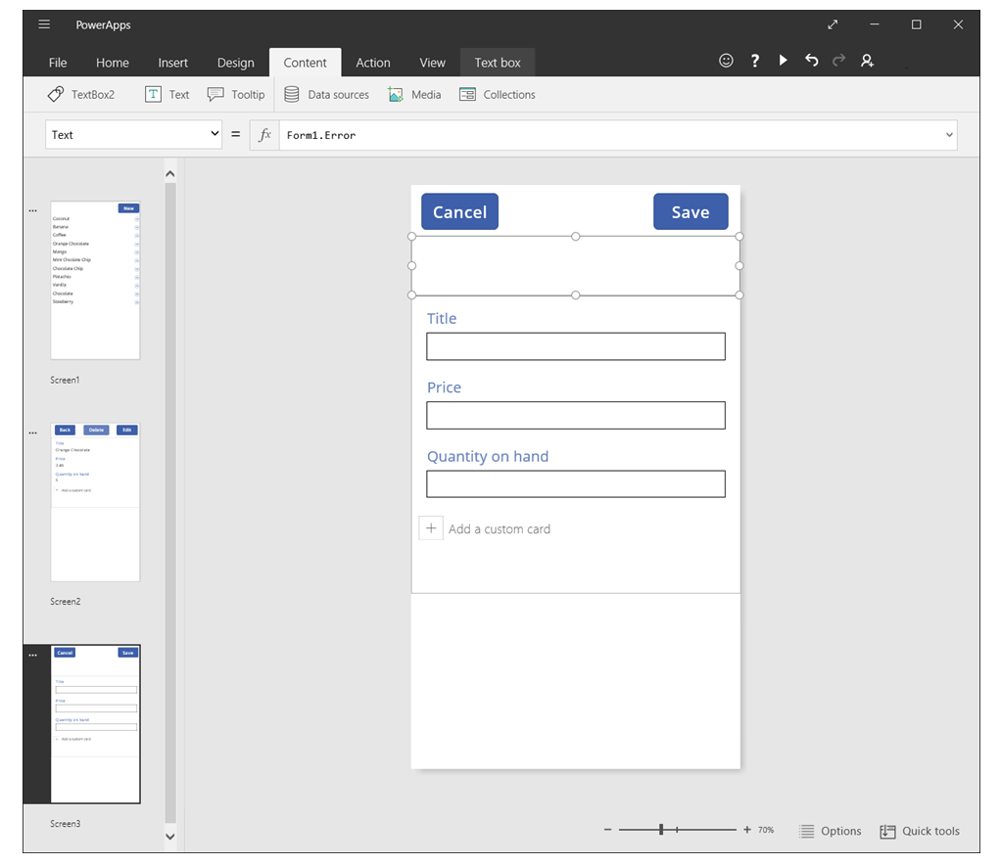

The app from data that is created by PowerApps sets the **AutoHeight** property on this control to *true* so that there is no space consumed if there is no error.  The **Height** and **Y** properties of the **Edit form** control are also adjusted dynamically to account for this control growing when there is an error.  For more details, create an app from data and inspect these properties.  As the error text control is very short when there is no error, you may need to use the "Advanced" view (available on the "View" tab) to select this control.

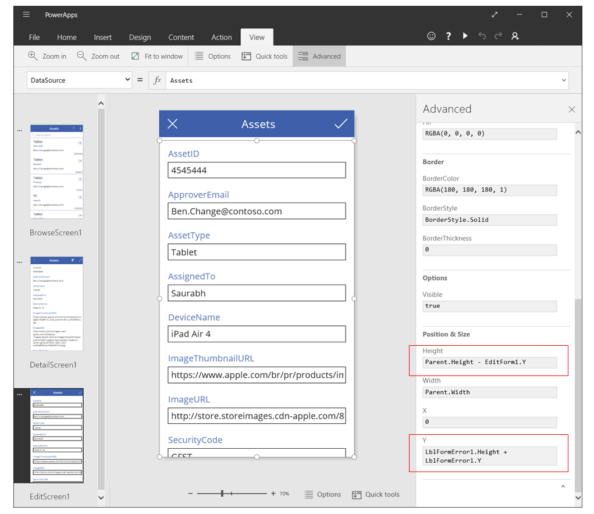

## Refreshing data ##

When the app is opened, the data source is refreshed.  To manually refresh the records in the gallery, you can add a "Refresh" button:

1. Select the first screen, hosting our **Gallery** control.

2. Add a **Button** control from the "Insert" tab.

3. Change the caption on this control to "Refresh".

4. Set the **OnSelect** property of this control to: **Refresh( 'Ice Cream' )**

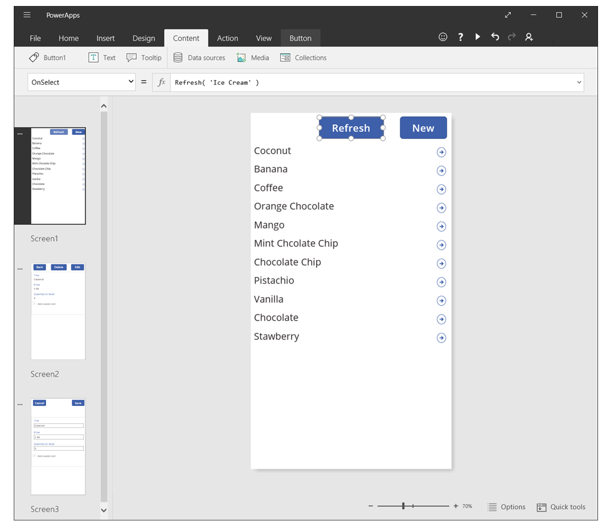

## Searching and sorting the gallery ##

Let's return to that app from data we had previously.  There were some controls that we neglected to discuss previously.  These extra two controls enable the user to search for a set of records or a particular record, and to sort the result up or down.  

Let's look at the sort button at the top first.  This button, when pressed, will cause the sort order of the gallery to reverse.  To accomplish this, we use a *context variable* to hold which direction we are currently sorting.  When the button is pressed, we reverse the direction.

- **ImageSortUpDown1.OnSelect = UpdateContext( {SortDescending1: !SortDescending1} )**

The **UpdateContext** function will create the **SortDescending1** context variable if it does not already exist.  It will read it's value, and using the **!** operator, set it to its logical opposite: if it is *true* it will become *false* and if it is *false* it will become *true*.

We then craft a formula for the **Items** property of the **Gallery** control to use this context variable, along with the text in the **TextSearchBox1** control:

	Gallery1.Items = Sort( If( IsBlank(TextSearchBox1.Text),
                               Assets,
                               Filter( Assets,
                                       TextSearchBox1.Text in Text(ApproverEmail) ) ),
	                        ApproverEmail,
	                        If(SortDescending1, Descending, Ascending) )

Let's break this down:

- On the outside, we have the **Sort** function.  This takes a table as an argument, a field to sort on, and the direction to sort.  
	- The sort direction is taken from the context variable that the **ImageSortUpDown1** control toggles, translating the *true*/*false* value to the constants **Descending** and **Ascending**.
	- The field to sort on is fixed to **ApproverEmail**.  If the fields shown in the gallery are changed, this argument will also need to be changed.

- On the inside, we have the **Filter** function.  This takes a table as an argument, and a filter expression to evaluate for each record.
	- The filter table is the raw **Assets** data source.  This is our starting point before filtering or sorting.
	- The filter expression searches for an instance of the string in **TextSearchBox1** within the **AproverEmail** field.  Again, if we change the fields shown in the gallery, this argument will also need to be updated.
	- There is check to ensure that **TextSearchBox1** is not empty.  If it is, the user is asking for all records, and the **Filter** function is bypassed.

This is but one example, you can craft your own formula for the **Items** property depending on the needs of your app, composing **Filter**, **Sort**, and other functions and operators together.    

## Screen layouts ##

So far, we haven't discussed how controls are to be distributed across screens.  And that is for a good reason - there are many possibilities and your selection will depend on your specific app's needs.

On a phone, with limited screen real estate, you will likely want different screens for browsing, viewing, and editing.  In the examples above, we used the **Navigate** and **Back** functions to move between these screens.  

On a tablet, with more screen real estate, you can place the **Gallery** control and the form controls on the same screen.  No **Navigate** or **Back** is required.

When working on the same screen, you need to be careful that the user can't change the selection in the **Gallery** and potentially lose edits in the **Edit form** control.  To keep selection from moving if there are unsaved changes, set this property:

- **Gallery.Disabled = EditForm.Unsaved**
