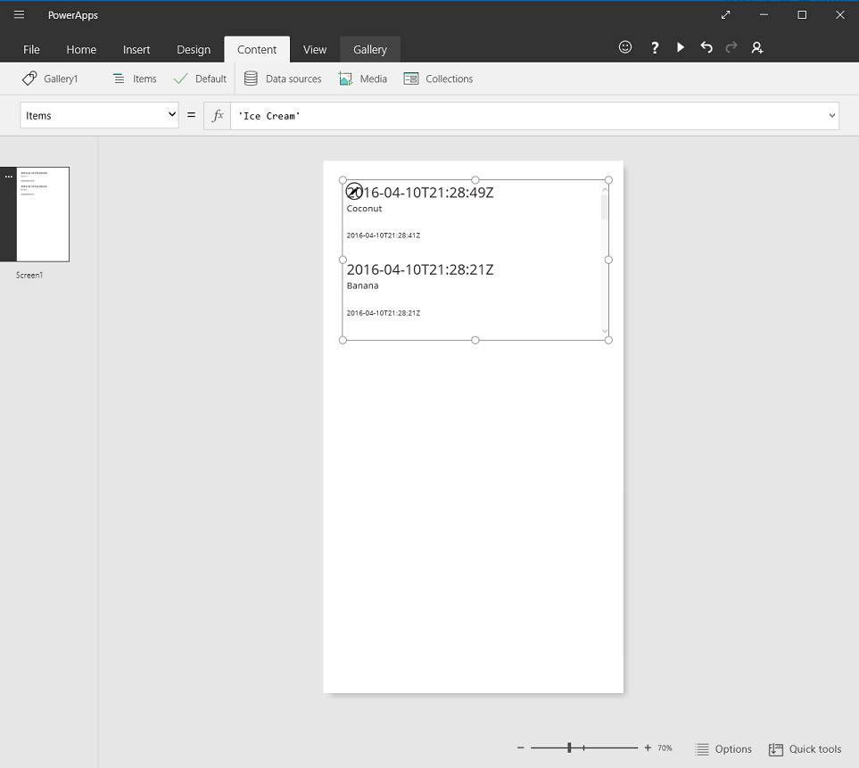
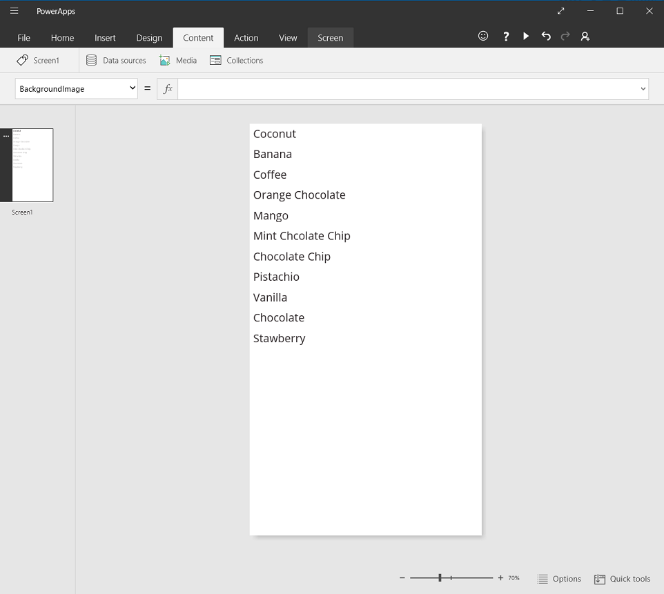
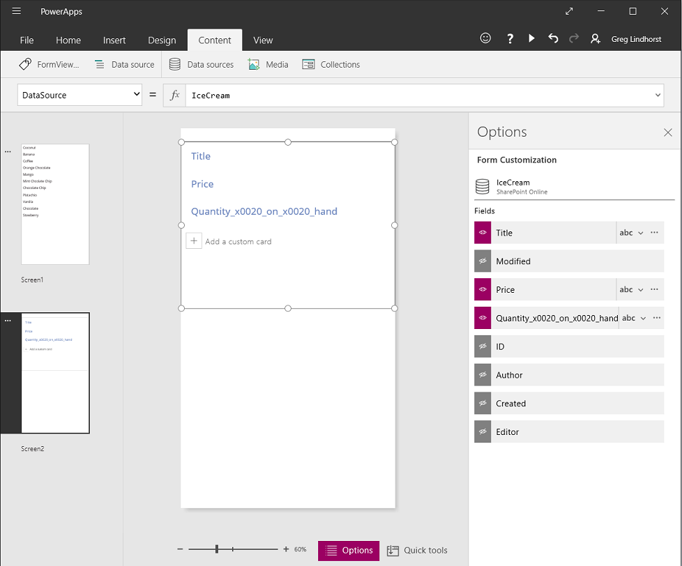
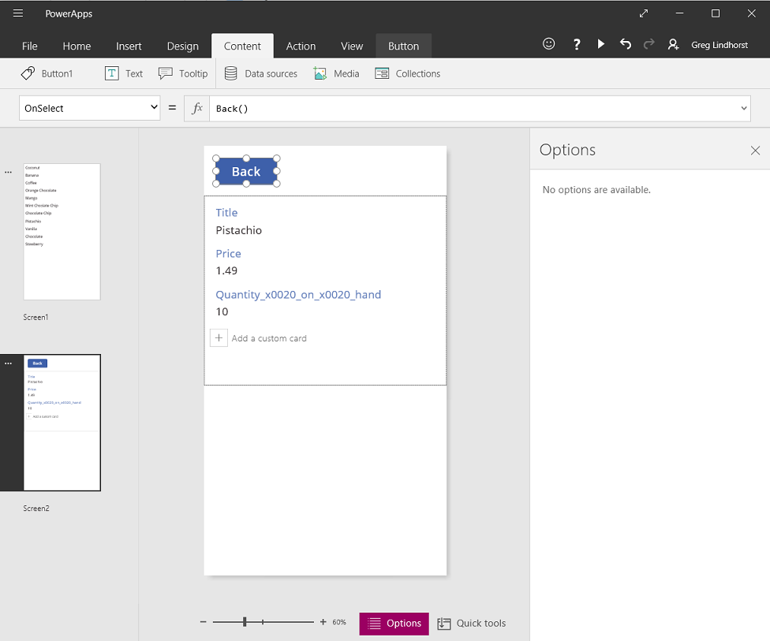
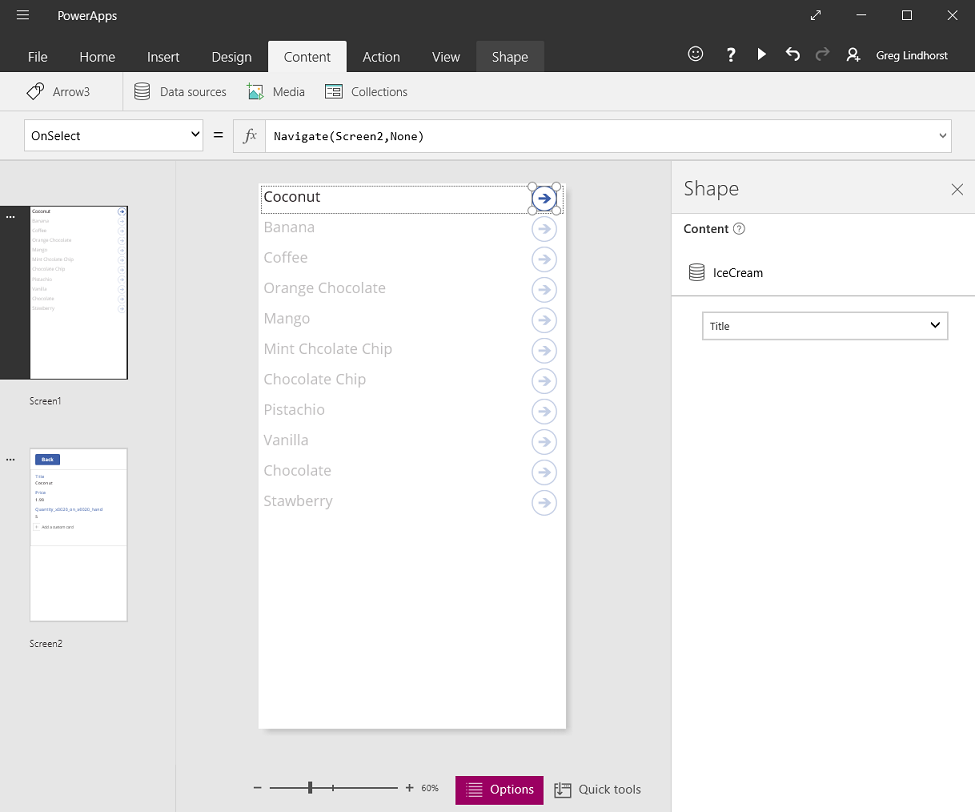

<properties
	pageTitle="Getting started with forms | Microsoft PowerApps"
	description="Use forms to collect and display information from a data source."
	services=""
	suite="powerapps"
	documentationCenter="na"
	authors="gregli-msft"
	manager="dwrede"
	editor=""
	tags=""/>

<tags
   ms.service="powerapps"
   ms.devlang="na"
   ms.topic="article"
   ms.tgt_pltfrm="na"
   ms.workload="na"
   ms.date="04/08/2015"
   ms.author="gregli"/>

# Getting started with forms #

Interacting with data involves three core activities, corresponding to three different controls in PowerApps:

| Activity | Control | Description |
|---------|------------|---------|
| **Browsing for records** | **[Gallery](controls/control-gallery.md)** control | Filtering, sorting, searching, and scrolling through the records of a data source to find the records desired.  To show many records on the screen at a time, only a few fields are shown. |
| **Viewing a record** | **[View form](controls/control-form-detail.md)** control | Once a record has been identified, drilling in to see all the details or fields of the record. |
| **Editing a record** | **[Form](controls/control-form-detail.md)** control | Updating the fields of a record and saving those changes back to the underlying data source.  Facilities for editing are often used to create new records too. |

This topic provides an overview of working with these controls.  

PowerApps can also generate an app from data for you, which uses these same building blocks.  This topic explains how that app is constructed.

**Prerequisites**

- [Sign up](signup-for-powerapps.md) for PowerApps, [install](http://aka.ms/powerappsinstall) it, open it, and then sign in by providing the same credentials that you used to sign up.
- Learn how to [configure a control](add-configure-controls.md) in PowerApps.

## Example Data Source ##

To get the most from this article, it is helpful to have a data source with which you can experiment.  Something that you can read, and write, and it won't be a problem if it is written with test data.  The remainder of this article will assume a SharePoint list named "Ice Cream" with the following contents:

1. Create a new PowerApp from blank, for phones.  We'll talk about tablet apps at the end of this article.

1. Create a connection to this data source in PowerApps.  For the remainder of this article, we will assume a data source with the name "Ice Cream".

## Browsing records ##

The first step in editing a record, is finding the record to edit.  The **Gallery** control  is designed to show a gallery of records, that the user can scroll through and select from.

1. Using the "Insert" ribbon, insert a **Gallery** control, of type "Text gallery" and "Vertical".

2. Set **Gallery1.Items = "Ice Cream"**

The gallery is showing the first three fields for this data source, which is not what we want.  Let's clean this up:

1. Select the first text control in the gallery by selecting the text which is currently showing the created date and time.

2. Change its **Text** property to **ThisItem.Title**.  The text box will now reflect the Title of this item.

3. Remove the other two text boxes in the gallery.

4. Resize the **Gallery** control to fill the screen.

5. Resize the repeating section of the gallery to take up less space.

When you are done, your screen should look more like this (it need not be exactly the same):

Great, we are now showing all the rows from the SharePoint list.

## Viewing details ##

With the gallery, we can identify a record of interest, that we want to drill into to see the price and quantity on hand.  We use the **View Form** control to view details of the record.  

The **View form** control uses two properties to display the record:

* **DataSource** property.  The name of the data source that holds the record.  This property is used to populate the options panel with fields and is used to determine the display name and data type (string, number, date, etc) for each field.  

* **Item** property.  The record to display.  This is often connected to the **SelectedItem** property of the **Gallery** control, allowing us to drill into the record that was selected in the **Gallery** control.

Once the **DataSource** property is set, you can add and remove fields through the options panel, and change how those fields are displayed.

At this stage, we do not wish to intentionally or accidentally change any values of the record.  The **View form** control is a read-only control, it will not modify a record.

To use the **View form** control in our sample app:

1. Add a new screen from the "Insert" tab.

2. Also from the "Insert" tab, open the "Forms" chunk, and select "View form".

3. Set the **DataSource** property to 'Ice Cream'.

4. Open the Options tab.

You can now select the fields to display on your screen.  You can also select which type of card to display for each field.  Your screen should look similar to this:

Finally, we need to connect the **View form** control to the **Gallery** control, so we can look at details for a specific record.  

1. Set the **Item** property on the **View form** control: **FormViewer1.Item = Gallery1.Selected**.  You should immediately see the details for the selected item in the gallery.

2. Add a **Button** control to the screen, and set its **OnSelect** property to: **Button1.OnSelect = Back()**.  This will return the user back to the gallery when they are done viewing details.  Set the label text on the button to "Back".

Now, let's return to the **Gallery** control and add some navigation to our detail screen.

1. Switch to the first screen, which is hosting your **Gallery** control.

2. Select the repeating region at the top of the gallery.

2. On the "Insert" tab, "Shapes" chunk, select the right arrow icon.  Place and resize as appropriate for the right hand side of the gallery.

3. Set the **OnSelect** property of the shape to **Arrow1.OnSelect = Navigate( Screen2, None )**.

You can now preview your app.  Press an arrow button next to an item in the gallery and you will be taken to a screen to see the details for that item.  Press the "Back" button to return to the gallery to select a different product.

## Editing details ##

Finally, our last core activity is changing the contents of a record.  We accomplish this with the **Form** control.

The **Form** control uses two properties to display and edit the record:

* **DataSource** property.  The name of the data source that holds the record.  Just as with the **View form** control, this property is used to populate the options panel with fields and is used to determine the display name and data type (string, number, date, etc) for each field.  This property is also used to determine if a field's value is valid before submitting to the underlying data source.

* **Item** property.  The record to edit.  This is often connected to the **SelectedItem** property of the **Gallery** control, allowing us to edit the record that was selected in the **Gallery** control.

These two properties are the same as the properties on the **View form** control.  And with these alone, we can display the details of a record.  Where the **Form** control goes further is offering the **SubmitForm** function, to write back changes to the data source.  You use this with a button or image control to save a user's changes:

* **SaveButton.OnSelect = SubmitForm( EditForm )**

## Creating new records ##

The **Form** control is also used to create new records.  Call the **NewForm** function to place the form in to **New** mode.

When in **New** mode, the value of each field is taken from the defaults of the data source. The record provided to the form's **Item** property is ignored.  

When **SubmitForm** is called, a new record will be created instead of editing an existing record. Once the form has been successfully submitted the form is again returned to **EditMode**.  

For example, you may want to offer a "Create new record" button.  This button's **OnSelect** property would be set to:

* **NewButton.OnSelect = NewForm( EditForm )**

## Deleting records ##

Your users may want to delete records too.  To offer this, insert a button or image control and set the **OnSelect** property to:

* **DeleteButton.OnSelect = Remove( DataSource, Gallery.Selected )**

## Handling errors ##

Errors happen.  The value of a field may be invalid, a blank field may be required, you may be disconnected from the network, or any number of other problems may pop up.  

If **SubmitForm** fails for any reason, the **Error** property of the **Form** control will contain an error message.  With this information, the user should be able to correct the issue and resubmit, or they can choose to cancel the edit.

For example, you should include a label control on the screen with your **Form** control, that contains:

* **ErrorLabel.Text = EditForm.Error**   

## Searching and Sorting ##

## Refreshing ##

Refreshing the data source.

* **RefreshButton.OnSelect = Refresh( DataSource )**

## Screen layouts ##

So far, we haven't discussed how controls are to be distributed across screens.  And that is for a good reason - there are many possibilities and your selection will depend on your specific app.

On a phone, with limited screen real estate, you will likely want different screens for browsing, details, and editing.  You use the **Navigate** and **Back** functions to move between these screens.  

On a tablet, with more screen real estate, you can place the **Gallery** control and the form controls on the same screen.  No **Navigate** is required.

When working on the same screen, you need to be careful that the user can't change the selection in the **Gallery** and potentially lose edits in the **Form** control.  To keep selection from moving, set this property:

* **Gallery.Disabled = EditForm.Unsaved**
