<properties
	pageTitle="Getting started with formulas | Microsoft PowerApps"
	description="Use formulas to customize an app."
	services=""
	suite="powerapps"
	documentationCenter="na"
	authors="gregli-msft"
	manager="dwrede"
	editor=""
	tags=""/>

<tags
   ms.service="powerapps"
   ms.devlang="na"
   ms.topic="article"
   ms.tgt_pltfrm="na"
   ms.workload="na"
   ms.date="11/23/2015"
   ms.author="gregli"/>

# Getting started with formulas #

Configure your app with formulas that not only calculate values and perform other tasks (as they do in Excel) but also respond to user input (as an app requires).

- In Excel, you build formulas that, for example, populate cells and create tables and charts.
- In PowerApps, you build similar formulas as you configure controls instead of cells. In addition, you build formulas that apply specifically to apps instead of spreadsheets.

For example, you build a formula to determine how your app responds when users click a button, adjust a slider, or provide other input. These formulas might show a different screen, update a data source that's external to the app, or create a table that contains a subset of the data in an existing table.

You can use formulas for a wide variety of scenarios. For example, you can use your device's GPS, a map control, and a formula that uses **Location.Latitude** and **Location.Longitude** to display your current location. As you move, the map automatically tracks your location.

This topic provides only an overview of working with formulas.  Browse the [formula reference](formula-reference.md) for more details and the complete list of functions, operators, and other building blocks you can use.

**Prerequisites**

- Install [PowerApps](http://aka.ms/powerappsinstall)
- Learn how to [configure a control](get-started-test-drive.md#configure-a-control) in PowerApps

## Show a simple value ##
In Excel, you can enter a specific piece of data, such as the number **42** or the phrase **Hello World**, by typing it into a cell. That cell will always show that data exactly as you typed it. In PowerApps, you can similarly specify a piece of data that doesn't change by setting the **Text** property of a label to the exact sequence of characters that you want, surrounded by double quotation marks.

1. Open PowerApps, and then select **New** on the **File** menu (near the left edge of the screen).

	

1. Leave the default option to create a phone app.

	

1. Under **Blank App**, select **Get Started**.

	

	You'll see the formula bar at the top of the screen.

	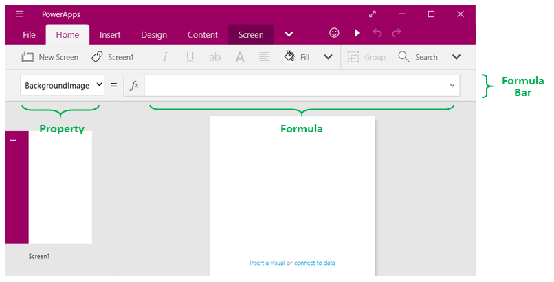

	This bar has two parts:

	- *Property list*:  Each control and screen has a [set of properties](reference-properties.md).  Use this list to select a specific property.  

	- *Formula*:  The formula to be calculated for this property, made up of [values, operators, and functions](formula-reference.md).

	In the formula bar, you can see and edit properties for the selected control or for the screen if no controls are selected.  You can see the name of the selected control on the **Content** tab:

	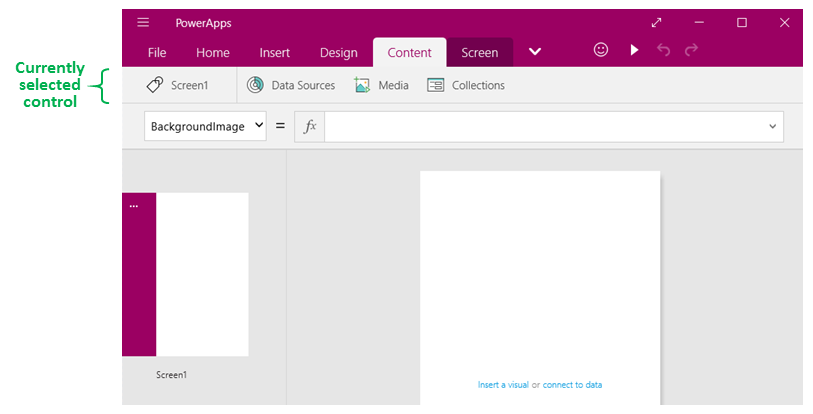

	You can change the name of the selected control in the **Content** tab by clicking the name.

1. Add a label by selecting **Label** on the **Insert** tab.

 	A label is added at the top of the screen:

	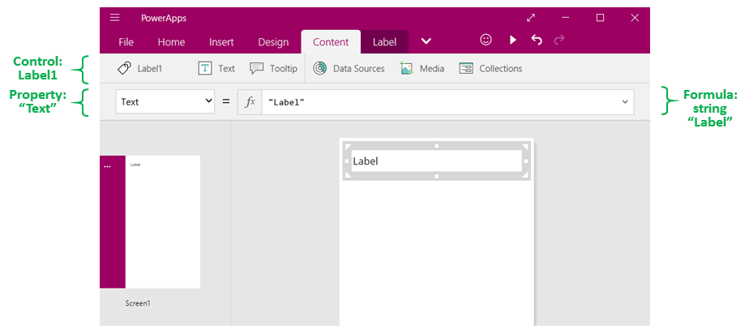

	When you add a label, the property list automatically shows the **Text** property, which drives what the label shows. By default, the value of this property is **"Label"**.  

1. Set the value of the **Text** property to **"Hello World"** by typing that string, surrounded by double quotes, into the formula bar:

	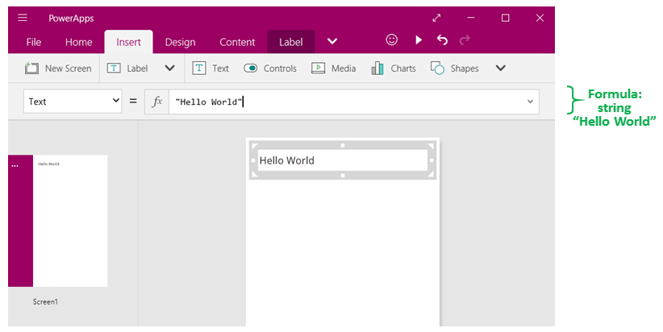

	The label reflects this new value as you type it.  The screen may show yellow exclamation-point icons while you type. These icons indicate errors, but they'll go away when you finish entering a valid value.  For example, a string without double quotes on both ends isn't valid.

	In Excel, you can show a number, such as **42**, by typing it into a cell or by typing a formula that resolves to that number, such as **=SUM(30,12)**. In PowerApps, you can achieve the same effect by setting the **Text** property of a control, such as a label, to **42** or **Sum(30,12)**. The cell and the label will always show that number regardless of what else changes in the worksheet or the app.

	**Note:** In PowerApps, you don't precede a formula with an equals sign or a plus sign as you do in Excel. The formula bar treats anything you type there as a formula by default. You also don't surround a formula with double quotation marks ("), as you did earlier to specify a string of text.

1. In the **Text** property of the label, replace **"Hello World"** with **Sum(1,2,3)**.

	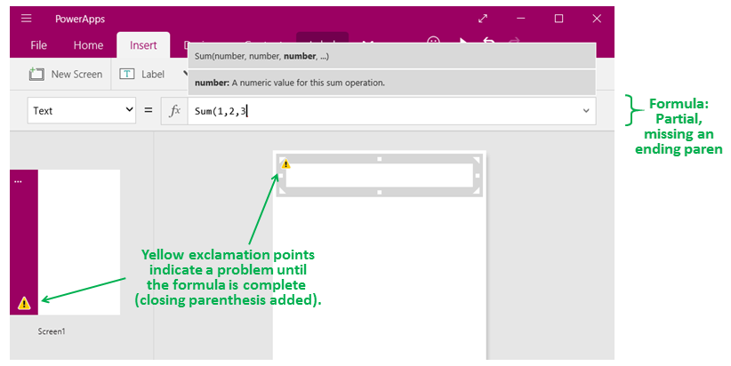

	While you type, the formula bar helps you by showing the description and the expected arguments for this function.  As with the final double quotation mark in **"Hello World"**, the screen shows yellow exclamation points to indicate an error until you type the final parenthesis of this formula:

	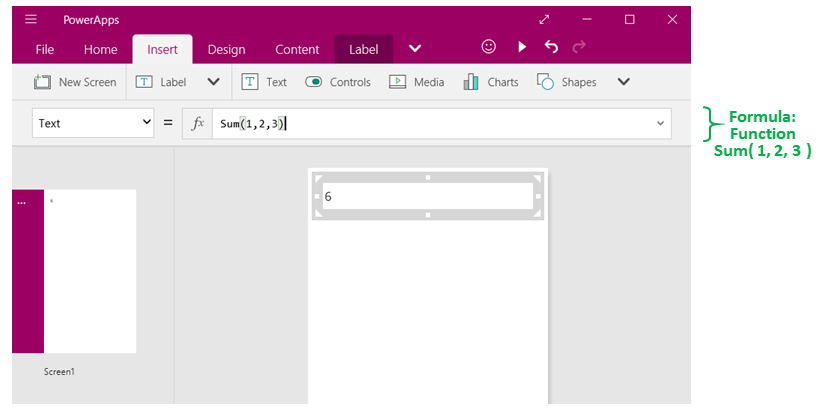

## Change a value based on input ##
In Excel, you type **=SUM(A1:A2)** into a cell to show the sum of whatever values cells A1 and A2 contain. If either or both of those values change, the cell that contains the formula automatically shows the updated result.

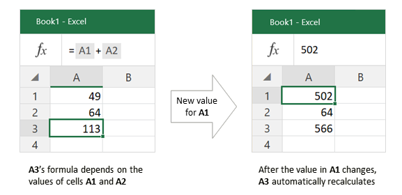

In PowerApps, you can achieve a similar result by adding controls and setting their properties. This example shows **Label1** from the previous procedure and two input-text controls, named **Text1** and **Text2**. Regardless of what numbers you type in the input-text controls, **Label1** always shows the sum of those numbers because its **Text** property is set to this formula:
 **Text1 + Text2**

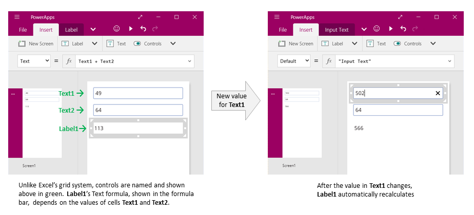

In Excel, you can use conditional formatting to show, for example, negative values in red. In PowerApps, you use a formula that contains the [**If**](function-if.md) function, which behaves similarly to how it behaves in Excel.

1. Set the **Color** property of **Label1** to this formula: **If( Value(Label1.Text) <0, Red, Black )**

	**Note:** Specify the property of a control by providing the name of the control, followed by a period, followed by the name of the property. For example, specify the **Text** property of **Label1** by typing **Label1.Text**.

	

1. In **Text1** and **Text2**, specify two numbers that, when added together, result in a negative number.

	The value in **Label1** appears in red.

## Change a color based on user input ##
You can configure your app with formulas so that users can change your app's appearance or behavior. For example, you can create a filter to show only data that contains a string of text that the user specifies, or you can let users sort a set of data based on a certain column in the data set. In this procedure, you'll let users change the color of the screen by adjusting one or more sliders.

1. Remove the controls from the previous procedures, or create a blank app as you did previously.

1. Add three slider controls to the screen by selecting **Controls** on the **Insert** tab and then selecting **Slider**:

	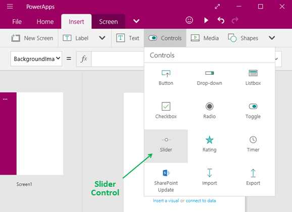

1. Arrange the sliders so they don't overlap, add three labels, and configure them to show **Red**, **Green**, and **Blue**:

	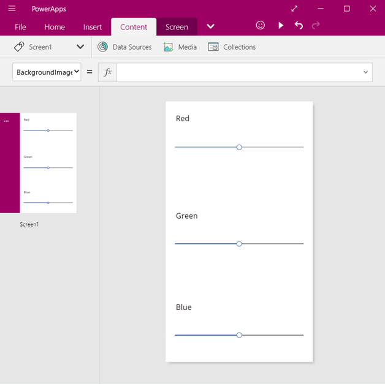

	**Note:** At any time, you can reveal the names of the controls and their boundaries on the screen by holding down the **Alt** key:

	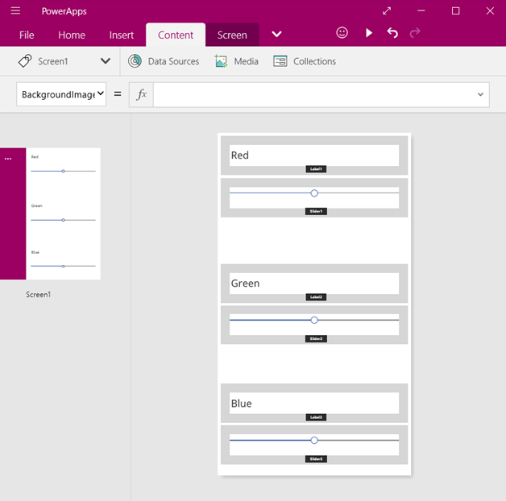

1. Set the **Max** property of each slider to 255, which is the maximum value of a color component for the **RGBA** function.

	You can specify the **Max** property by selecting it on the **Content** tab or in the property list:

	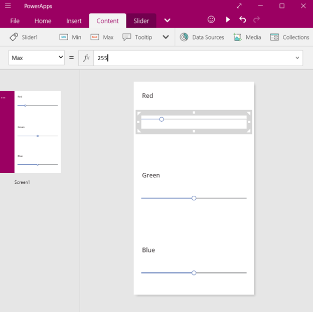

1. Select the screen by clicking away from any control, and then set the screen's **Fill** property to this formula: **RGBA( Slider1.Value, Slider2.Value, Slider3.Value, 1 )**

	As already described, you access control properties by using the **.** operator.  **Slider1.Value** refers to the slider's **Value** property, which reflects where the user has placed the slider between the **Min** and **Max** values.  As you type this formula, each control that it contains is color coded between the screen and the formula bar:

	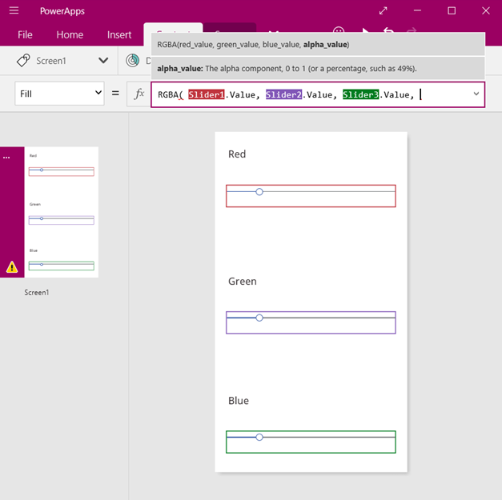

	As you type the closing parenthesis, the screen's background will change to dark gray based on the default value of each slider, which is **50**. At the moment when you finish typing the formula, it's calculated and used as the value of the background fill color.  You can interact with your app while in the default workspace without needing to open Preview:

	

1. Adjust the sliders, and see how your changes affect the background color.

	As each slider changes, the formula that contains the **RGBA** function is recalculated, which immediately changes how the screen appears.

	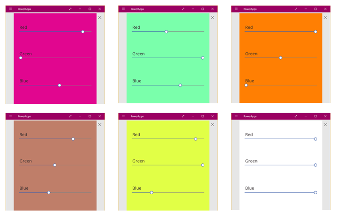

## Manage app behavior ##

You can use formulas not only to perform calculations and change appearance but also to take action. For example, you can set the **OnSelect** property of a button to a formula that includes the **Navigate** function. When a user selects that button, the screen that you specify in the formula appears.

You can use some functions, such as **Navigate** and **Collect**, only in behavior formulas.  The formula reference calls out if you can use a function only in this context.  

You can take than one action in a behavior formula if you separate functions with a semi-colon (;). For example, you might want to update a context variable, push data to a data source, and finally navigate to another screen.

## View a list of properties by category ##

The properties list shows properties alphabetically, but you can also view all the properties of a control, organized by category, if you select the **Advanced** option on the **View** tab:

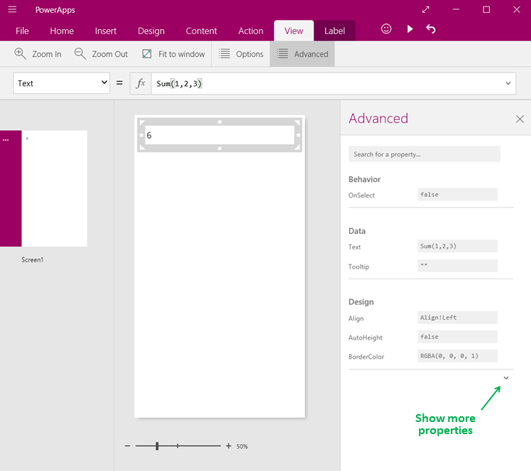

You can edit formulas directly within this view.

Initially, this view shows the most important properties.  To reveal all the properties, click the down arrow at the bottom of the pane:

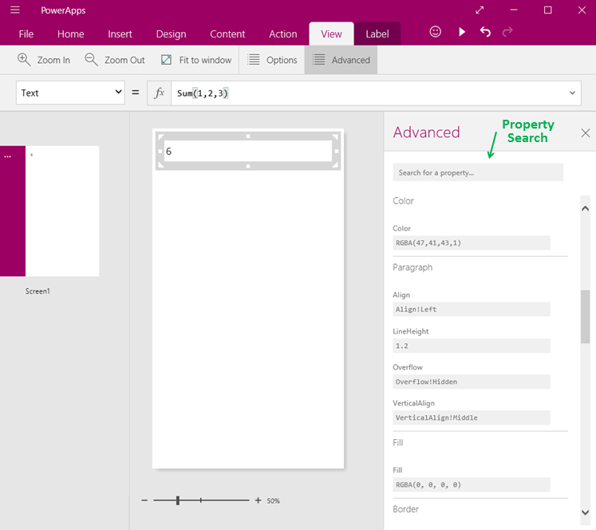

Each control has a long list of properties that govern all aspects of the control's behavior and appearance. You can scroll through the list or search for a property by typing in the box at the top of the pane.
