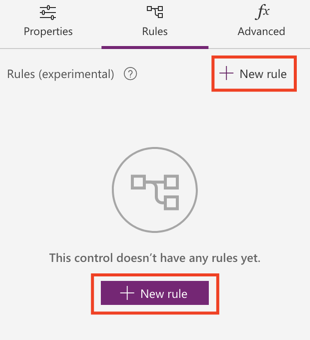
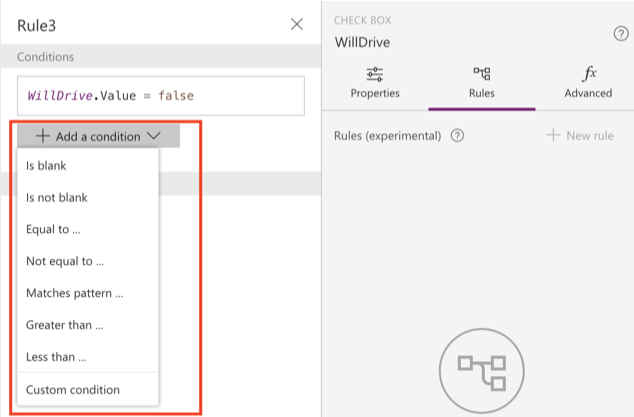
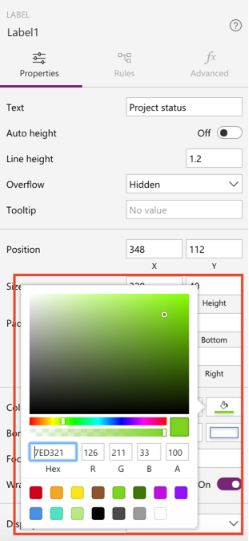
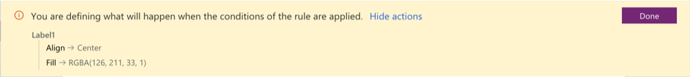
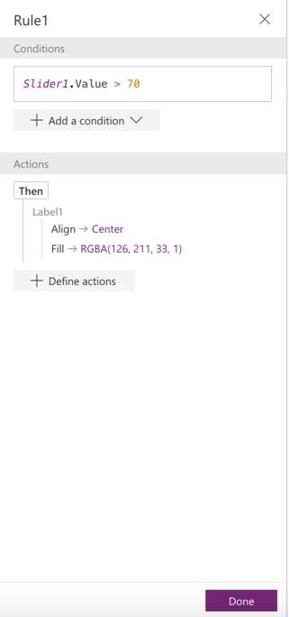

<properties
	pageTitle="Using Rules in apps | Microsoft PowerApps"
	description="Step-by-step instructions to creating Rules for app makers"
	services=""
	suite="PowerApps"
	documentationCenter="na"
	authors="karthik-1"
	manager="anneta"
	editor=""
	tags=""/>

<tags
   ms.service="powerapps"
   ms.devlang="na"
   ms.topic="article"
   ms.tgt_pltfrm="na"
   ms.workload="na"
   ms.date="09/14/2017"
   ms.author="karthikb"/>

# Using Rules in PowerApps #
Rules empower app authors to modify the state of the app based on certain conditions. App authors can define the conditions, which when true trigger one or more actions. The actions can modify the properties of the control like its color, location, visibility and so on.

For example, using Rules app authors can define conditional formatting of controls (say formatting the status as red-yellow-green) or conditionally show or hide controls (say show approval button only for managers).

## Adding a rule ##
In PowerApps Studio, add a new control or select an existing control, click or tap **Rules** panel (next to the properties panel on the right), and then follow these steps:

- If you've never created a rule, click or tap **+ New rule**.

	

- If you have created rules before, click or tap an exiting Rule.  

## Adding conditions ##
Conditions define when actions in a rule will be triggered. Conditions are PowerApps expressions that evaluate to true or false. The rules panel provides out-of-box templates that help write conditions. You can use IntelliSense to modify the PowerApps expression.

## Adding Actions
1. In the rules fly out panel, click or tap **+ Define actions**. Click or tap on **Let's go** in the confirmation dialog box.

	

1. You can now change properties of controls directly on the canvas or using the Properties panel.

 

1. Review the set of properties by clicking or tapping on **Show actions**. Click or tap **Done** to exit the capture mode.

	

1. In the rules fly out review the Rule condition and actions. Click or tap **Done** to save the rule.

	

## Testing the rule ##
Once the rule is defined on the control, you can preview the app by clicking on the play  button or hitting F5 on the keyboard. If the set of conditions are met the rules would trigger the actions.

In the above example you will see the label color change to green when the slider value is more than 70.

## Known limitations ##
- Rule names are auto generated for the first release.

- **ThisItem** property of a Form or a Gallery is not available in Conditions.

- Conditions need the specific property of the control used in the comparison. In future releases, we plan to infer common properties like "Text" or "Value" of the Control from the condition.
