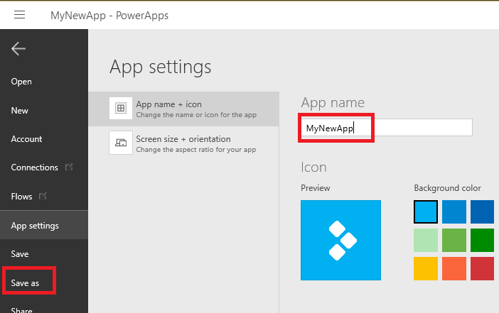
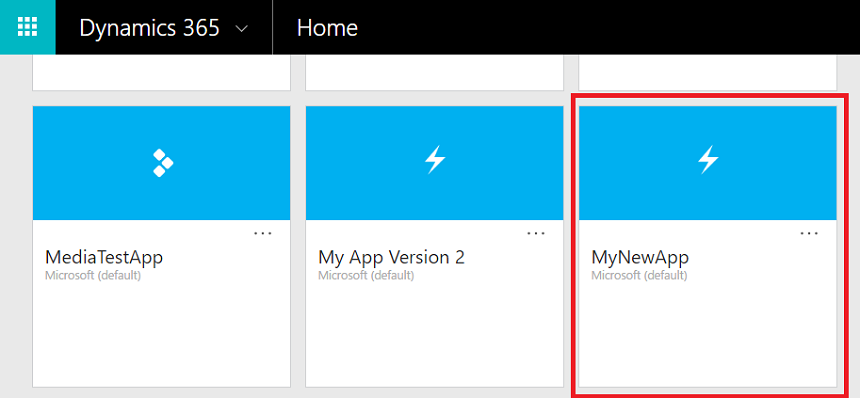

### Thorough testing of your app

You should thoroughly test your app on different platforms.

1. On the home page, save your app to PowerApps.

    

2. Test your app in the [Dynamics browser](https://home.dynamics.com/).

    a. Open the browser and select your app.

   
    b. Test your app's functionality.

3. Also test your app on at least one phone:

    a. Download the PowerApps app from your phone's store.

    b. Open the PowerApps app, find the name of the app you created, and tap it.

    c. Test your app's functionality.
