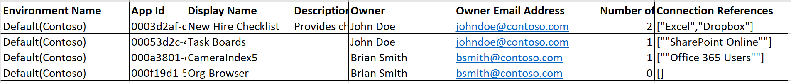

# View PowerApps created in your organization
As an environment admin, you can now download a list of apps being created in the environment from the [PowerApps admin center][1]. If you are an Office 365 Global admin or an Azure Active Directory tenant admin, you can download the list of apps for all the environments in your organization. The list contains the app name, the creator of the app, any connectors that the app uses to connect to data sources, and other information.

### Download the list of apps
1. In the PowerApps admin center, click on **Environments** near the left edge and select the environment for which want to view the list of apps:
   
    
2. Visit **Resources** from the horizontal navigation and select **Apps**. Download the list of apps by clicking the **Download the list of apps** button as shown below:
   
    
3. Wait a few minutes for the .csv file to download, and then open it in Excel.
   
   
   <!--Reference links in article-->

[1]:https://admin.powerapps.com
