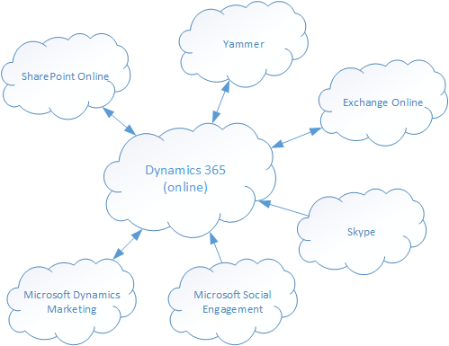

# Add Office 365 Online services

[!INCLUDE[cc-applies-to-update-9-0-0](../includes/cc_applies_to_update_9_0_0.md)] [!INCLUDE[cc-applies-to-update-8-2-0](../includes/cc_applies_to_update_8_2_0.md)]

Integrating [!INCLUDE[pn_MS_Office_365](../includes/pn-ms-office-365.md)] with [!INCLUDE[pn_CRM_Online](../includes/pn-crm-online.md)] is a great way to enhance your customer relationship management with the power of cloud services: easier maintenance, broader availability, and better coordination across multiple devices.  
  
   
  
 The following topics provide information on how to integrate [!INCLUDE[pn_Exchange_Online](../includes/pn-exchange-online.md)], [!INCLUDE[pn_sharepoint_online](../includes/pn-sharepoint-online.md)], and [!INCLUDE[pn_skype](../includes/pn-skype.md)] into [!INCLUDE[pn_CRM_Online](../includes/pn-crm-online.md)].  
  
> [!NOTE]
> [!INCLUDE[cc_Office365PlanRequirement](../includes/cc-office365planrequirement.md)]  
 
